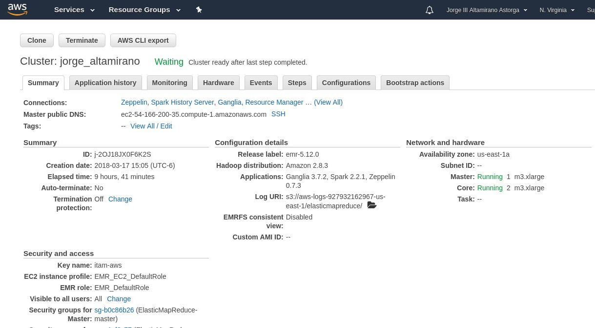

## {.tabset}

### Cluster {.tabset}

#### AWS EMR Cluster

Muestro mi cluster con mi nombre.

#### Northwind Load {.tabset}

##### Script

<pre><code>
employees = spark.read.csv("", header = True, inferSchema = True)
orders = spark.read.csv("s3a://jorge-altamirano/northwind/orders.csv", header = True, inferSchema = True)
orderdetails = spark.read.csv("s3a://jorge-altamirano/northwind/order_details.csv", header = True, inferSchema = True)
print("Employees:")
employees.printSchema()
print("Orders:")
orders.printSchema()
print("Order Details:")
orderdetails.printSchema()
</code></pre>

##### Output

<pre><code>
Employees:
root
 |-- employeeid: integer (nullable = true)
 |-- lastname: string (nullable = true)
 |-- firstname: string (nullable = true)
 |-- title: string (nullable = true)
 |-- titleofcourtesy: string (nullable = true)
 |-- birthdate: timestamp (nullable = true)
 |-- hiredate: timestamp (nullable = true)
 |-- address: string (nullable = true)
 |-- city: string (nullable = true)
 |-- region: string (nullable = true)
 |-- postalcode: string (nullable = true)
 |-- country: string (nullable = true)
 |-- homephone: string (nullable = true)
 |-- extension: integer (nullable = true)
 |-- photo: string (nullable = true)
 |-- notes: string (nullable = true)
 |-- reportsto: integer (nullable = true)
 |-- photopath: string (nullable = true)
Orders:
root
 |-- orderid: integer (nullable = true)
 |-- customerid: string (nullable = true)
 |-- employeeid: integer (nullable = true)
 |-- orderdate: timestamp (nullable = true)
 |-- requireddate: timestamp (nullable = true)
 |-- shippeddate: timestamp (nullable = true)
 |-- shipvia: integer (nullable = true)
 |-- freight: double (nullable = true)
 |-- shipname: string (nullable = true)
 |-- shipaddress: string (nullable = true)
 |-- shipcity: string (nullable = true)
 |-- shipregion: string (nullable = true)
 |-- shippostalcode: string (nullable = true)
 |-- shipcountry: string (nullable = true)
Order Details:
root
 |-- orderid: integer (nullable = true)
 |-- productid: integer (nullable = true)
 |-- unitprice: double (nullable = true)
 |-- quantity: integer (nullable = true)
 |-- discount: double (nullable = true)
</code></pre>

#### Flights Load {.tabset}

##### Code 

<pre><code>
flights = spark.read.csv("s3a://jorge-altamirano/flights/flights.csv", header = True, inferSchema = True)
airports = spark.read.csv("s3a://jorge-altamirano/flights/airports.csv", header = True, inferSchema = True)
airlines = spark.read.csv("s3a://jorge-altamirano/flights/airlines.csv", header = True, inferSchema = True)
print("Flights:")
flights.printSchema()
print("Airports:")
airports.printSchema()
print("Airlines:")
airlines.printSchema()
</code></pre>

##### Output

<pre></code>
Flights:
root
 |-- YEAR: integer (nullable = true)
 |-- MONTH: integer (nullable = true)
 |-- DAY: integer (nullable = true)
 |-- DAY_OF_WEEK: integer (nullable = true)
 |-- AIRLINE: string (nullable = true)
 |-- FLIGHT_NUMBER: integer (nullable = true)
 |-- TAIL_NUMBER: string (nullable = true)
 |-- ORIGIN_AIRPORT: string (nullable = true)
 |-- DESTINATION_AIRPORT: string (nullable = true)
 |-- SCHEDULED_DEPARTURE: integer (nullable = true)
 |-- DEPARTURE_TIME: integer (nullable = true)
 |-- DEPARTURE_DELAY: integer (nullable = true)
 |-- TAXI_OUT: integer (nullable = true)
 |-- WHEELS_OFF: integer (nullable = true)
 |-- SCHEDULED_TIME: integer (nullable = true)
 |-- ELAPSED_TIME: integer (nullable = true)
 |-- AIR_TIME: integer (nullable = true)
 |-- DISTANCE: integer (nullable = true)
 |-- WHEELS_ON: integer (nullable = true)
 |-- TAXI_IN: integer (nullable = true)
 |-- SCHEDULED_ARRIVAL: integer (nullable = true)
 |-- ARRIVAL_TIME: integer (nullable = true)
 |-- ARRIVAL_DELAY: integer (nullable = true)
 |-- DIVERTED: integer (nullable = true)
 |-- CANCELLED: integer (nullable = true)
 |-- CANCELLATION_REASON: string (nullable = true)
 |-- AIR_SYSTEM_DELAY: integer (nullable = true)
 |-- SECURITY_DELAY: integer (nullable = true)
 |-- AIRLINE_DELAY: integer (nullable = true)
 |-- LATE_AIRCRAFT_DELAY: integer (nullable = true)
 |-- WEATHER_DELAY: integer (nullable = true)
Airports:
root
 |-- IATA_CODE: string (nullable = true)
 |-- AIRPORT: string (nullable = true)
 |-- CITY: string (nullable = true)
 |-- STATE: string (nullable = true)
 |-- COUNTRY: string (nullable = true)
 |-- LATITUDE: double (nullable = true)
 |-- LONGITUDE: double (nullable = true)
Airlines:
root
 |-- IATA_CODE: string (nullable = true)
 |-- AIRLINE: string (nullable = true)
READY   
</code></pre>

### Ejercicio 1 {.tabset}

#### Ejercicio 1.a {.tabset}

¿Cuántos "jefes" hay en la tabla empleados? ¿Cuáles son estos jefes: número de empleado, nombre, apellido, título, fecha de nacimiento, fecha en que iniciaron en la empresa, ciudad y país? (atributo `reportsto`, ocupa `explode` en tu respuesta)

_Son 2 ejefes: Steven Buchanan y Andrew Fuller._

##### Spark 

<pre><code>
reports = employees.select("reportsto").filter(employees.reportsto > 0).distinct()
print("Reporta a %d jefes."%reports.count())
reports = [int(i.reportsto) for i in reports.collect()]
q1a = employees.select("employeeid", "firstname", "lastname", "title", "birthdate", "hiredate", "city", "country").\
    filter(employees.employeeid.isin(reports))
q1a.write.csv('s3a://jorge-altamirano/tarea_6/q1a')
q1a.show()
</code></pre>

##### Output

<pre><code>
+----------+---------+--------+--------------------+-------------------+-------------------+------+-------+
|employeeid|firstname|lastname|               title|          birthdate|           hiredate|  city|country|
+----------+---------+--------+--------------------+-------------------+-------------------+------+-------+
|         2|   Andrew|  Fuller|Vice President, S...|1952-02-19 00:00:00|1992-08-14 00:00:00|Tacoma|    USA|
|         5|   Steven|Buchanan|       Sales Manager|1955-03-04 00:00:00|1993-10-17 00:00:00|London|     UK|
+----------+---------+--------+--------------------+-------------------+-------------------+------+-------+
</code></pre>

#### Ejercicio 1.b {.tabset}

¿Quién es el segundo "mejor" empleado que más órdenes ha generado? (nombre, apellido, título, cuándo entró a la compañía, número de órdenes generadas, número de órdenes generadas por el mejor empleado (número 1))

_El segundo mejor lugar con 127 ventas es Janet Leverling que es Representante de Ventas, fue contratada el 4 de Abril de 1992. El máximo número de ventas es 156, que corresponde al primer lugar en ventas._

##### Spark

<pre><code>
from pyspark.sql.functions import col
from pyspark.sql import Row

n_order = orders.groupBy("employeeid").count().sort(col("count").desc()).collect()
#orders.groupBy("employeeid").count().sort(col("count").desc()).show()
best = sc.parallelize([Row(employeeid = n_order[1][0], n_orders = n_order[1][1], best_n_orders = n_order[0][1])]).toDF()
#best.show()
q1b = employees.filter(employees.employeeid == n_order[1][0]).\
    join(best, employees.employeeid == best.employeeid).\
    select("firstname", "lastname", "title", "hiredate", "n_orders", "best_n_orders")
q1b.write.csv('s3a://jorge-altamirano/tarea_6/q1b')
q1b.show()
</code></pre>

##### Output

<pre><code>
+---------+---------+--------------------+-------------------+--------+-------------+
|firstname| lastname|               title|           hiredate|n_orders|best_n_orders|
+---------+---------+--------------------+-------------------+--------+-------------+
|    Janet|Leverling|Sales Representative|1992-04-01 00:00:00|     127|          156|
+---------+---------+--------------------+-------------------+--------+-------------+
</code></pre>

#### Ejercicio 1.c {.tabset}

¿Cuál es el delta de tiempo más grande entre una orden y otra?

_Son 3 días._

##### Spark

<pre><code>
from pyspark.sql.functions import to_timestamp, col, window, datediff
from pyspark.sql.window import Window

delta = orders.\
    select("orderid", \
        to_timestamp("orderdate", "yyyy/MM/dd HH:mm:ss").alias("orderdate"),
        lag("orderdate").over(Window().partitionBy().orderBy(col("orderid").asc())).\
            alias("lag")).\
    select("orderid", "orderdate", "lag", #se separa porque no reconoce lag
        datediff("orderdate", "lag").alias("delta")).\
    orderBy(col("delta").desc())

delta.limit(5).show()
q1c = delta.select(delta.delta).limit(1)
q1c.show()
q1c.write.csv('s3a://jorge-altamirano/tarea_6/q1c')
</code></pre>

##### Output

<pre><code>
+-----+
|delta|
+-----+
|    3|
+-----+
</code></pre>

### Ejercicio 2 {.tabset}

#### Ejercicio 2.a {.tabset}

¿Qué aerolíneas (nombres) llegan al aeropuerto "Honolulu International Airport"?

_Las aerolíneas que llegan al aeropuerto de Honolulu HNL son: US Airways, Delta, Hawaiian (obviamente), United, Virgin America, Alaska, AA._

##### Spark

<pre><code>
from pyspark.sql.functions import col

q2a = flights.select("DESTINATION_AIRPORT", "AIRLINE").\
    join(airports, flights.DESTINATION_AIRPORT == airports.IATA_CODE).\
    select(col("DESTINATION_AIRPORT").alias("iata_airport"), 
        col("AIRPORT").alias("airport"),
        col("AIRLINE").alias("airlines")).\
    join(airlines, col("airlines") == airlines.IATA_CODE).\
    select(col("IATA_CODE").alias("iata"),
        col("AIRLINE").alias("airline")).\
    filter(col("airport") == "Honolulu International Airport").\
    distinct()
q2a.show()
q2a.write.csv('s3a://jorge-altamirano/tarea_6/q2a')
</code></pre>

##### Output

<pre><code>
+----+--------------------+
|iata|             airline|
+----+--------------------+
|  AS|Alaska Airlines Inc.|
|  DL|Delta Air Lines Inc.|
|  VX|      Virgin America|
|  US|     US Airways Inc.|
|  HA|Hawaiian Airlines...|
|  AA|American Airlines...|
|  UA|United Air Lines ...|
+----+--------------------+
</code></pre>

#### Ejercicio 2.b {.tabset}

¿En qué horario (hora del día, no importan los minutos) hay salidas del aeropuerto de San Francisco ("SFO") a "Honolulu International Airport"?

_Salen a las siguientes horas: 6, 7, 8, 9, 10, 11, 12, 13, 14, 15, 16, 17, 18 y 19. En formato 24 hrs._

##### Spark

<pre><code>
from pyspark.sql.functions import floor

q2b = flights.select(col("DESTINATION_AIRPORT").alias("destination"),
        col("ORIGIN_AIRPORT").alias("origin"),
        col("SCHEDULED_DEPARTURE").alias("departure_time")).\
    join(airports, col("origin") == col("IATA_CODE")).\
    select("destination", "origin", "departure_time",
        col("AIRPORT").alias("origin2")).\
    join(airports, col("destination") == col("IATA_CODE")).\
    select("departure_time", "destination",  
        col("AIRPORT").alias("destination2"),
        "origin", "origin2").\
    filter((col("origin") == "SFO") & \
        (col("destination2") == "Honolulu International Airport")).\
    select("departure_time").\
    orderBy("departure_time").\
    select(floor(col("departure_time") / 100).alias("departs")).\
    distinct().\
    orderBy(col("departs"))

q2b.show()
q2b.write.csv('s3a://jorge-altamirano/tarea_6/q2b')
</code></pre>

##### Output

<pre><code>
+-------+
|departs|
+-------+
|      6|
|      7|
|      8|
|      9|
|     10|
|     11|
|     12|
|     13|
|     14|
|     15|
|     16|
|     17|
|     18|
|     19|
+-------+
</code></pre>

#### Ejercicio 2.c {.tabset}

¿Qué día de la semana y en qué aerolínea nos conviene viajar a "Honolulu International Airport" para tener el menor retraso posible?

_Nos conviene viajar en domingo (day of week 1) por Virgin America, el cual no solo no tiene retraso, sino llega usualmente antes._

##### Spark

<pre><code>

from pyspark.sql.functions import avg, round

q2c = flights.select(col("ARRIVAL_DELAY").alias("delay"), 
        col("DESTINATION_AIRPORT").alias("destination"),
        col("DAY_OF_WEEK").alias("day"),
        col("AIRLINE").alias("airline1")
    ).\
    join(airports, col("destination") == airports.IATA_CODE).\
    filter(col("airport") == "Honolulu International Airport").\
    groupBy("day", "airline1").avg("delay").\
    select("day", "airline1", round(col("avg(delay)"), 2).alias("delay")).\
    orderBy(col("delay").asc()).\
    join(airlines, col("airline1") == airlines.IATA_CODE).\
    select("day", "airline1", "delay", col("airline").alias("airline_name")).\
    limit(1)
    
q2c.show()
q2c.write.csv('s3a://jorge-altamirano/tarea_6/q2c')
</code></pre>

##### Output

<pre><code>
+---+--------+------+--------------+
|day|airline1| delay|  airline_name|
+---+--------+------+--------------+
|  1|      VX|-14.22|Virgin America|
+---+--------+------+--------------+
</code></pre>

#### Ejercicio 2.d {.tabset}

¿Cuál es el aeropuerto con mayor tráfico de entrada?

_El aeropuerto con más tráfico de entrada es: Hartsfield-Jackson Atlanta (GA, USA). Investigando un poco, esto se debe a que es el Hub de [Delta](https://en.wikipedia.org/wiki/Delta_Air_Lines)_ _(una de las mayores aerolíneas) y de [Sky Team](https://en.wikipedia.org/wiki/SkyTeam) (una de las mayores alianzas y hub de estas)._ 

##### Spark

<pre><code>
q2d = flights.select(col("DESTINATION_AIRPORT").alias("destination")).\
    groupBy("destination").count().\
    orderBy(col("count").desc()).\
    limit(1).\
    join(airports, col("destination") == airports.IATA_CODE).\
    select("destination", 
        col("AIRPORT").alias("airport"), 
        "count")
        
q2d.show()
q2d.write.csv('s3a://jorge-altamirano/tarea_6/q2d')
</code></pre>

##### Output

<pre><code>
+-----------+--------------------+------+
|destination|             airport| count|
+-----------+--------------------+------+
|        ATL|Hartsfield-Jackso...|346904|
+-----------+--------------------+------+
</code></pre>

#### Ejercicio 2.e {.tabset}

¿Cuál es la aerolínea con mayor retraso de salida por día de la semana?

_* Domingo, Lunes, Miércoles, Jueves, Viernes, Sábado._

_* Martes es Frontier._

##### Spark

<pre><code>
from pyspark.sql.functions import window, avg
from pyspark.sql.window import Window

q2e = flights.select(\
        col("DAY_OF_WEEK").alias("day"),
        col("ARRIVAL_DELAY").alias("delay"),
        col("AIRLINE").alias("iata")).\
    groupBy("day", "iata").avg("delay").\
    select("*", col("avg(delay)").alias("delay2")).\
    select(\
        "*",
        rank().over(Window().partitionBy("day").orderBy(col("delay2").desc())).alias("rank")
    ).\
    filter(col("rank") == 1).\
    orderBy("day").\
    join(airlines, col("iata") == airlines.IATA_CODE).\
    select("day", "iata", col("AIRLINE").alias("airline"))

q2e.show()
q2e.write.csv('s3a://jorge-altamirano/tarea_6/q2e')
</code></pre>

##### Output

<pre><code>
+---+----+--------------------+
|day|iata|             airline|
+---+----+--------------------+
|  1|  NK|    Spirit Air Lines|
|  2|  NK|    Spirit Air Lines|
|  3|  F9|Frontier Airlines...|
|  4|  NK|    Spirit Air Lines|
|  5|  NK|    Spirit Air Lines|
|  6|  NK|    Spirit Air Lines|
|  7|  NK|    Spirit Air Lines|
</code></pre>

#### Ejercicio 2.f {.tabset}

¿Cuál es la tercer aerolínea con menor retraso de salida los lunes (day of week = 2)?

_Es US Airway tercera aerolínea con menor atraso los lunes._

##### Spark

<pre><code>
from pyspark.sql.functions import avg, round
from pyspark.sql.window import Window

q2f = flights.select(flights.DAY_OF_WEEK.alias("day"),
        flights.AIRLINE.alias("iata"),
        flights.DEPARTURE_DELAY.alias("delay")).\
    filter(col("day") == 2).\
    groupBy("iata").avg("delay").\
    orderBy(col("avg(delay)").asc()).\
    limit(3).\
    select(\
        "*",
        rank().over(Window().partitionBy().orderBy(col("avg(delay)").asc())).alias("rank")
    ).\
    join(airlines, col("iata") == airlines.IATA_CODE).\
    filter(col("rank") == 3).\
    select("iata", col("AIRLINE").alias("airline"))
    
q2f.show()
q2f.write.csv('s3a://jorge-altamirano/tarea_6/q2f')
</code></pre>

##### Output

<pre><code>
+----+---------------+
|iata|        airline|
+----+---------------+
|  US|US Airways Inc.|
+----+---------------+
</code></pre>

#### Ejercicio 2.g {.tabset}

¿Cuál es el aeropuerto origen que llega a la mayor cantidad de aeropuertos destino diferentes?

_El aeropuerto con más destinos diferentes es Hartsfield-Jackson, como se mencione en el Ejercicio 2D_.

##### Spark

<pre><code>
q2g = flights.select(
        flights.ORIGIN_AIRPORT.alias("origin"),
        flights.DESTINATION_AIRPORT.alias("destination")).\
    #groupBy("origin", "destination").count().alias("origin_count").\
    groupBy("destination").count().\
    orderBy(col("count").desc()).\
    limit(1).\
    join(airports, col("destination") == airports.IATA_CODE).\
    select("destination", 
        col("AIRPORT").alias("airport"))
q2g.show()
q2g.write.csv('s3a://jorge-altamirano/tarea_6/q2g')
</code></pre>

##### Output

<pre><code>
+-----------+--------------------+
|destination|             airport|
+-----------+--------------------+
|        ATL|Hartsfield-Jackso...|
+-----------+--------------------+
</code></pre>

### Referencias

* <https://spark.apache.org/docs/2.1.0/api/python/pyspark.sql.html>
* <https://stackoverflow.com/questions/31719575/inferschema-in-spark-csv-package>
* <https://stackoverflow.com/questions/38610559/convert-spark-dataframe-column-to-python-list>
* <https://stackoverflow.com/questions/40421845/pyspark-dataframe-filter-or-include-based-on-list>
* <https://stackoverflow.com/questions/34514545/spark-dataframe-groupby-and-sort-in-the-descending-order-pyspark>