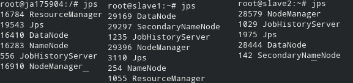

# {.tabset}

## Introducción

Presento la siguiente tarea en la cual se analizó el dataset de Flights con el fin de aplicar métodos de Aprendizaje Máquina (aka ML, _Machine Learning_). Este dataset es de tamaño considerablemente grande para ser aplicado en R o scikit-learn, por lo que fue muy adecuado para iniciar a utilizar Spark como motor para hacer ML con los 5.7 millones de registros que contamos.

Como buena práctica, se dividió el set en 2: entrenamiento (70%, denominado train) y pruebas (30%, denominado test).

Inicié mi exploración de los métodos con Random Forest pero no fueron fructíferos los resultados y el tiempo demorado en realizarlo, por lo que el Magic Loop fue hecho con Regresión Logística (este fue el mejor y con resultados similares a RandomForest) y Regresión Lineal. Para realizar pruebas realicé pruebas con un subset del train con el 0.1% de la muestra y un seed estático (mi número de cuenta). Estas pruebas tomaban un par de minutos por vez.

## Cluster {.tabset}

Realicé un cluster _on-prem_ con 64 GB de RAM y 16 cores Xeon, el cual también contenía un sistema de archivos distribuido: HDFS. Incluyo los screenshots.

### Hadoop {.tabset}

#### JPS



#### Nodos


### Spark


### Jupyter

[El cuaderno completo lo incluyo aquí](tarea_7-jupyter.html), así como la [fuente](tarea_7-jupyter.ipynb).


## Carga de Datos {.tabset}

### Carga inicial

```
#carga de datos
flights = spark.read.csv("hdfs://172.17.0.2:9000/data/flights/flights.csv", 
                         inferSchema=True, 
                         header=True)
#acelerar los queries con un cache
flights = flights.cache()
#columnas más relevantes
relevant_cols = ["YEAR", "MONTH", "DAY", "DAY_OF_WEEK", "AIRLINE", 
                "FLIGHT_NUMBER", "ORIGIN_AIRPORT", "DESTINATION_AIRPORT",
                "SCHEDULED_DEPARTURE", "DEPARTURE_TIME", "SCHEDULED_TIME",
                "AIR_TIME", "DISTANCE", "SCHEDULED_ARRIVAL", "CANCELLED",
                "DEPARTURE_DELAY"]
```

### Set de Entrenamiento+Pruebas y Feature Engineering

```
### selección de columnas
flights = flights.select(relevant_cols)
### descartar nulos
flights = flights.na.drop().cache()
### dividir en sets de entrenamiento y set de pruebas
flights.write.parquet("hdfs://172.17.0.2:9000/tmp/flights-tmp.parquet", mode="overwrite")
flights.show(2)
#por eficiencia he visto que es mejor guardarlo
flights = spark.read.parquet("hdfs://172.17.0.2:9000/tmp/flights-tmp.parquet")
flights = flights.cache()
#dividir el set
(train, test) = flights.randomSplit([0.7, 0.3], seed=175904)
train2 = train.sample(fraction=0.001, seed=175904)

#guardamos por eficiencia, nuevamente
train.write.parquet("hdfs://172.17.0.2:9000/tmp/train-tmp.parquet", mode="overwrite")
test.write.parquet("hdfs://172.17.0.2:9000/tmp/test-tmp.parquet", mode="overwrite")
train = spark.read.parquet("hdfs://172.17.0.2:9000/tmp/train-tmp.parquet")
test = spark.read.parquet("hdfs://172.17.0.2:9000/tmp/test-tmp.parquet")
train = train.cache()
test = test.cache()

#descartando categóricas y la que vamos a predecir: "DEPARTURE_DELAY"
features = [ x for x in train.schema.names if x not in 
            [ "DEPARTURE_DELAY", "AIRLINE", "ORIGIN_AIRPORT", "DESTINATION_AIRPORT"] ]
#agregando las columnas que ya van a ser indizadas
features.append("airline_indexer")
features.append("origin_indexer")
features.append("destination_indexer")
print("Features que se tomarán para la predicción: ", features)

#indización de columnas: de categóricas a texto
li0 = StringIndexer(inputCol="AIRLINE",
                    outputCol="airline_indexer", 
                    handleInvalid="skip") \
    .fit(flights)
li1 = StringIndexer(inputCol="ORIGIN_AIRPORT",
                    outputCol="origin_indexer", 
                    handleInvalid="skip") \
    .fit(flights)
li2 = StringIndexer(inputCol="DESTINATION_AIRPORT",
                    outputCol="destination_indexer", 
                    handleInvalid="skip") \
    .fit(flights)
li  = StringIndexer(inputCol="DEPARTURE_DELAY",
                    outputCol="delay_indexer", 
                    handleInvalid="skip") \
    .fit(flights)
#este ensamble es requerido para usar los clasificadores y regresores de Spark ML
va0 = VectorAssembler() \
    .setInputCols(features) \
    .setOutputCol("features")
pca = PCA(k=10, inputCol="features", outputCol="features_pca")
lc = IndexToString(inputCol="prediction", outputCol="predictedLabel",
                   labels=li.labels)
```

### Modelos y Pipelines

#### Regresión Logística


```
# regresión logística
lr = LogisticRegression(featuresCol="features_pca",
                        labelCol="delay_indexer",
                        #maxIter=10, elasticNetParam=0.8,
                        regParam=0.3, 
                        family="multinomial",
                        predictionCol="prediction")
#creación del pipeline, este no se va a utilizar en el Magic Loop
pipeline1 = Pipeline(stages=[li0, li1, li2, va0, pca, li, lr, lc]) 
```

#### Regresión Lineal


```
# regresión lineal
glr = GeneralizedLinearRegression(featuresCol="features_pca",
                        labelCol="delay_indexer", family="Gaussian")
#creación del pipeline, este no se va a utilizar en el Magic Loop
pipeline2 = Pipeline(stages=[li0, li1, li2, va0, pca, li, glr, lc])
```

## Magic Loop

Dado que tomaba demasiado tiempo a 10 folds te solicité por Slack bajar el número a 3. Te agradezco la comprehensión.

Otra diferencia que hice fue diseccionar el pipeline con el fin de no tener que procesar todas y cada una de las veces el pipeline dentro del CrossValidation, sólamente la parte ML que era la que estamos manipulando, por lo cual hace sentido _no moverle_. Creo que esto lo aceleró sustancialmente en mi "pequeño cluster".

```
def magic_loop3(pipelines, grid, train, test, cvfolds=3):
    best_score = 0.0 #symbolic high value :-)
    best_grid = None #inicializar la variable
    #este loop inicia las pruebas secuenciales de los pipelines:
    #es relevante que no sólo soporta 2, sino se va en cada uno 
    #de los que estén presentes en la lista
    for pipe in pipelines:
        try:
            #quiero que se desligue, para no modificar (al final, usa poco RAM)
            pipe = pipe.copy()
            #etapas del pipeline
            stages = pipe.getStages()
            #obtener el predictor (el motor ML)
            predictor = [stage for stage in stages
                if "pyspark.ml.classification" in str(type(stage)) or
                 "pyspark.ml.regression" in str(type(stage))][0]
            predictor_i = stages.index(predictor)
            stringer = [stage for stage in pipe.getStages()
                if "pyspark.ml.feature.StringIndexer" in str(type(stage))][0]
            if DEBUG: print("pipeline:\n%s\n\n"%stages)
            if DEBUG: print("predictor=%s (index %s, type %s), stringer=%s (%s)\n"%
                  (predictor, stages.index(predictor), type(predictor),
                  stringer, type(stringer)))
            #dado que no son predicciones susceptibles a cambios en el CV
            prepipe = Pipeline(stages=stages[0:(predictor_i)])
            if DEBUG: print("pre pipeline:\n%s\n\n"%prepipe.getStages())
            print("Starting fit on prepipe...")
            #modelo para el prepipeline
            prepipem = prepipe.fit(train)
            print("Starting transform on prepipe...")
            train2 = prepipem.transform(train)
            test2 = prepipem.transform(test)
            #el motor ML sí es susceptible CV
            postpipe = Pipeline(stages=stages[(predictor_i):len(stages)])
            if DEBUG: print("post pipeline:\n%s\n\n"%postpipe.getStages())
            #creación del Cross Validator
            gridcv = CrossValidator(estimator=postpipe,
                          estimatorParamMaps=grid,
                          evaluator=MulticlassClassificationEvaluator(labelCol="DEPARTURE_DELAY"),
                          numFolds=cvfolds)
            #extraemos el nombre y le quitamos la parte "fea" que devuelve type()
            predictr = [str(type(stage)) for stage in pipe.getStages() 
            if "pyspark.ml.classification" in str(type(stage)) or
             "pyspark.ml.regression" in str(type(stage))][0]
            predictr = re.sub("^<class 'pyspark\.ml\.(classification|regression)\.([a-zA-Z0-9]+)'>", 
                              "\\2", 
                              predictr)
            #creación del modelo
            print("Starting fit on %s..."%predictr)
            gridcvm = gridcv.fit(train2)
            #aplicación del modelo
            print("Starting transform on %s..."%predictr)
            preds = gridcvm.transform(test2)
            #obtenemos el evaluador para el uso en la medición de errores
            ev = gridcvm.getEvaluator()
            #obtenemos la métrica del error
            metric = ev.getMetricName()
            print("Starting error calculation on %s..."%predictr)
            #obtenemos el valor del eror
            error  = ev.evaluate(preds)
            print("Error %s: %f"% (metric, error))
            #si es mejor que el modelo pasado, lo guardamos. El último
            #guardado será el que devuelva esta función
            if error > best_score:
                print("%s is the best model so far: %f (%s)"%(predictr, error, metric))
                best_grid = gridcvm
        #manejo de errores y horrores
        except Exception as e:
            print('Error during Magic Loop:', e)
        continue
    return best_grid

paramGrid = ParamGridBuilder() \
                .addGrid(glr.family, ["Gaussian", "Poisson", "Tweedie"]) \
                .addGrid(glr.maxIter, [1, 2, 3]) \
                .addGrid(lr.maxIter, [1, 2, 3]) \
                .addGrid(lr.elasticNetParam, [0.1,0.2,0.3]) \
                .build()
magic = magic_loop3(pipelines, paramGrid, train, test, 3) 
```


## Resultados

El mejor resultado fue Logistic Regression: 100 iteraciones máximas y 0.0 de valor `elasticNet`. Esto es uno de las cosas que me encontré: Spark (y Hadoop en general) tienen _vida propia_, muchas veces hacen caso omiso de los parámetros o causan cosas _raras_: si pones un CrossValidation fold=2 no funciona y lanza errores no muy deductibles.

```
best_model = magic.getEstimator()
best_estimator = best_model.getStages()[0]
best_estimator_params = best_estimator.extractParamMap()
#obtener el evaluador para medi rerrores
ev0 = magic.getEvaluator()
type(best_estimator_params)
print("%s (best model) Parameters: maxIter=%d, elasticNetParam=%f"%
      (re.sub("^<class 'pyspark\.ml\.(classification|regression)\.([a-zA-Z0-9]+)'>", 
                              "\\2", (str)((type(best_estimator)))), 
       best_estimator_params[best_estimator.maxIter], 
       best_estimator_params[best_estimator.elasticNetParam]))
#aquí probé como se veían los errores
preds = magic.transform(Pipeline(stages=pipeline1.getStages()[0:6]).fit(test).transform(test))
print("Error %s: %f"% (ev0.getMetricName(), ev0.evaluate(preds)))
```


## Diagramas {.tabset}

### General

_Dar clic para zoom :-)_

[](diag00.jpg)

### Magic Loop

_Dar clic para zoom :-)_

[](diag01.jpg)

## Conclusiones

Sin duda el `Magic Loop` es una gran herramienta para iniciar _auto ML_. Sin embargoo, observé que en Machine Learning muchos modelos toman demasiado tiempo, y son prometedores y populares a utilizarse frecuentemente, como RandomForest. Los resultados son variados, por lo que sin importar el número de folds se puede tener una buena idea de cómo se comportan, siendo esto un poco de prueba y error; cosa que no permite auto ML de manera rápida, a menos que se tengan recursos ilimitados (sobretodo de tiempo) y disponibles.

Es un poco quisquilloso utilizar Spark al compararlo con el noble R, tengo que aceptarlo. Aún con mi background de Ingeniero en Sistemas. Es claro que yo inicialmente ví con malos ojos R, y quería puro Python. Me es claro que es mucho más escalable y estable (para producción). Pero R es sumamente noble para el aprendizaje, pruebas y demás; comparado con el rigor de Python (y más aún en Java/Scala). Lástima que R no es tan escalable.

Además Python no tiene ggplot que tanto nos gusta. Pero combinar las herramientas y utilizarlas sabiamente (esto después de cierto sufrimiento por batallar terminé aprendiendo, apreciando y teniendo no una visión superficial de las cosas, para poder ejercer en el campo.

Sin duda seguiré utilizando python, scikit-learn y Spark, pero también es altamente probable que siga utilizando R para hacer pruebas y pequeños modelos, dado que es sumamente rápido realizarlas. Cada herramienta a cada aplicación, aprovechándo sus fortalezas y considerando sus debilidades.

## Bibliografía

* <https://blog.insightdatascience.com/spark-pipelines-elegant-yet-powerful-7be93afcdd42>
* <https://spark.apache.org/docs/2.3.0/ml-classification-regression.html#generalized-linear-regression>
* <https://spark.apache.org/docs/latest/api/python/index.html>
* <https://spark.apache.org/docs/2.2.0/ml-pipeline.html>
* <https://stackoverflow.com/questions/37278999/logistic-regression-with-spark-ml-data-frames>
* <https://elbauldelprogramador.com/en/how-to-convert-column-to-vectorudt-densevector-spark/>
* <https://www.dezyre.com/apache-spark-tutorial/pyspark-tutorial>
* <https://github.com/apache/spark/blob/master/examples/src/main/python/ml/generalized_linear_regression_example.py>
* <https://github.com/apache/spark/blob/master/data/mllib/sample_linear_regression_data.txt>
* <https://en.m.wikipedia.org/wiki/F1_score>