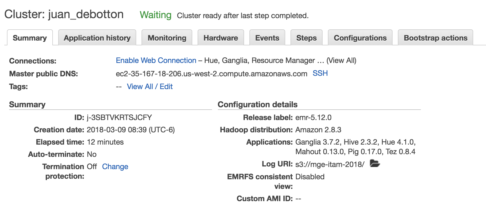
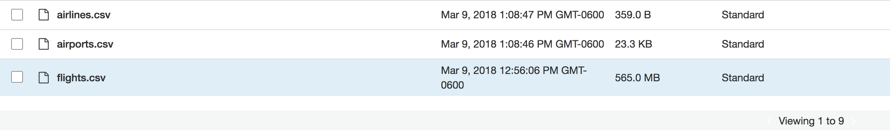
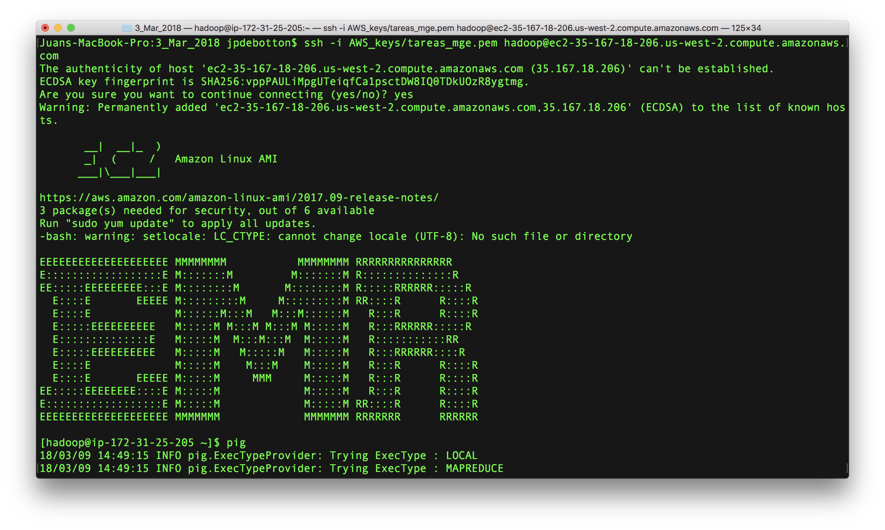
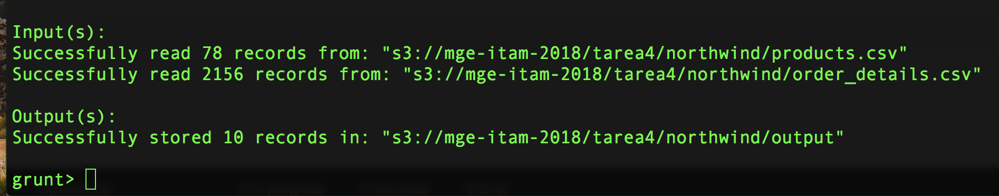
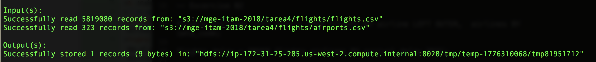
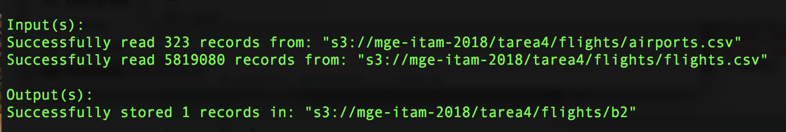
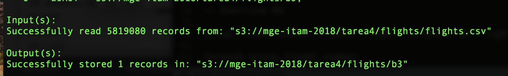
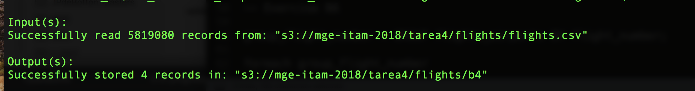
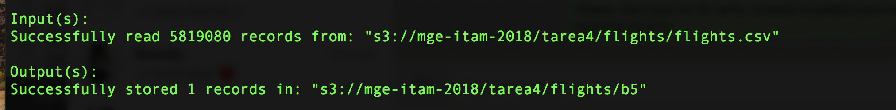
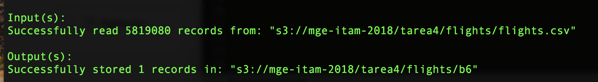

```{r setup, include=FALSE}
knitr::opts_chunk$set(echo = TRUE)
```

## Tarea 4 - Pig

### Foto del Cluster




### Subimos Northwind a S3


### Subimos Flights a S3




### Conexión SSH para pruebas interactivas



### Ejercicio A

#### A.1

Modifica el ejercicio de Rank para que en lugar de obtener el id del producto con mejor rank obtengamos el nombre del producto -requieres un join- con el mejor rank

```{r eval=FALSE}
-- Cargar datos de Order Details y quedarnos con columna productid
order_details = LOAD 's3://mge-itam-2018/tarea4/northwind/order_details.csv' using PigStorage(',') as (orderid:chararray, productid:chararray, unitprice:float, quantity:int, discount:float);

product_order_details = FOREACH order_details GENERATE productid;

-- Cargar datos de Order Details y quedarnos con columnas productid y product_name

products = LOAD 's3://mge-itam-2018/tarea4/northwind/products.csv' using PigStorage(',') as (productid:chararray, productname:chararray, supplierid:chararray, categoryid:chararray, quantityperunit:int, unitprice:float, unitsinstock:int, unitsonorder:int, reorderlevel:int, discounted:int);

product_names = FOREACH products GENERATE productid, productname;

-- Join y limpiar el Join
product_join_orders = JOIN product_order_details BY productid, product_names BY productid;
product_join_orders_clean = FOREACH product_join_orders GENERATE $1, $2;

-- Agrupar y contar
group_products = GROUP product_join_orders_clean BY productname;
count_products = FOREACH group_products GENERATE $0 AS product_names, COUNT($1) as n;

-- Rankear y Top 10
ranked = rank count_products by n DESC;
top_10 = limit ranked 10;

-- Guardar Salida
STORE top_10 into 's3://mge-itam-2018/tarea4/northwind/output' USING PigStorage(',');
```



#### Ranking Productos
#### 1,Raclette Courdavault,54
#### 2,Camembert Pierrot,51
#### 2,Guaraná Fantástica,51
#### 2,Gorgonzola Telino,51
#### 5,Gnocchi di nonna Alice,50
#### 6,Tarte au sucre,48
#### 7,Jack's New England Clam Chowder,47
#### 8,Rhönbräu Klosterbier,46
#### 9,Chang,44
#### 10,Pavlova,43

### Ejercicio B

#### B.1 ¿Cuántos vuelos existen en el dataset cuyo aeropuerto destino sea el "Honolulu International Airport"?

#### 43,157

```{r eval=FALSE}
-- Cargamos los datos a PIG y hacemos un JOIN

airports = LOAD 's3://mge-itam-2018/tarea4/flights/airports.csv' using PigStorage(',') as (iata_code:chararray, airport:chararray, city:chararray, state:chararray, country:chararray, latitude:float, longitude:float);

flights = LOAD 's3://mge-itam-2018/tarea4/flights/flights.csv' using PigStorage(',') as (year:int, month:int, day:int, day_of_week:int, airline:chararray, flight_number:int, tail_number:chararray, origin_airport:chararray, destination_airport:chararray, scheduled_departure:int, departure_time:int, departure_delay:int, taxi_out:int, wheels_off:int, scheduled_time:int, elapsed_time:int, air_time:int, distance:int, wheels_on:int, taxi_in:int, scheduled_arrival:int, arrival_time:int, arrival_delay:int, diverted:int, cancelled:int, cancellation_reason:chararray, air_system_delay:chararray,	security_delay:chararray, airline_delay:chararray, late_aircraft_delay:chararray, weather_delay:chararray);

airlines = LOAD 's3://mge-itam-2018/tarea4/flights/airports.csv' using PigStorage(',') as (iata_code:chararray, airline:chararray);

flights_airports = JOIN flights BY destination_airport, airports BY iata_code;

-- Filtramos por el nombre del aeropuerto y contamos ocurrencias

honolulu = FILTER flights_airports BY airport == 'Honolulu International Airport';

group_honolulu = GROUP honolulu BY airport;
num_honolulu = FOREACH group_honolulu GENERATE COUNT($1);

-- Guardamos nuestra salida en b1
STORE num_honolulu INTO 's3://mge-itam-2018/tarea4/flights/b1/' using PigStorage(','); 
```


#### B.2 ¿Cuál es el vuelo con más retraso? ¿De qué aerolínea es?

#### El vuelo 1322 de American Airlines (AA)

```{r eval=FALSE}
-- Hacemos un LEFT JOIN de las aerolíneas y ordenamos por arrival_delay

flights_airlines_left_join = JOIN flights BY airline LEFT OUTER, airlines BY iata_code;

flights_delay = ORDER flights_airlines_left_join BY arrival_delay DESC;

-- Escogemos el vuelo con mayor delay
max_delay = LIMIT flights_delay 1;

-- Guardamos nuestra salida en b2
STORE max_delay INTO 's3://mge-itam-2018/tarea4/flights/b2/' using PigStorage(','); 

```



#### B.3 ¿Qué día es en el que más vuelos cancelados hay?

#### El día número 1 (asumimos que es Domingo). Hay 21,073 vuelos cancelados

```{r eval=FALSE}
ancelled = FILTER flights BY cancelled == 1;

group_cancelled = GROUP cancelled BY day_of_week;

sum_cancelled_dow = FOREACH group_cancelled GENERATE group AS day_of_week, COUNT($1) as total;

ord_cancelled_dow = ORDER sum_cancelled_dow BY total DESC; 

top_cancelled_dow = LIMIT ord_cancelled_dow 1;

-- Guardamos nuestra salida en b3
STORE top_cancelled_dow INTO 's3://mge-itam-2018/tarea4/flights/b3/' using PigStorage(','); 

```



#### B.4 ¿Cuáles son los aeropuertos orígen con 17 cancelaciones?

#### DHN,17
#### DIK,17
#### ESC,17
#### 14107,17

```{r eval=FALSE}
-- Agrupamos y sumamos cancelaciones

group_cancelled_airport = GROUP cancelled BY origin_airport;

sum_cancelled_airport = FOREACH group_cancelled_airport GENERATE group AS airport, COUNT($1) as num_cancelled;

-- Filtramos donde las cancelaciones sean exactamente 17

cancelled_17 = FILTER sum_cancelled_airport by num_cancelled == 17;

-- Guardamos nuestra salida en b4
STORE cancelled_17 INTO 's3://mge-itam-2018/tarea4/flights/b4/' using PigStorage(',');

```



#### B.5 ¿Cuál es el aeropuerto origen con más vuelos cancelados?

#### Chicago O'Hare International Airport

```{r eval=FALSE}

-- Ordenamos nuestra base de datos por cancelaciones. Nos quedamos con el aeropuerto con más cancelaciones

ord_cancelled_airport = ORDER sum_cancelled_airport BY num_cancelled DESC;

top_cancelled_airport = LIMIT ord_cancelled_airport 1;

-- Guardamos nuestra salida en b5
STORE top_cancelled_airport INTO 's3://mge-itam-2018/tarea4/flights/b5/' using PigStorage(',');
```



#### B.6 ¿Cuál es el vuelo (flight number) con mayor diversidad de aeropuertos destino, cuáles son estos destinos? (ocupar bag te ayudará en esta pregunta)

#### Es el vuelo 202 que visita 68 destinos

```{r eval=FALSE}
-- Agrupamos nuestros vuelos por número de vuelo, calculamos los aeropuertos de destino, agrupando por número de vuelo y contamos los destinos únicos en un bag

unique_destinations = foreach (GROUP flights BY flight_number){unique_destination = DISTINCT flights.destination_airport; generate group as flight_number, COUNT(unique_destination) as sum_unique_destination, unique_destination;};

-- Ordenamos nuestro bag por el número de destinos y escogemos el que tiene mayor número de destinos

unique_destinations_ord = ORDER unique_destinations BY sum_unique_destination DESC;

top_unique_destination = LIMIT unique_destinations_ord 1;

-- Guardamos nuestra salida en b6
STORE top_unique_destination INTO 's3://mge-itam-2018/tarea4/flights/b6/' using PigStorage(',');

```



