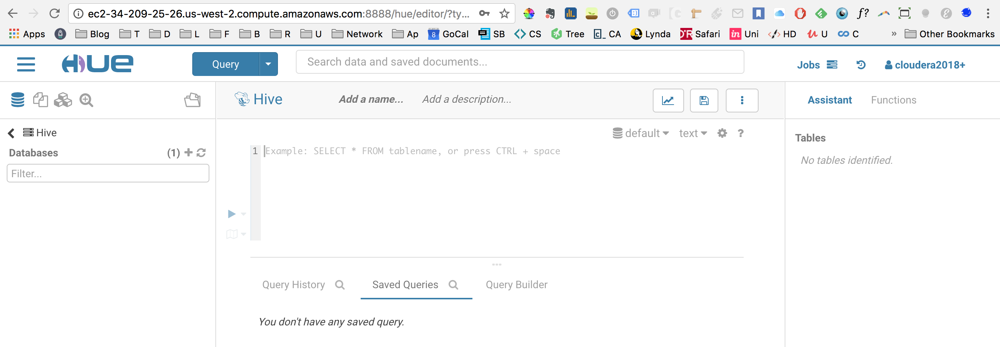

## Tarea 5 - Hive

### Foto del Cluster


### Conexión SSH para pruebas interactivas


### Abrimos la interfaz de Hue



### y cargamos las tablas


### Ejercicio 1

#### 1.a ¿Cuántos 'jefes' hay en la tabla empleados? ¿Cuáles son estos jefes: número de empleado, nombre, apellido, título, fecha de nacimiento, fecha en que iniciaron en la empresa, ciudad y país? (atributo reportsto, ocupa explode en tu respuesta)

#### 2 jefes, los datos sobre los jefes están en la salida en /tarea5/salidas/1a


```{r eval=FALSE}

```


#### 1.b ¿Quién es el segundo ???mejor??? empleado que más órdenes ha generado? (nombre, apellido, título, cuándo entró a la compañía, número de órdenes generadas, número de órdenes generadas por el mejor empleado (número 1))

#### El segundo mejor empleado es Janet Leverling y ha generado 127 órdenes, mientras que el mejor empleado (Margaret Peacock) ha generado 156 órdenes

```{r eval=FALSE}

```


#### 1.c ¿Cuál es el delta de tiempo más grande entre una orden y otra?

#### El delta de tiempo más grande entre una orden y otra es de 3

```{r eval=FALSE}
CREATE TEMPORARY TABLE orders_delta AS
SELECT orderid,
from_utc_timestamp(date_format(orderdate,'yyyy-MM-dd HH:mm:ss.SSS'),'UTC') AS order_date,
datediff(orderdate, lag(orderdate) OVER (order by orderid)) AS delta
FROM orders
ORDER BY delta DESC;

SELECT MAX(delta) AS max_delta FROM orders_delta;

SELECT * FROM orders_delta WHERE delta IN (SELECT MAX(delta) AS delta FROM orders_delta);
```


### Ejercicio 2

#### 2.a ¿Qué aerolíneas (nombres) llegan al aeropuerto ???Honolulu International Airport????

#### American Airlines Inc.
#### US Airways Inc.
#### Virgin America
#### Alaska Airlines Inc.
#### Delta Air Lines Inc.
#### Hawaiian Airlines Inc.
#### United Air Lines Inc.

```{r eval=FALSE}
USE flights;

SELECT DISTINCT(f.airline) as hnl_airlines, a.airline AS hnl_airline_name FROM flights f
JOIN airlines a
ON a.iata_code = f.airline
WHERE destination_airport = 'HNL';
```


#### 2.b ¿En qué horario (hora del día, no importan los minutos) hay salidas del aeropuerto de San Francisco (???SFO???) a ???Honolulu International Airport????

#### 6, 7, 8, 9, 10, 11, 12, 13, 14, 15, 16, 17, 18, 19

```{r eval=FALSE}
SELECT DISTINCT SUBSTRING(LPAD(scheduled_departure,4,"0"),1,2) AS hour
FROM flights f WHERE f.destination_airport='HNL' and f.origin_airport='SFO';
```


#### 2.c ¿Qué día de la semana y en qué aerolínea nos conviene viajar a ???Honolulu International Airport??? para tener el menor retraso posible?

#### Martes, Alaska Airlines

```{r eval=FALSE}
SELECT f.day_of_week, f.airline, a.airline, AVG(f.departure_delay) AS avg_delay
FROM flights f
JOIN airlines a
ON a.iata_code = f.airline
WHERE f.destination_airport = 'HNL'
GROUP BY f.day_of_week, f.airline, a.airline
ORDER BY avg_delay ASC;
```


#### 2.d ¿Cuál es el aeropuerto con mayor tráfico de entrada?

#### Hartsfield-Jackson Atlanta International Airport

```{r eval=FALSE}
SELECT f.destination_airport, a.airport, COUNT(f.destination_airport) AS total_llegadas
FROM flights f
JOIN airports a
ON a.iata_code = f.destination_airport
GROUP BY f.destination_airport, a.airport
ORDER BY total_llegadas DESC LIMIT 10;
```


#### 2.e ¿Cuál es la aerolínea con mayor retraso de salida por día de la semana?

#### American Airlines en todos los casos tiene los vuelos con mayor retraso

```{r eval=FALSE}
SELECT f.airline, a.airline, f.day_of_week, f.departure_delay FROM flights f
JOIN (
	SELECT day_of_week, MAX(departure_delay) AS maximo FROM flights 
	GROUP BY day_of_week
) ff
ON f.departure_delay = ff.maximo
JOIN airlines a
ON f.airline = a.iata_code
ORDER BY f.day_of_week;
```


#### 2.f ¿Cuál es la tercer aerolínea con menor retraso de salida los lunes (day of week = 2)?

#### Atlantic Southeast Airlines

```{r eval=FALSE}
SELECT f.airline, a.airline, min(f.departure_delay) AS menor
FROM flights f
JOIN airlines a
ON a.iata_code = f.airline
WHERE day_of_week = 2
GROUP BY f.airline, a.airline
ORDER BY menor ASC
LIMIT 3;
```


#### 2.g Cuál es el aeropuerto origen que llega a la mayor cantidad de aeropuertos destino diferentes?


#### Hartsfield-Jackson Atlanta International Airport llega a 169 aeropuertos

```{r eval=FALSE}
SELECT a.airport, COUNT(DISTINCT f.destination_airport) AS num_destinos
FROM flights f
JOIN airports a
ON a.iata_code = f.origin_airport
GROUP BY a.airport
ORDER BY num_destinos DESC 
LIMIT 1;
```


