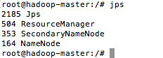
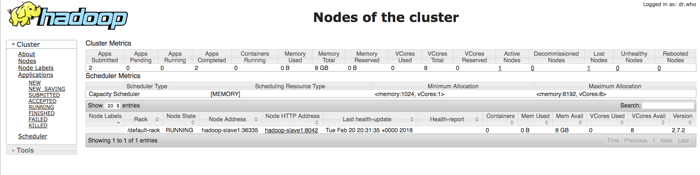
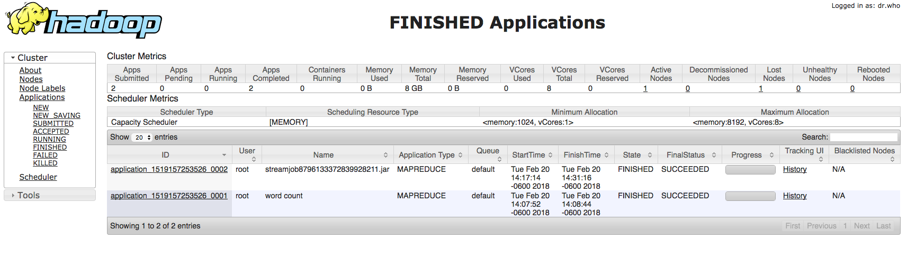
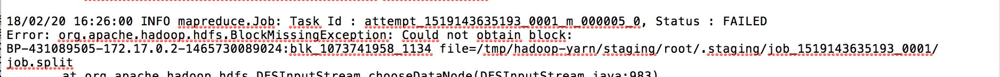
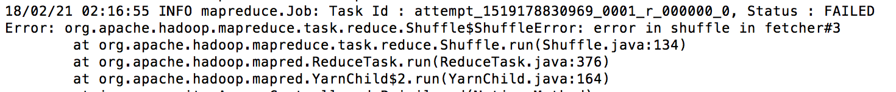

### Primer intento

Los siguientes ejercicios son utilizando su cluster multinodo creado con su imagen de docker: 

[imagen](https://github.com/kiwenlau/hadoop-cluster-docker)

1. Ejercicio 1: Utilizando los datos de [ecobici_2010_2017](https://www.dropbox.com/sh/u0g3g378xfdyxot/AACN77EAFN1rjNkPemkX-PWZa?dl=0) y MapReduce averigua ¿Cuántos registros hay por cicloestación? 
- Se corrió el mapreduce con los primero datos de ecobici como prueba.

    + Imágen del jps del clúster
    

    
    

    
    + Imágen de `localhost:8088` seleccionando la opción Nodes
    

    
    

    
    + Imágen de `localhost:8088` seleccionando la opción FINISHED para ver que los jobs corrieron existosamente
    

    
    

    
+ El ejercicio completo no se puedo resolver, pues la computadora tuvo problema. 

+ Para los ejercicios 2 y 3 intentamos lo mismo. 

+ Se intentó con la imagen de Fernando pero se cae un nodo.

+ Seguimos intentando.

