<script>
   $(document).ready(function() {
     $head = $('#header');
     $head.prepend('')
   });
</script>

```{r message=FALSE, warning=FALSE, paged.print=FALSE, echo=FALSE}
library(tidyverse)
```

### Foto de tu clúster de AWS 

+ management console

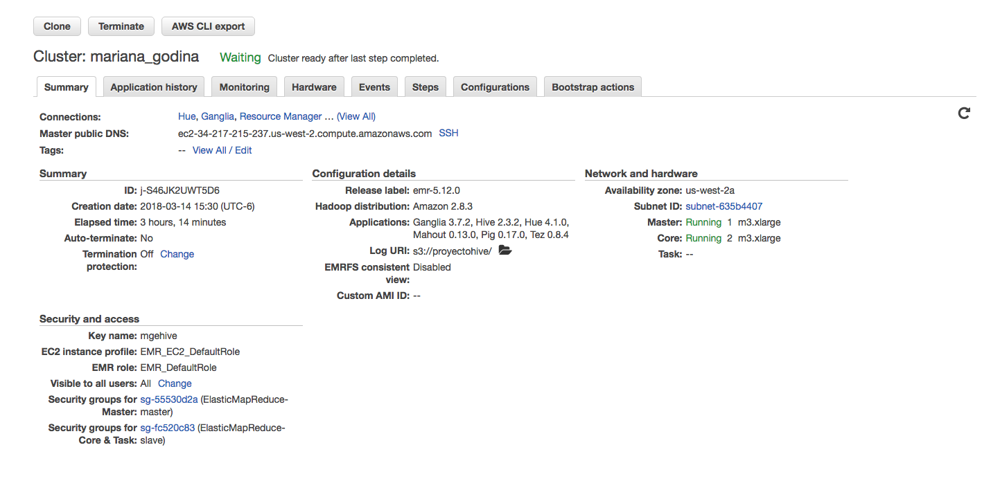

### Ejercicio 1

a. ¿Cuántos “jefes” hay en la tabla empleados? 

- Hay 2 "jefes"

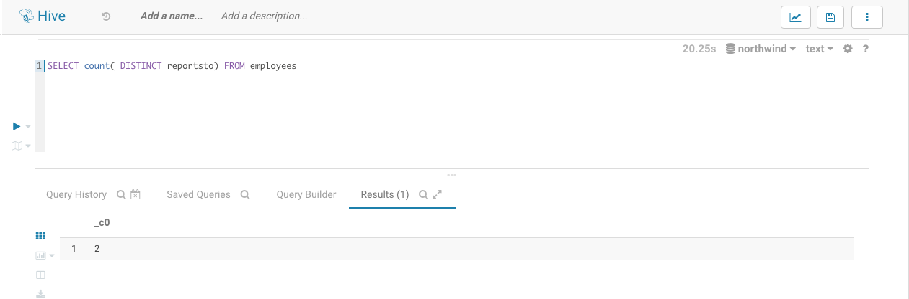

```{r message=FALSE, warning=FALSE}
read_csv("Ejercicio1/query-hive-8.csv")
```

¿Cuáles son estos jefes: número de empleado, nombre, apellido, título, fecha de nacimiento, fecha en que iniciaron en la empresa, ciudad y país? (atributo reportsto, ocupa explode en tu respuesta)

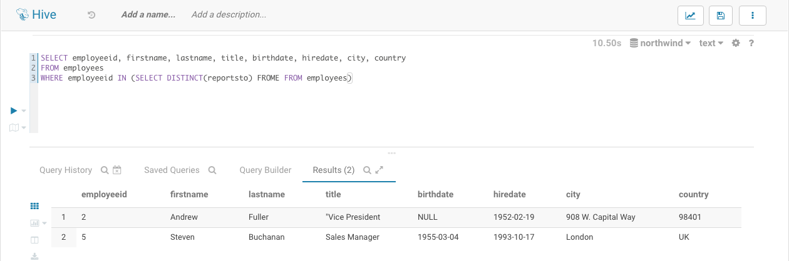

```{r message=FALSE, warning=FALSE}
read_csv("Ejercicio1/query-hive-10.csv")
```

b. ¿Quién es el segundo “mejor” empleado que más órdenes ha generado? (nombre, apellido, título, cuándo entró a la compañía, número de órdenes generadas, número de órdenes generadas por el mejor empleado (número 1))

- La segunda "mejor" empleada es Janet con 127 ordenes generadas.

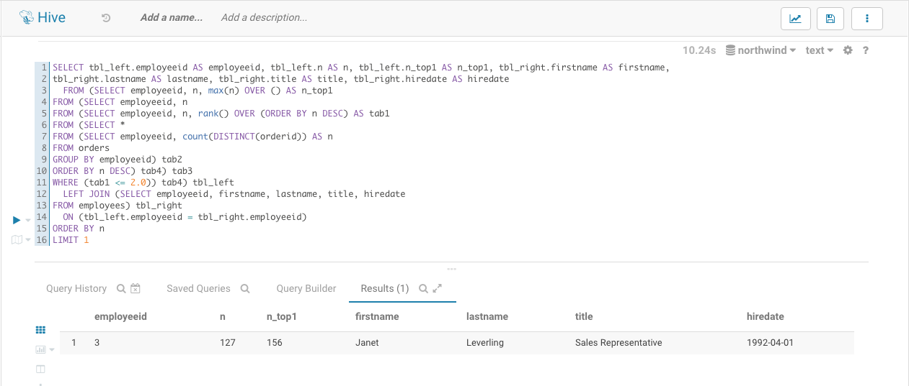

```{r message=FALSE, warning=FALSE}
read_csv("Ejercicio1/query-hive-23.csv")
```

c. ¿Cuál es el delta de tiempo más grande entre una orden y otra?

- 3 días es el tiempo más grande entre una orden y otra
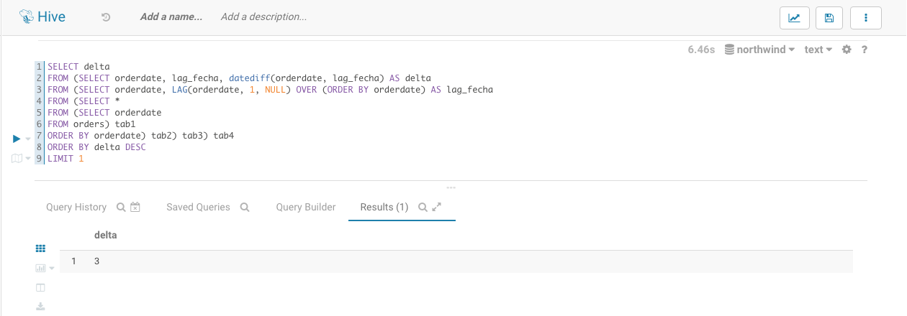

```{r message=FALSE, warning=FALSE}
read_csv("Ejercicio1/query-hive-46.csv")
```

### Ejercicio 2

a. ¿Qué aerolíneas (nombres) llegan al aeropuerto “Honolulu International Airport”?

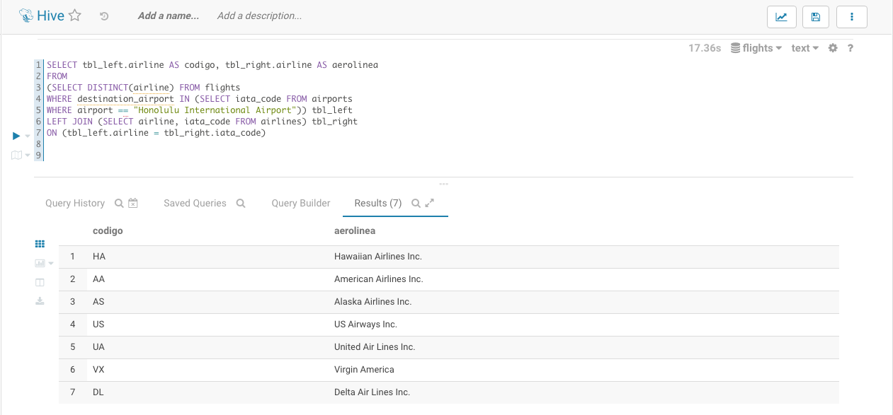

```{r message=FALSE, warning=FALSE}
read_csv("Ejercicio2/query-hive-44.csv")
```

b. ¿En qué horario (hora del día, no importan los minutos) hay salidas del aeropuerto de San Francisco (“SFO”) a “Honolulu International Airport”?

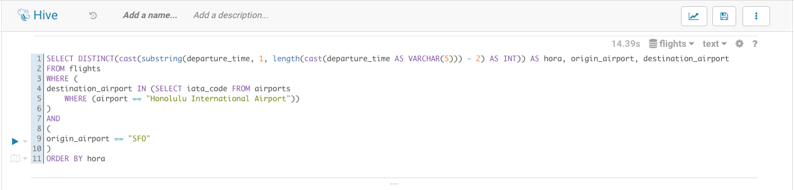

```{r message=FALSE, warning=FALSE}
read_csv("Ejercicio2/query-hive-94.csv")
```

c. ¿Qué día de la semana y en qué aerolínea nos conviene viajar a “Honolulu International Airport” para tener el menor retraso posible?

- El día de la semana que nos conviene viajar a “Honolulu International Airport” es el Martes por la aerolínea Alska Airlines Inc.

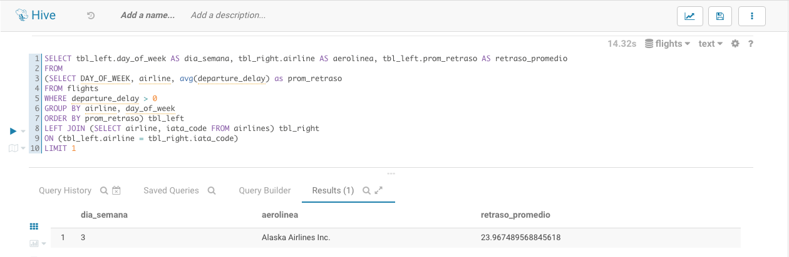

```{r message=FALSE, warning=FALSE}
read_csv("Ejercicio2/query-hive-108.csv")
```

d. ¿Cuál es el aeropuerto con mayor tráfico de entrada?

- El aeropuerto con mayor tráfico es el de atlanta

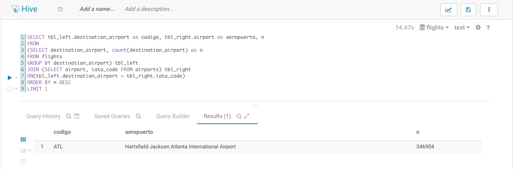

```{r message=FALSE, warning=FALSE}
read_csv("Ejercicio2/query-hive-133.csv")
```

e. ¿Cuál es la aerolínea con mayor retraso de salida por día de la semana?

- La aerolínea con mayor retras todos los días de la semana es American Airlines

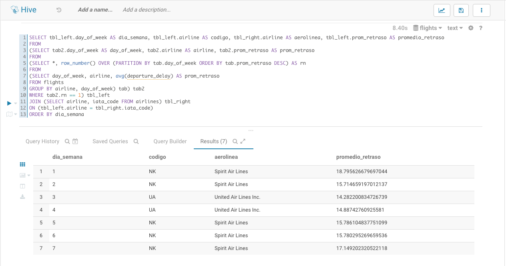

```{r message=FALSE, warning=FALSE}
read_csv("Ejercicio2/query-hive-225.csv")
```

f. ¿Cuál es la tercer aerolínea con menor retraso de salida los lunes (day of week = 2)?

- La tercer aerolínea con menor retraso es Southwest Airlines Co.

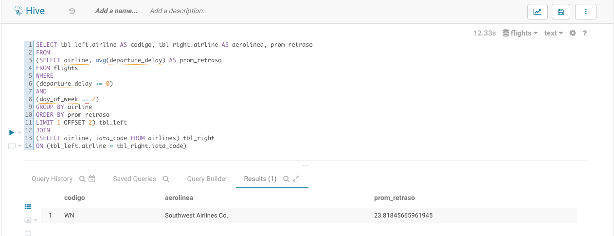

```{r message=FALSE, warning=FALSE}
read_csv("Ejercicio2/query-hive-179.csv")
```


g. ¿Cuál es el aeropuerto origen que llega a la mayor cantidad de aeropuertos destino diferentes?

- El aeropuerto origen que llega a la mayor cantidad de aeropuertos es 

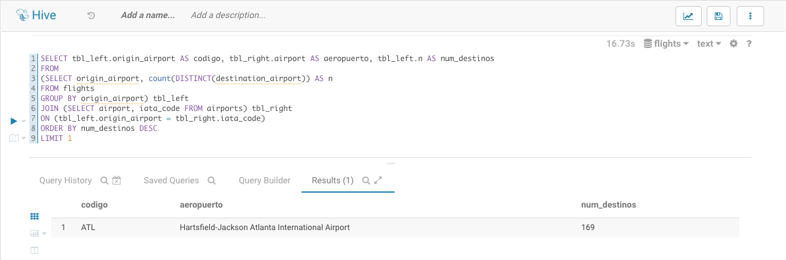

```{r message=FALSE, warning=FALSE}
read_csv("Ejercicio2/query-hive-188.csv")
```