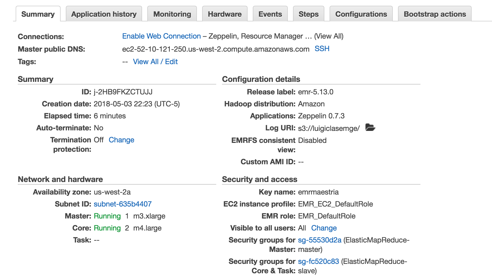
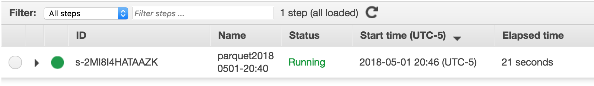
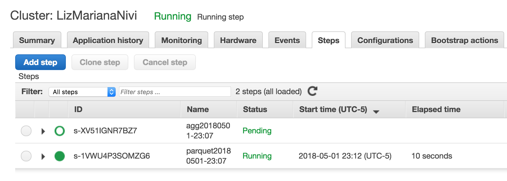
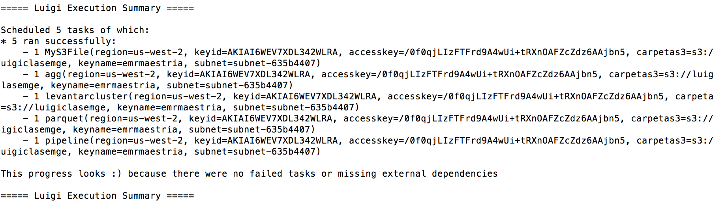

<script>
   $(document).ready(function() {
     $head = $('#header');
     $head.prepend('')
   });
</script>

### Pasos a seguir

+ En la carpeta se encuentran los archivos parquet.py y agg.py

Tanto en el archivo parquet.py y agg.py es necesario poner su carpeta de s3, ya que no logramos poner como input esta instrucción.

+ Agregar ambos archivos .py al bucket de s3 junto con los datos all_data.csv

+ Instalar los requerimientos requirements.txt

+ Desde terminal correr tarea8.py

Se neceista las llaves de aws, el bucket de s3 y subnet

```
PYTHONPATH="." luigi --module tarea8 pipeline --region 'us-west-2' --keyid 'key_id'  --accesskey 'access_key' --carpetas3 's3://nombre_carpeta' --keyname 'key_name' --subnet 'subnet-' --local-scheduler
```
+ El output del agg.py se encontrará en una carpeta con nombre salida dentro de la carpeta donde esta corriendo la terminal.

### Cluster



### Step 1 parquet



### Step 2 agg



### Correr luigi



### Salida

```{r, echo=FALSE, warning=FALSE, message=FALSE}
library(tidyverse)
read_csv("salida_cortada.csv")
```

