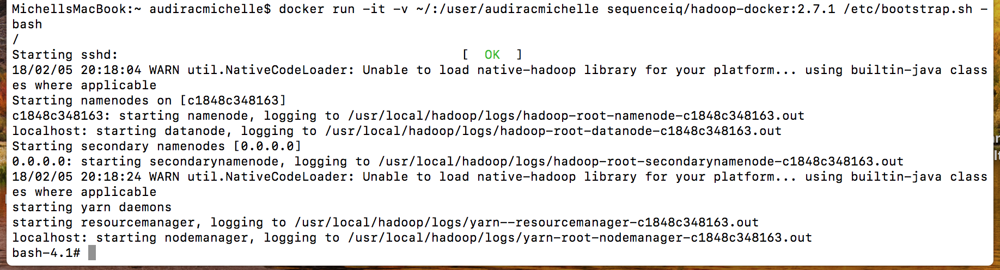
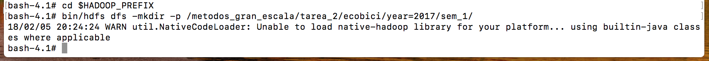
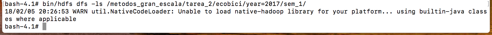
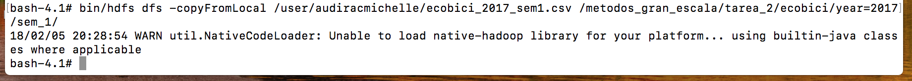
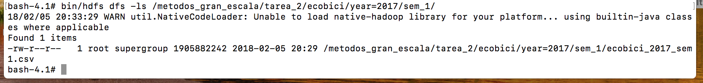
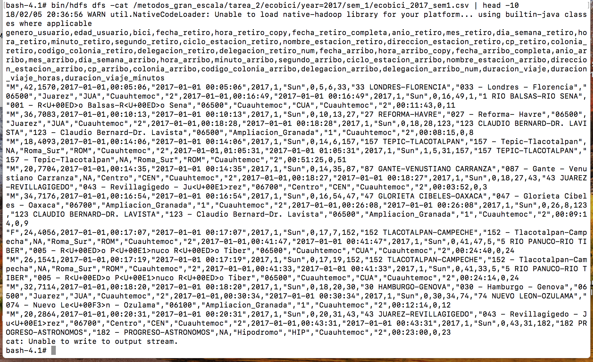
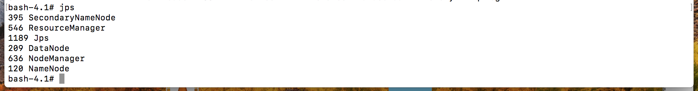
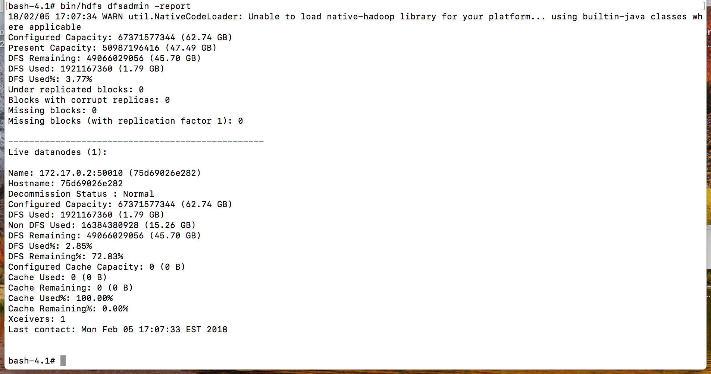

```{r setup, include=FALSE}
knitr::opts_chunk$set(echo = TRUE)
```

# Tarea 2

### Paso 1: Descargar los datos

Descargamos la base de datos desde dropbox con la siguiente url: https://www.dropbox.com/sh/u0g3g378xfdyxot/AACN77EAFN1rjNkPemkX-PWZa?dl=0

### Paso 2: Bajar la imagen de Hadoop

Hacemos un docker pull a la imagen de hadoop de sequenceiq con el comando: `docker pull sequenceiq/hadoop-docker:2.7.1.` 

La url del github es la siguiente: https://github.com/sequenceiq/hadoop-docker

### Paso 3: Correr la imagen de Hadoop

Corremos la imagen de hadoop que bajamos y generamos un volumen mediante el siguiente comando: `docker run -it -v ~/:/user/audiracmichelle sequenceiq/hadoop-docker:2.7.1 /etc/bootstrap.sh -bash/`



### Paso 4: Creamos el directorio en HDFS

Primero nos situamos donde se encuentran los archivos binarios de HDFS con el comando: `cd $HADOOP_PREFIX` y enseguida podemos crear el directorio utilizando el comando `bin/hdfs dfs -mkdir -p /metodos_gran_escala/tarea_2/ecobici/year=2017/sem_1/`



### Paso 5: Verificamos que el directorio en HDFS está vacío

Verificamos que está vacío mediante el comando `bin/hdfs dfs -ls /metodos_gran_escala/tarea_2/ecobici/year=2017/sem_1/`



### Paso 6: Copiamos el archivo .csv desde nuestro volumen hacia el HDFS

Copiamos los datos de ecobici desde nuestro volumen hacia el HDFS con el comando:
`bin/hdfs dfs -copyFromLocal /user/audiracmichelle/ecobici_2017_sem1.csv /metodos_gran_escala/tarea_2/ecobici/year=2017/sem_1/`



### Paso 7: Verificamos que el directorio en HDFS tenga nuestro archivo
Mediante el comando `bin/hdfs dfs -ls /metodos_gran_escala/tarea_2/ecobici/year=2017/sem_1/`



e imprimimos las primeras diez filas `bin/hdfs dfs -cat /metodos_gran_escala/tarea_2/ecobici/year=2017/sem_1/ecobici_2017_sem1.csv | head -10`



### Paso 8: Verificamos que están levantados Hadoop (namenode y datanode) así como yarn (resource-manager y node-manager)
Utilizamos el comando `jps`



### Paso 9: Verificamos el % del DFS que está ocupado por nuestros datos
Utilizamos el comando `bin/hdfs dfsadmin -report` y vemos que se ha utilizado el 3.77%

