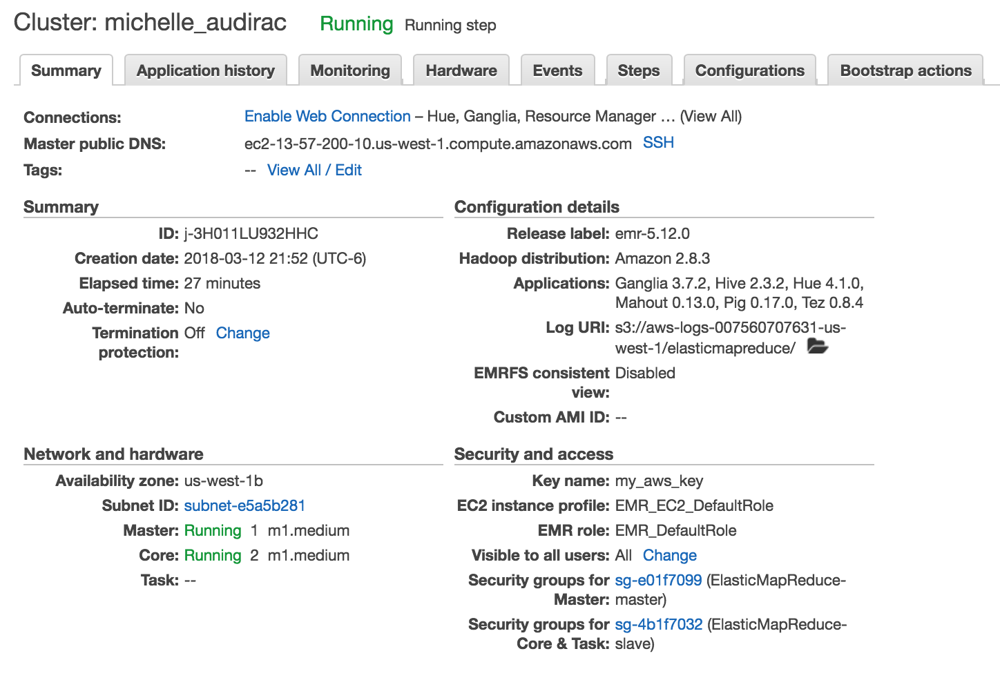

```{r setup, include=FALSE}
knitr::opts_chunk$set(echo = TRUE)
```

## Entregables

### Foto de mi cluster



### Ejercicio 1a

1a. ¿Cuántos "jefes" hay en la tabla empleados? ¿Cuáles son estos jefes: número de empleado, nombre, apellido, título, fecha de nacimiento, fecha en que iniciaron en la empresa, ciudad y país? (atributo reportsto, ocupa explode en tu respuesta)

* hive query

```{bash}
cat ./1a/1a.hql
```

El output se encuentra en [./1a/output](./1a/output) y se ve así

```{bash}
cat ./1a/output/1a
```

### Ejercicio 1b

1b. ¿Quién es el segundo "mejor" empleado que más órdenes ha generado? (nombre, apellido, título, cuándo entró a la compañía, número de órdenes generadas, número de órdenes generadas por el mejor empleado (número 1)) 

* hive query

```{bash}
cat ./1b/1b.hql
```

El output se encuentra en [./1b/output](./1b/output) y se ve así

```{bash}
cat ./1b/output/1b
```

### Ejercicio 1c

1c. ¿Cuál es el delta de tiempo más grande entre una orden y otra?

* hive query

```{bash}
cat ./1c/1c.hql
```

* La delta más grande es 3

El output se encuentra en [./1b/output](./1b/output) y se ve así

```{bash}
cat ./1c/output/1c
```

### Ejercicio 2a

2a. ¿Qué aerolíneas (nombres) llegan al aeropuerto "Honolulu International Airport"?

* hive query

```{bash}
cat ./2a/2a.hql
```

El output se encuentra en [./2a/output](./2a/output) y se ve así

```{bash}
cat ./2a/output/2a
```

### Ejercicio 2b

2b. ¿En qué horario (hora del día, no importan los minutos) hay salidas del aeropuerto de San Francisco ("SFO") a "Honolulu International Airport"

* hive query

```{bash}
cat ./2b/2b.hql
```

El output se encuentra en [./2b/output](./2b/output) y se ve así

```{bash}
cat ./2b/output/2b
```

### Ejercicio 2c

2c. ¿Qué día de la semana y en qué aerolínea nos conviene viajar a "Honolulu International Airport" para tener el menor retraso posible? 

* hive query

```{bash}
cat ./2c/2c.hql
```

* En Virgin America los lunes

El output se encuentra en [./2c/output](./2c/output) y se ve así

```{bash}
cat ./2c/output/2c
```

### Ejercicio 2d

2d. ¿Cuál es el aeropuerto con mayor tráfico de entrada?

* hive query

```{bash}
cat ./2d/2d.hql
```

* tenemos registrados 346,904 vuelos con destino a ATL (Hartsfield-Jackson Atlanta International Airport)

El output se encuentra en [./2d/output](./2d/output) y se ve así

```{bash}
cat ./2d/output/2d
```

### Ejercicio 2e

2e. ¿Cuál es la aerolínea con mayor retraso de salida por día de la semana? 

* hive query

```{bash}
cat ./2e/2e.hql
```

* tenemos que los días de la semana 3 y 4 (martes y miércoles) es UA (United Airlines) y el resto de los días es NK (Spirit Air Lines)

El output se encuentra en [./2e/output](./2e/output) y se ve así

```{bash}
cat ./2e/output/2e
```

### Ejercicio 2f

2f. ¿Cuál es la tercer aerolínea con menor retraso de salida los lunes (day of week = 2)?

* hive query

```{bash}
cat ./2f/2f.hql
```

* en el rank 3 está US (US Airways Inc.)

El output se encuentra en [./2f/output](./2f/output) y se ve así

```{bash}
cat ./2f/output/2f
```

### Ejercicio 2g

2g. ¿Cuál es el aeropuerto origen que llega a la mayor cantidad de aeropuertos destino diferentes?

* hive query

```{bash}
cat ./2g/2g.hql
```

* tenemos que el aeropuerto con mayor cantidad de destinos es ATL (Hartsfield-Jackson Atlanta International Airport) con 169 destinos

El output se encuentra en [./2g/output](./2g/output) y se ve así

```{bash}
cat ./2g/output/2g
```

