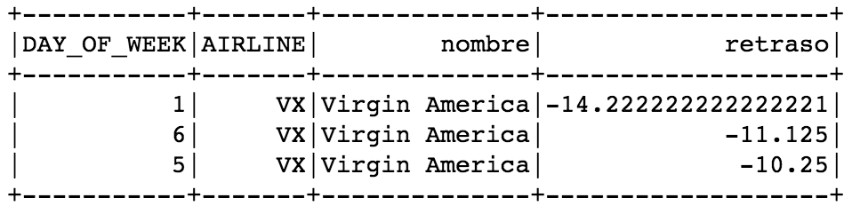

```{r setup, include=FALSE}
knitr::opts_chunk$set(echo = TRUE)
```

## Entregables

### Foto de docker corriendo contenedor de jupyter/pyspark-notebook


### Ejercicio 1a

1a. ¿Cuántos "jefes" hay en la tabla empleados? ¿Cuáles son estos jefes: número de empleado, nombre, apellido, título, fecha de nacimiento, fecha en que iniciaron en la empresa, ciudad y país? (atributo reportsto, ocupa explode en tu respuesta)

* spark sql query

```{}
res = spark.sql("""SELECT employeeid,firstname,lastname,titleofcourtesy,
birthdate,hiredate,city,country FROM employees where employeeid 
IN ( select distinct reportsto from employees where reportsto >0)""")
res.toPandas()
```

* imagen output


* El .csv output se encuentra en [./1a/](./1a/)

### Ejercicio 1b

1b. ¿Quién es el segundo "mejor" empleado que más órdenes ha generado? (nombre, apellido, título, cuándo entró a la compañía, número de órdenes generadas, número de órdenes generadas por el mejor empleado (número 1)) 

* spark sql query

```{}
res = spark.sql("""SELECT lastname, firstname, title, hiredate, count(*) 
as total_ordenes FROM orders JOIN employees 
ON orders.employeeid = employees.employeeid 
GROUP BY lastname, firstname, title, hiredate 
ORDER BY total_ordenes DESC LIMIT 2
""")
res.toPandas().loc[1]
```

* imagen output


* La delta más grande es 3

El .csv output se encuentra en [./1b/](./1b/)


### Ejercicio 1c

1c. ¿Cuál es el delta de tiempo más grande entre una orden y otra?

* spark sql query

```{}
res = spark.sql("""
SELECT orderid, orderdate, lag(orderdate) OVER(ORDER BY orderid), 
datediff(orderdate, lag(orderdate) OVER(ORDER BY orderid)) delta
FROM orders 
ORDER BY delta DESC LIMIT 5
""")
res.toPandas()
```

* imagen output


* La delta más grande es 3

El .csv output se encuentra en [./1c/](./1c/)

### Ejercicio 2a

2a. ¿Qué aerolíneas (nombres) llegan al aeropuerto "Honolulu International Airport"?

* spark sql query

```{}
dest = flights.select("AIRLINE").where("DESTINATION_AIRPORT = 'HNL'").distinct()
aerolinea = airlines.select("IATA_CODE", 
                          airlines.AIRLINE.alias("nombre"))
ej_2a = dest.join(aerolinea, dest.AIRLINE == aerolinea.IATA_CODE, 'left')
ej_2a = ej_2a.select("AIRLINE", "nombre")

ej_2a.show()
ej_2a.repartition(1).write.csv('2a')
```

* imagen output


* El .csv output se encuentra en [./2a/](./2a/)

### Ejercicio 2b

2b. ¿En qué horario (hora del día, no importan los minutos) hay salidas del aeropuerto de San Francisco ("SFO") a "Honolulu International Airport"

* spark sql query

```{}
horas = flights.withColumn("HORAS", floor(flights.SCHEDULED_DEPARTURE / 100))
ej_2b = horas.select("HORAS").where("destination_airport = 'HNL' AND origin_airport = 'SFO'")\
.distinct()

ej_2b.show()
ej_2b.repartition(1).write.csv('2b')
```

* imagen output


* El .csv output se encuentra en [./2b/](./2b/)


### Ejercicio 2c

2c. ¿Qué día de la semana y en qué aerolínea nos conviene viajar a "Honolulu International Airport" para tener el menor retraso posible? 

* spark sql query

```{}
retraso = flights.select(flights.DAY_OF_WEEK, 
                         flights.ARRIVAL_DELAY.cast("float").alias("ARRIVAL_DELAY"),
                        flights.DESTINATION_AIRPORT,
                        flights.AIRLINE)
retraso = retraso.where("DESTINATION_AIRPORT = 'HNL'")
retraso = retraso.groupBy("DAY_OF_WEEK", "AIRLINE").avg("ARRIVAL_DELAY")
retraso = retraso.sort(retraso["avg(ARRIVAL_DELAY)"]).limit(3)

aerolinea = airlines.select("IATA_CODE", 
                          airlines.AIRLINE.alias("nombre"))
ej_2c = retraso.join(aerolinea, retraso.AIRLINE == aerolinea.IATA_CODE, 'left')
ej_2c = ej_2c.select("DAY_OF_WEEK",
                    "AIRLINE",
                    "nombre",
                    ej_2c["avg(ARRIVAL_DELAY)"].alias("retraso"))

ej_2c.show()
ej_2c.repartition(1).write.csv('2c')
```

* imagen output



* En Virgin America los lunes

El .csv output se encuentra en [./2c/](./2c/)

### Ejercicio 2d

2d. ¿Cuál es el aeropuerto con mayor tráfico de entrada?

* spark sql query

```{}
destino = flights.groupBy("DESTINATION_AIRPORT").count().sort(desc("count")).limit(3)
aeropuerto = airports.select("IATA_CODE", "AIRPORT")

ej_2d = destino.join(aeropuerto, destino.DESTINATION_AIRPORT == aeropuerto.IATA_CODE, 'left')
ej_2d.show()
ej_2d.repartition(1).write.csv('2d')
```

* imagen output


* tenemos registrados 346,904 vuelos con destino a ATL (Hartsfield-Jackson Atlanta International Airport)

El .csv output se encuentra en [./2d/](./2d/)

### Ejercicio 2e

2e. ¿Cuál es la aerolínea con mayor retraso de salida por día de la semana? 

* spark sql query

```{}
retraso = flights.select(flights.DAY_OF_WEEK, 
                         flights.AIRLINE,
                         flights.DEPARTURE_DELAY.cast("float").alias("DEPARTURE_DELAY"))
retraso = retraso.groupBy("DAY_OF_WEEK", "AIRLINE").avg("DEPARTURE_DELAY")

retraso_2 = retraso.groupBy("DAY_OF_WEEK").max("avg(DEPARTURE_DELAY)")
retraso_2 = retraso_2.select(retraso_2.DAY_OF_WEEK.alias("dia_semana"),
                            retraso_2["max(avg(DEPARTURE_DELAY))"])
retraso_2 = retraso_2.join(retraso, 
               retraso_2["max(avg(DEPARTURE_DELAY))"] == retraso["avg(DEPARTURE_DELAY)"],
              'left')

ej_2e = retraso_2.select("DAY_OF_WEEK", "AIRLINE", "avg(DEPARTURE_DELAY)")
ej_2e.show()
ej_2e.repartition(1).write.csv('2e')
```

* imagen output


* tenemos que los días de la semana 3 y 4 (martes y miércoles) es UA (United Airlines) y el resto de los días es NK (Spirit Air Lines)

El .csv output se encuentra en [./2e/](./2e/)

### Ejercicio 2f

2f. ¿Cuál es la tercer aerolínea con menor retraso de salida los lunes (day of week = 2)?

* spark sql query

```{}
retraso = flights.select(flights.DAY_OF_WEEK, 
                         flights.AIRLINE,
                         flights.DEPARTURE_DELAY.cast("float").alias("DEPARTURE_DELAY"))

ej_2f = retraso.groupBy("DAY_OF_WEEK", "AIRLINE").avg("DEPARTURE_DELAY") \
.where("DAY_OF_WEEK = 2").sort(asc("avg(DEPARTURE_DELAY)")).limit(5)
ej_2f.show()
ej_2f.repartition(1).write.csv('2f')
```

* imagen output


* en el rank 3 está US (US Airways Inc.)

El .csv output se encuentra en [./2f/](./2f/)

### Ejercicio 2g

2g. ¿Cuál es el aeropuerto origen que llega a la mayor cantidad de aeropuertos destino diferentes?

* spark sql query

```{}
destino = flights.groupBy("ORIGIN_AIRPORT").agg(countDistinct("DESTINATION_AIRPORT"))
destino = destino.select("ORIGIN_AIRPORT", 
               destino["count(DISTINCT DESTINATION_AIRPORT)"].alias("destino"))
destino = destino.sort(desc("destino")).limit(3)
aeropuerto = airports.select("IATA_CODE", "AIRPORT")
ej_2g = destino.join(aeropuerto, destino.ORIGIN_AIRPORT == aeropuerto.IATA_CODE, "left")

ej_2g.show()
ej_2g.repartition(1).write.csv('2g')
```

* imagen output


* tenemos que el aeropuerto con mayor cantidad de destinos es ATL (Hartsfield-Jackson Atlanta International Airport) con 169 destinos

El .csv output se encuentra en [./2g/](./2g/)