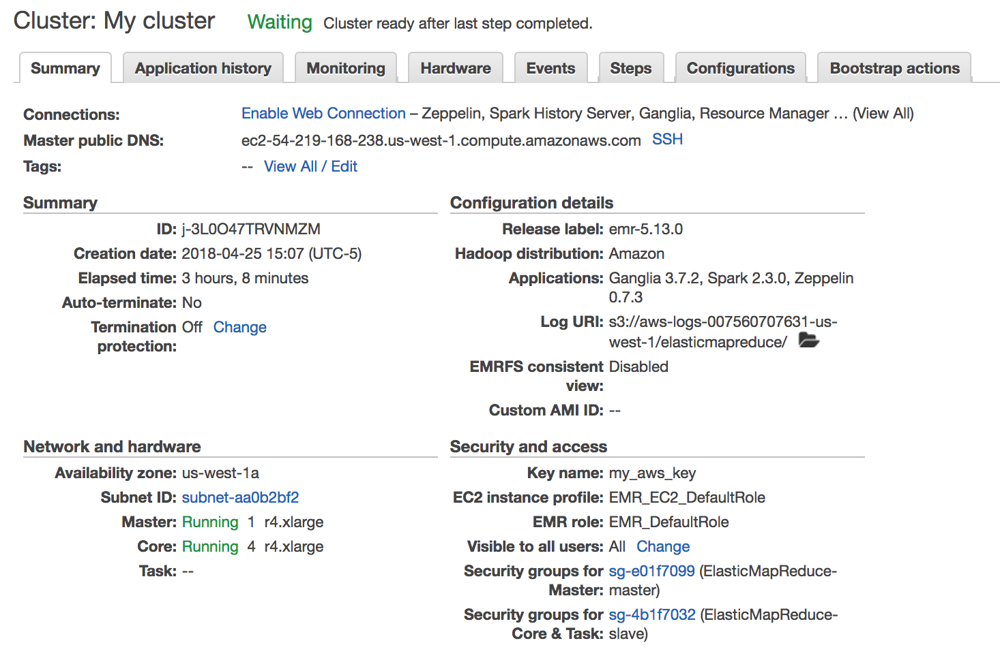
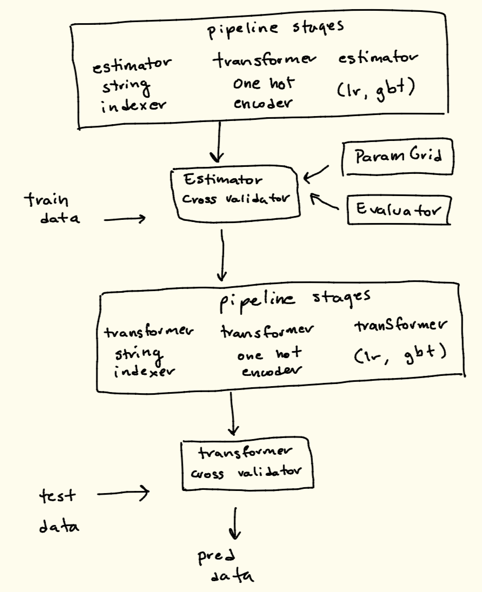
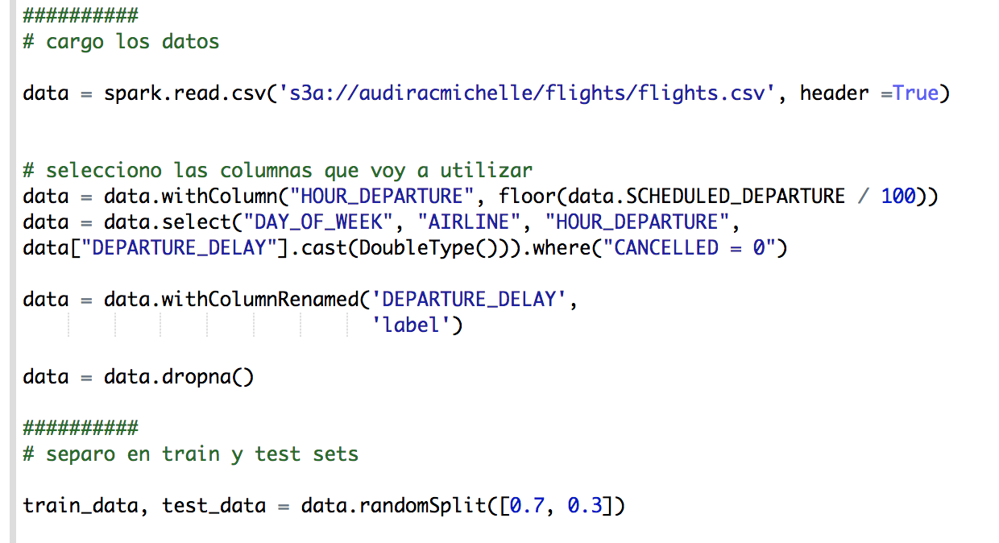
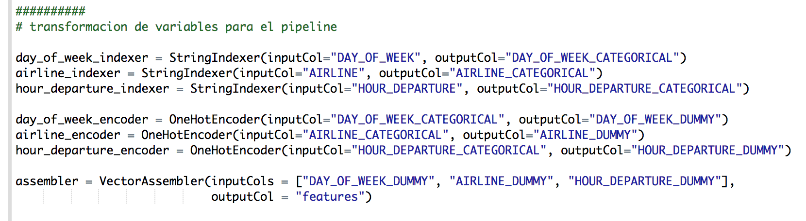
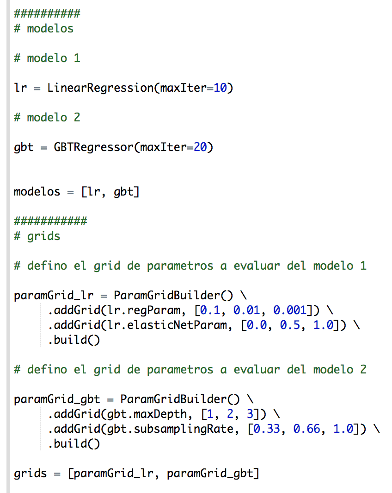
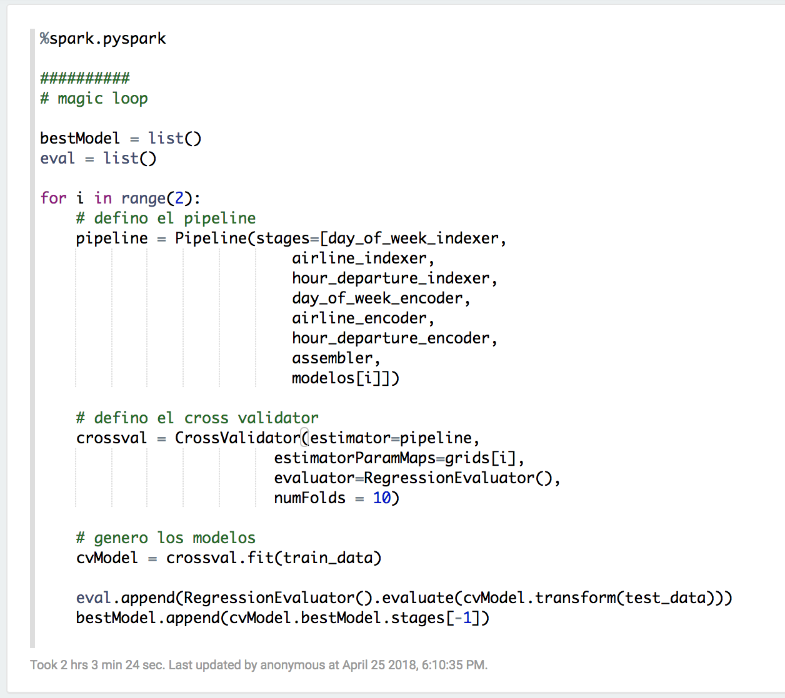
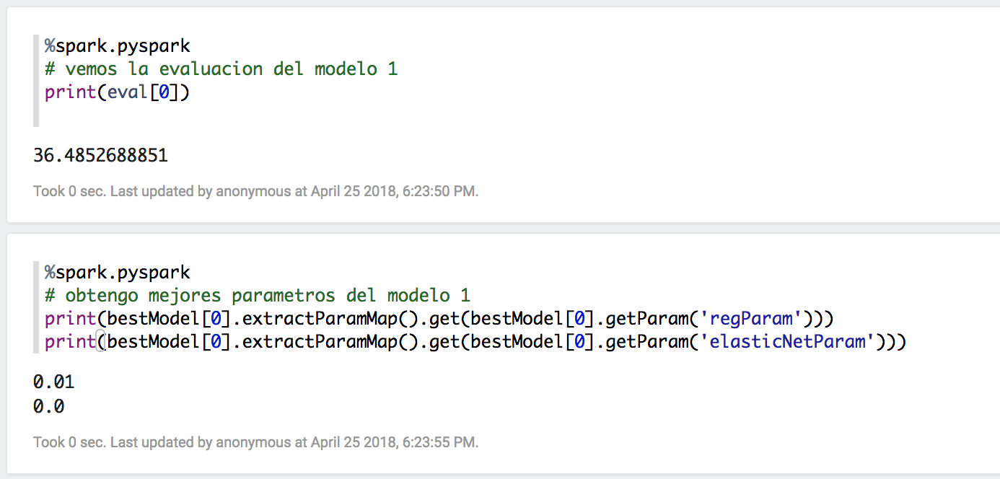
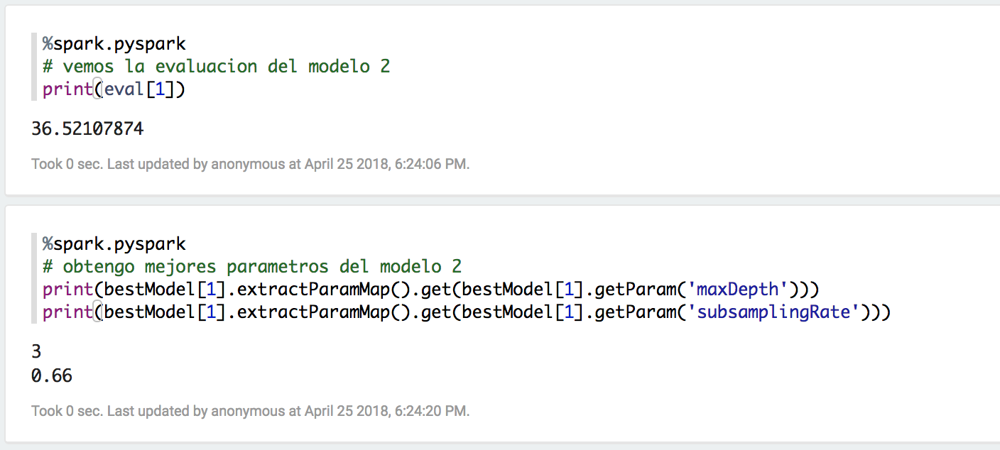

```{r setup, include=FALSE}
knitr::opts_chunk$set(echo = TRUE)
```

## Entregables

### Código de pyspark

* El **script dy pyspark de la tarea 7 comentado** se encuentra en [./tarea_7.py](./tarea_7.py) y se ve así:

```{bash}
cat tarea_7.py
```

* Adicionalmente el **zeppelin** se encuentra en:
    + versión json [./zeppelin_tarea_7.json](./tzeppelin_tarea_7.json)
    + versión pdf [./zeppelin_tarea_7.pdf](./zeppelin_tarea_7.pdf)
    

### Foto del cluster

* Utilicé un cluster con:
    + 1 master node
    + 4 esclavos



### Diagrama de elementos del proceso de ML en Spark

* En las siguientes secciones se muestran "screenshots" de los elementos que se encuentran en este diagrama.



### Foto carga de datos en spark

* Separo en **train y test sets**



### Foto transformadores/estimadores variables del pipeline

* Utilicé stringIndexers y OneHotEncoders como parte del **pipeline**



### Foto modelos y grids

* Probé **dos modelos**: 
    + linear regression
    + gradient boosted trees
    
* Para cada uno se probaron **tres niveles de dos hiperparámetros**



### Foto magic loop

* El **evaludador** que uliticé es `RegressionEvaluator()`



### Tiempo de ejecución del magic loop

Como lo muestra el "chunk" del zepellin notebook, **al magic loop le tomó dos hora con 3 minutos y 24 segundos ejecutarse**

### Foto evaluación de modelo 1

* Aquí muestro la evaluación del modelo 1 y los parámetros del bestModel



* Los mejores parámetros para el modelo 1 (regresión lineal) son:
    + regParam: 0.01
    + elasticNetParam:0

### Foto evaluación modelo 2

* Aquí muestro la evaluación del modelo 2 y los parámetros del bestModel



* Los mejores parámetros para el modelo 2 (gradient boosted tree) son:
    + maxDepth: 3
    + subsamplingRate: 0.66
    
