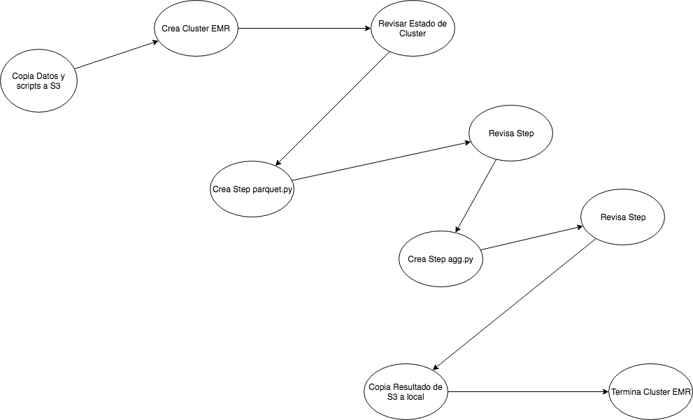
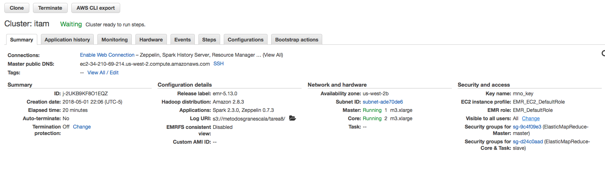
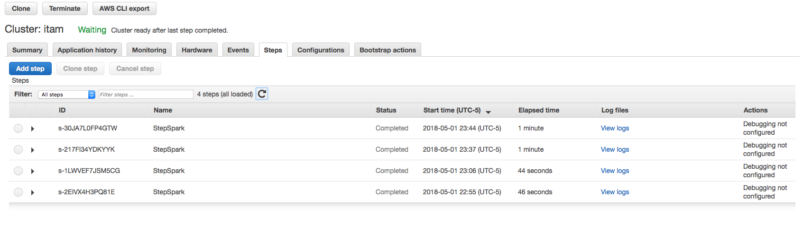

# Tarea 8

Integrantes: 

* Michelle Audirac Kushida 91180
* Juan Pablo de Botton Falcón 124768
* Miguel Castañeda Santiago 175840


## Tarea
Se requiere hacer procesamiento por lote de la base de datos de QQP. Esta base de datos se puede descargar por medio de este [link](https://drive.google.com/uc?export=download&id=0B-4W2dww7ELNazFfOFVhNG5vckE) que servirá como la fuente principal de datos. Se requiere armar un pipeline de procesamiento con 
los siguientes elementos:

1. Creación de EMR
    - Parámetros:
        - cluster_name: Nombre del equipo (equipo en clase).
        - keyname
        - subnet_id
        - region_id
        - s3_url_log
    - Consideraciones
        - Monitoreo del estado del cluster
        - Si tarda más de 10 minutos en crear el cluster, detener el pipeline
        - No avanzar hasta que el cluster esté listo para recibir tareas

2. Parquet
    - Consideraciones
        - La salida debe terminar en s3
        - Archivo con lógica de parqueteo (parquet.py) debe vivir en s3
        - El archivo fuente csv (prfeco.csv) debe vivir en s3 en el mismo path que los anteriores

3. Procesamiento en EMR
    - Consideraciones
        - Monitoreo del step
        - Si el step falla dentro de EMR detener el pipeline
        - Los cálculos deben terminar en un bucket de s3 definido
        - El archivo con la lógica de procesamiento vive en s3 (agg.py) en el mismo path de los demás archivos

4. Borrar EMR
    - Consideraciones
        - Monitoreo del estado del cluster
        - Si tarda más de 10 minutos en destruir el cluster, detener el pipeline
        - No avanzar hasta que el cluster esté eliminado

5. Descarga Agregaciones de S3 a local


### Requerimientos
- Python(luigi) 3.5.2
- Python(EMR) 3.4x

### Estructura de proyecto
- pipeline.py
- parquet.py
- agg.py
- requirements.txt (con base en un ambiente pyenv virtualenv)
- readme.MD (instrucciones de ejecución y detalle de status de las tareas)

### Reglas del Juego
- Equipos de 3 personas máximo (Si ya hay equipos, quedarse en los mismos)
- La calificación de la tarea es booleana (0 - 10).
- Se respetan las penalizaciones por retraso.


El flujo usado en el pipeline es:



Instrucciones:

El proyecto consiste en los archivos: 

- [pipeline.py](pipeline.py)
- [parquet.py](parquet.py)
- [agg.py](agg.py)
- [requirements.txt](requirements.txt)
- [readme.MD](README.md)
- [util.py](util.py)
- [emr-config.json](emr-config.json)


Para iniciar el pipeline se debe ejecutar desde la línea de comandos

```
PYTHONPATH="." luigi --module pipeline EstadoTerminacionEMR --clusterName "itam" --keyName "itam" --subnet "subnet-ade10de3" --region "us-west-2" --s3log "s3://metodosgranescala/tarea8" --local-scheduler
```
los parámetros para la ejecución son:

- clusterName
- keyName
- subnet
- region
- s3log

#### Consideraciones 
- Antes de ejecutar el pipeline se debe borrar la carpeta /tmp/tarea8 , *rm -r /tmp/tarea8*
- Para ejecutar el pipeline el archivo de datos all_data.csv y los scripts [parquet.py](parquet.py), [agg.py](agg.py) se deben encontrar en la misma carpeta que el pipeline de luigi. 
- Para ejecutar los comandos de aws utilizamos la herramienta *aws cli*, por lo que debe estar configurada con la salida en formato json.
- Los scripts parquet.py y agg.py tienen como parametros la ruta del s3 donde deben estar los archivos de entrada y salida tomando como ruta base el bucket definido en la variable s3log.
- El archivo de configuracion [emr-config.json](emr-config.json) incluye el uso de python3 para pyspark


Evidencia de ejecución:

#### Cluster 


#### Steps



