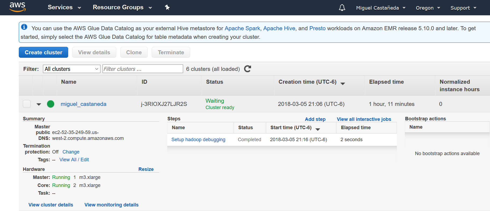

```{r setup, include=FALSE}
knitr::opts_chunk$set(echo = TRUE)
```


#### Tarea 4 - Pig


### Foto del Cluster 




### Ejecución de pasos 


Ejercicio A. 

Los datos de northwind se encuentran en [dropbox](https://www.dropbox.com/sh/qormkgqgt5o8zk3/AADNbqwqeXEfM_tNcieeX0B-a?dl=0)

Modifica el ejercicio de Rank para que en lugar de obtener el id del producto con mejor rank obtengamos el nombre del producto -requieres un join- con el mejor rank


```{r eval=FALSE}
products = LOAD 's3://metodosgranescala/northwind/products.csv' using PigStorage(',') as (productid:chararray, productname:chararray, supplierid:chararray, categoryid:chararray, quantityperunit:int, unitprice:float, unitsinstock:int, unitsonorder:int, reorderlevel:int, discounted:int);
order_details = LOAD 's3://metodosgranescala/northwind/order_details.csv'using PigStorage(',') as (orderid:chararray, productid:chararray, unitprice:float, quantity:int, discount:float);
group_orders = GROUP order_details BY productid;
count_products = FOREACH group_orders GENERATE group as productid , COUNT($1) as n;
ranked = rank count_products by n DESC;
-- El mejor rank
limited_rank = limit ranked 1; 
join_limited_product = JOIN limited_rank BY productid, products BY productid;
pregunta_a = FOREACH join_limited_product GENERATE $1 as productid, productname,n; 
STORE pregunta_a INTO 's3://metodosgranescala/output/northwind/salida'  USING PigStorage(',');

```
Código
[tarea4_a.pig](scripts/tarea4_a.pig)
Resultado 
[resultado](resultados/northwind/part-v010-o000-r-00000)


Ejercicio B. 

Con los datos de aerolíneas, vuelos y aeropuertos que se encuentran en el [dropbox](https://www.dropbox.com/sh/rdd78b7nofjb5vy/AAAwUm97baTusv5l8QY2ZAi2a?dl=0) y **utilizando Pig** contesta las siguietnes preguntas:


1. ¿Cuántos vuelos existen en el dataset cuyo aeropuerto destino sea el "Honolulu International Airport"?

```{r eval=FALSE}
airports = LOAD 's3://metodosgranescala/flights/airports.csv' using PigStorage(',') as (iata_code:chararray, airport:chararray, city:chararray, state:chararray, country:chararray, latitude:float, longitude:float);
flights = LOAD 's3://metodosgranescala/flights/flights.csv' using PigStorage(',') as (year:int, month:int, day:int, day_of_week:int, airline:chararray, flight_number:int, tail_number:chararray, origin_airport:chararray, destination_airport:chararray, scheduled_departure:chararray, departure_time:chararray, departure_delay:int, taxi_out:int, wheels_off:chararray, scheduled_time:chararray, elapsed_time:int, air_time:int, distance:int, wheels_on:chararray, taxi_in:int, scheduled_arrival:chararray, arrival_time:chararray, arrival_delay:int, diverted:chararray, cancelled:chararray, cancellation_reason:chararray, air_system_delay:chararray, security_delay:chararray, airline_delay:chararray, late_aircraft_delay:chararray, weather_delay:chararray);
flights_airports = JOIN flights BY destination_airport , airports BY iata_code;
fligths_honolulu = FILTER flights_airports BY airport == 'Honolulu International Airport';
fligths_honolulu_g = GROUP fligths_honolulu by airport;
fligths_honolulu_c = FOREACH fligths_honolulu_g GENERATE group as airport, COUNT($1) as n;
STORE fligths_honolulu_c INTO 's3://metodosgranescala/output/flights/1' USING PigStorage(',');

```
Código
[tarea4_b_1.pig](scripts/tarea4_b_1.pig)
Resultado 
[resultado](resultados/flights/1/part-v003-o000-r-00000)


2. ¿Cuál es el vuelo con más retraso? ¿De qué aerolínea es? 
```{r eval=FALSE}
airlines = LOAD 's3://metodosgranescala/flights/airports.csv' using PigStorage(',') as (iata_code:chararray, airline:chararray);
flights = LOAD 's3://metodosgranescala/flights/flights.csv' using PigStorage(',') as (year:int, month:int, day:int, day_of_week:int, airline:chararray, flight_number:int, tail_number:chararray, origin_airport:chararray, destination_airport:chararray, scheduled_departure:chararray, departure_time:chararray, departure_delay:int, taxi_out:int, wheels_off:chararray, scheduled_time:chararray, elapsed_time:int, air_time:int, distance:int, wheels_on:chararray, taxi_in:int, scheduled_arrival:chararray, arrival_time:chararray, arrival_delay:int, diverted:chararray, cancelled:chararray, cancellation_reason:chararray, air_system_delay:chararray, security_delay:chararray, airline_delay:chararray, late_aircraft_delay:chararray, weather_delay:chararray);
flights_airlines = JOIN flights BY airline LEFT OUTER,  airlines BY iata_code;
flights_delay = ORDER flights_airlines BY arrival_delay DESC;
respuesta_2 = LIMIT flights_delay 1;
STORE respuesta_2 INTO 's3://metodosgranescala/output/flights/2' USING PigStorage(',');

```

Código
[tarea4_b_2.pig](scripts/tarea4_b_2.pig)
Resultado 
[resultado](resultados/flights/2/part-v006-o000-r-00000)


3. ¿Qué día es en el que más vuelos cancelados hay? 
```{r eval=FALSE}
flights = LOAD 's3://metodosgranescala/flights/flights.csv' using PigStorage(',') as (year:int, month:int, day:int, day_of_week:int, airline:chararray, flight_number:int, tail_number:chararray, origin_airport:chararray, destination_airport:chararray, scheduled_departure:chararray, departure_time:chararray, departure_delay:int, taxi_out:int, wheels_off:chararray, scheduled_time:chararray, elapsed_time:int, air_time:int, distance:int, wheels_on:chararray, taxi_in:int, scheduled_arrival:chararray, arrival_time:chararray, arrival_delay:int, diverted:chararray, cancelled:chararray, cancellation_reason:chararray, air_system_delay:chararray, security_delay:chararray, airline_delay:chararray, late_aircraft_delay:chararray, weather_delay:chararray);
cancelados = FILTER flights BY cancelled == '1';
cancelados_dow = GROUP cancelados by day_of_week;
totales_dow = FOREACH cancelados_dow GENERATE group as day_of_week, COUNT($1) as total;
cancelados_o = ORDER totales_dow by total DESC;
respuesta_3 = LIMIT cancelados_o 1;
STORE respuesta_3 INTO 's3://metodosgranescala/output/flights/3' USING PigStorage(',');

```
Código
[tarea4_b_3.pig](scripts/tarea4_b_3.pig)
Resultado 
[resultado](resultados/flights/3/part-v005-o000-r-00000)

4. ¿Cuáles son los aeropuertos orígen con 17 cancelaciones? 
```{r eval=FALSE}
flights = LOAD 's3://metodosgranescala/flights/flights.csv' using PigStorage(',') as (year:int, month:int, day:int, day_of_week:int, airline:chararray, flight_number:int, tail_number:chararray, origin_airport:chararray, destination_airport:chararray, scheduled_departure:chararray, departure_time:chararray, departure_delay:int, taxi_out:int, wheels_off:chararray, scheduled_time:chararray, elapsed_time:int, air_time:int, distance:int, wheels_on:chararray, taxi_in:int, scheduled_arrival:chararray, arrival_time:chararray, arrival_delay:int, diverted:chararray, cancelled:chararray, cancellation_reason:chararray, air_system_delay:chararray, security_delay:chararray, airline_delay:chararray, late_aircraft_delay:chararray, weather_delay:chararray);
airports = LOAD 's3://metodosgranescala/flights/airports.csv' using PigStorage(',') as (iata_code:chararray, airport:chararray, city:chararray, state:chararray, country:chararray, latitude:float, longitude:float);
flights_airports = JOIN flights BY destination_airport , airports BY iata_code;
cancelados = FILTER flights_airports BY cancelled == '1';
cancelados_g = GROUP cancelados by airport;
total = FOREACH cancelados_g GENERATE group as airport, COUNT($1) as n;
respuesta_4 = FILTER total by n == 17;
STORE respuesta_4 INTO 's3://metodosgranescala/output/flights/4' USING PigStorage(',');

```
Código
[tarea4_b_4.pig](scripts/tarea4_b_4.pig)
Resultado 
[resultado](resultados/flights/4/part-v003-o000-r-00000)

5. ¿Cuál es el aeropuerto origen con más vuelos cancelados? 

```{r eval=FALSE}
flights = LOAD 's3://metodosgranescala/flights/flights.csv' using PigStorage(',') as (year:int, month:int, day:int, day_of_week:int, airline:chararray, flight_number:int, tail_number:chararray, origin_airport:chararray, destination_airport:chararray, scheduled_departure:chararray, departure_time:chararray, departure_delay:int, taxi_out:int, wheels_off:chararray, scheduled_time:chararray, elapsed_time:int, air_time:int, distance:int, wheels_on:chararray, taxi_in:int, scheduled_arrival:chararray, arrival_time:chararray, arrival_delay:int, diverted:chararray, cancelled:chararray, cancellation_reason:chararray, air_system_delay:chararray, security_delay:chararray, airline_delay:chararray, late_aircraft_delay:chararray, weather_delay:chararray);
airports = LOAD 's3://metodosgranescala/flights/airports.csv' using PigStorage(',') as (iata_code:chararray, airport:chararray, city:chararray, state:chararray, country:chararray, latitude:float, longitude:float);
flights_airports = JOIN flights BY destination_airport , airports BY iata_code;
cancelados = FILTER flights_airports BY cancelled == '1';
cancelados_g = GROUP cancelados by airport;
total = FOREACH cancelados_g GENERATE group as airport, COUNT($1) as n;
total_o = ORDER total by n DESC;
respuesta_5 = LIMIT total_o 1;
STORE respuesta_5 INTO 's3://metodosgranescala/output/flights/5' USING PigStorage(',');

```
Código
[tarea4_b_5.pig](scripts/tarea4_b_5.pig)
Resultado 
[resultado](resultados/flights/5/part-v007-o000-r-00000)


6. ¿Cuál es el vuelo (flight number) con mayor diversidad de aeropuertos destino, cuáles son estos
destinos? (ocupar bag te ayudará en esta pregunta)

```{r eval=FALSE}
flights = LOAD 's3://metodosgranescala/flights/flights.csv' using PigStorage(',') as (year:int, month:int, day:int, day_of_week:int, airline:chararray, flight_number:int, tail_number:chararray, origin_airport:chararray, destination_airport:chararray, scheduled_departure:chararray, departure_time:chararray, departure_delay:int, taxi_out:int, wheels_off:chararray, scheduled_time:chararray, elapsed_time:int, air_time:int, distance:int, wheels_on:chararray, taxi_in:int, scheduled_arrival:chararray, arrival_time:chararray, arrival_delay:int, diverted:chararray, cancelled:chararray, cancellation_reason:chararray, air_system_delay:chararray, security_delay:chararray, airline_delay:chararray, late_aircraft_delay:chararray, weather_delay:chararray);
airports = LOAD 's3://metodosgranescala/flights/airports.csv' using PigStorage(',') as (iata_code:chararray, airport:chararray, city:chararray, state:chararray, country:chararray, latitude:float, longitude:float);
flights_airports = JOIN flights BY destination_airport , airports BY iata_code;
flights_number_g = GROUP flights_airports by flight_number;
dest_unicos = FOREACH flights_number_g { dest = FOREACH flights_airports GENERATE destination_airport; dest_unico = DISTINCT dest; GENERATE flatten(group) as flight_number, COUNT(dest_unico) as dest_unico_air; };
dest_unico_ord = ORDER dest_unicos BY dest_unico_air DESC;
dest_unico_1 = LIMIT dest_unico_ord 1;
tmp_flights = DISTINCT flights;
vuelo_div = JOIN dest_unico_1 BY flight_number, tmp_flights BY flight_number;
respuesta_6 = join vuelo_div by destination_airport LEFT OUTER, airports by iata_code;
STORE respuesta_6 INTO 's3://metodosgranescala/output/flights/6' USING PigStorage(',');

```
Código
[tarea4_b_6.pig](scripts/tarea4_b_6.pig)
Resultado (top 20)
[resultado](resultados/flights/6/part-v010-o000-r-00000)


