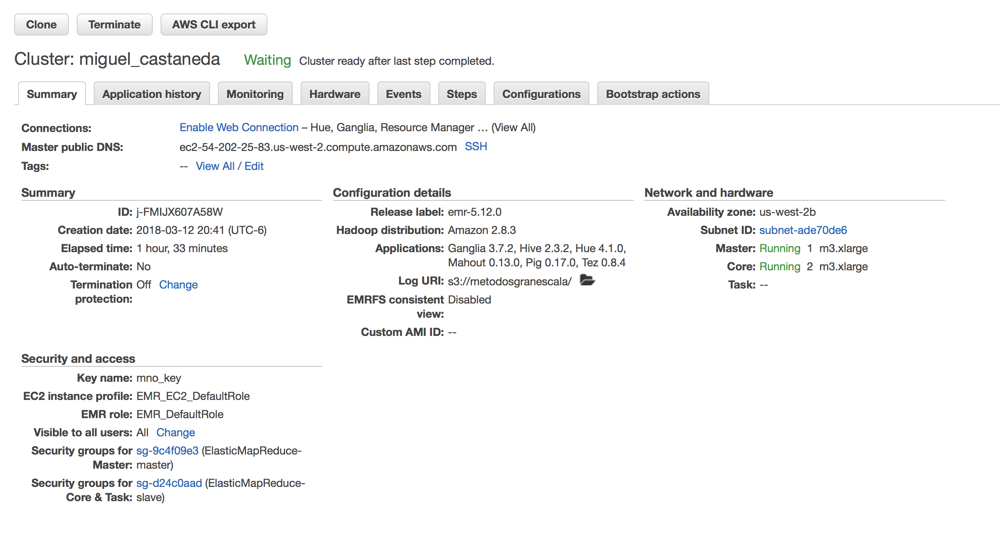
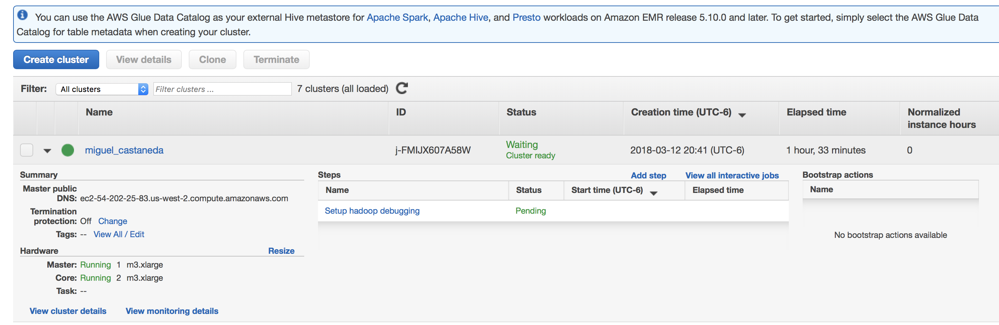
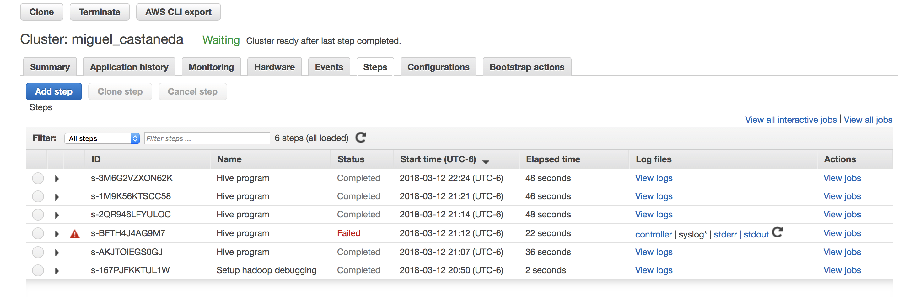

```{r setup, include=FALSE}
knitr::opts_chunk$set(echo = TRUE)
```

### Cluster de AWS








**Ejercicio 1.** Con la base de datos de northwind que se encuentran en el [dropbox](https://www.dropbox.com/sh/qormkgqgt5o8zk3/AADNbqwqeXEfM_tNcieeX0B-a?dl=0):


a. ¿Cuántos "jefes" hay en la tabla empleados? ¿Cuáles son estos jefes: número de empleado, nombre, apellido, título, fecha de nacimiento, fecha en que iniciaron en la empresa, ciudad y país? (atributo `reportsto`, ocupa `explode` en tu respuesta)


Script con la creación de la base de datos: [northwind.hql](scripts/northwind.hql)


```{sql eval=FALSE}
use northwind;

select count(*) as total_jefes
  from employees e 
  join (select distinct reportsto from employees) jefes 
  on jefes.reportsto = e.employeeid;
```
Código
[E_1a.hql](scripts/E_1a.hql)
Resultado 
[resultado](resultados/E_1a_resultado.txt)


```{sql eval=FALSE}
select e.employeeid, e.lastname, e.firstname, e.title, e.birthdate, e.hiredate, e.city, e.country, e.reportsto    
  from employees e 
  join (select distinct reportsto from employees) jefes 
  on jefes.reportsto = e.employeeid;
```
Código
[E_1a2.hql](scripts/E_1a2.hql)
Resultado 
[resultado](resultados/E_1a2_resultado.txt)


b. ¿Quién es el segundo "mejor" empleado que más órdenes ha generado? (nombre, apellido, título, cuándo entró a la compañía, número de órdenes generadas, número de órdenes generadas por el mejor empleado (número 1))


```{sql eval=FALSE}
select a.employeeid, concat(e.lastname ," ",  e.firstname) as nombre, e.title, e.hiredate, a.total, lead(a.total,1) over (order by a.total) as primero 
from ( 
  select o.employeeid, count(*) as total 
  from orders o 
  group by o.employeeid
) a 
join employees e
on e.employeeid = a.employeeid
order by primero desc limit 1;
```
Código
[E_1b.hql](scripts/E_1b.hql)
Resultado 
[resultado](resultados/E_1b_resultado.txt)


c. ¿Cuál es el delta de tiempo más grande entre una orden y otra? 


```{sql eval=FALSE}
select orderid, from_utc_timestamp(date_format(orderdate,'yyyy-MM-dd HH:mm:ss.SSS'),'UTC') as orderdate , 
datediff(orderdate, lag(orderdate) over (order by orderid)) as diferencia
from orders 
order by diferencia desc
limit 1;
```
Código
[E_1c.hql](scripts/E_1c.hql)
Resultado 
[resultado](resultados/E_1c_resultado.txt)


**Ejercicio 2.** Con los archivos de vuelos, aeropuertos y aerolíneas que están en el [dropbox](https://www.dropbox.com/sh/rdd78b7nofjb5vy/AAAwUm97baTusv5l8QY2ZAi2a?dl=0)

Script con la creación de la base de datos: [flights.hql](scripts/flights.hql)

a. ¿Qué aerolíneas (nombres) llegan al aeropuerto "Honolulu International Airport"? 

```{sql eval=FALSE}
select distinct(f.airline) as airline, a.airline from flights f 
join airlines a 
on a.iata_code = f.airline
where destination_airport = 'HNL';
```
Código
[E_2a.hql](scripts/E_2a.hql)
Resultado 
[resultado](resultados/E_2a_resultado.txt)


b. ¿En qué horario (hora del día, no importan los minutos) hay salidas del aeropuerto de San Francisco ("SFO") a "Honolulu International Airport"?

```{sql eval=FALSE}
select distinct substring(lpad(scheduled_departure,4,"0"),1,2) as hora 
from flights f where f.destination_airport ='HNL' and f.origin_airport ='SFO';
```
Código
[E_2b.hql](scripts/E_2b.hql)
Resultado 
[resultado](resultados/E_2b_resultado.txt)


c. ¿Qué día de la semana y en qué aerolínea nos conviene viajar a "Honolulu International Airport" para tener el menor retraso posible? 

```{sql eval=FALSE}
select f.day_of_week, f.airline, a.airline, min(f.departure_delay) as minimo
 from flights f 
 join airlines a 
 on a.iata_code = f.airline 
where f.destination_airport ='HNL' 
group by f.day_of_week, f.airline, a.airline
order by minimo asc limit 1;
```
Código
[E_2c.hql](scripts/E_2c.hql)
Resultado 
[resultado](resultados/E_2c_resultado.txt)


d. ¿Cuál es el aeropuerto con mayor tráfico de entrada? 

```{sql eval=FALSE}
select  f.destination_airport, a.airport, count(f.destination_airport) as total_llegadas
 from flights f 
 join airports a 
 on a.iata_code = f.destination_airport 
 group by f.destination_airport, a.airport
 order by total_llegadas desc limit 1;
```
Código
[E_2d.hql](scripts/E_2d.hql)
Resultado 
[resultado](resultados/E_2d_resultado.txt)


e. ¿Cuál es la aerolínea con mayor retraso de salida por día de la semana? 

```{sql eval=FALSE}
select f.airline, a.airline, f.day_of_week , f.departure_delay from flights f 
    join (
    select day_of_week, max(departure_delay) as maximo from flights group by day_of_week
    ) ff 
    on  f.departure_delay = ff.maximo
    join airlines a 
    on f.airline = a.iata_code
    order by f.day_of_week;
```
Código
[E_2e.hql](scripts/E_2e.hql)
Resultado 
[resultado](resultados/E_2e_resultado.txt)


f. ¿Cuál es la tercer aerolínea con menor retraso de salida los lunes (day of week = 2)? 

```{sql eval=FALSE}
select  f.airline, a.airline, min(f.departure_delay) as menor
 from flights f 
 join airlines a 
 on a.iata_code = f.airline 
 where day_of_week = 2
 group by f.airline, a.airline
 order by menor asc limit 1 offset 2;
```
Código
[E_2f.hql](scripts/E_2f.hql)
Resultado 
[resultado](resultados/E_2f_resultado.txt)


g. ¿Cuál es el aeropuerto origen que llega a la mayor cantidad de aeropuertos destino diferentes?  

```{sql eval=FALSE}
select a.airport, count(distinct f.destination_airport) as total_destinos
 from flights f 
 join airports a 
 on a.iata_code = f.origin_airport 
 group by a.airport
 order by total_destinos desc limit 1;
```
Código
[E_2g.hql](scripts/E_2g.hql)
Resultado 
[resultado](resultados/E_2g_resultado.txt)


