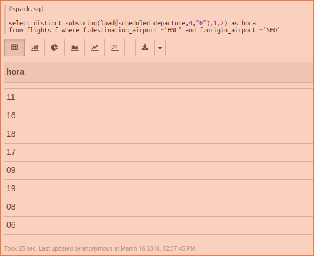

```{r setup, include=FALSE}
knitr::opts_chunk$set(echo = TRUE)
```


### Cluster de AWS


<br>


<br>


**Ejercicio 1.** Con la base de datos de northwind que se encuentran en el [dropbox](https://www.dropbox.com/sh/qormkgqgt5o8zk3/AADNbqwqeXEfM_tNcieeX0B-a?dl=0):


a. ¿Cuántos "jefes" hay en la tabla empleados? ¿Cuáles son estos jefes: número de empleado, nombre, apellido, título, fecha de nacimiento, fecha en que iniciaron en la empresa, ciudad y país? (atributo `reportsto`, ocupa `explode` en tu respuesta)

Los scripts los ejecuté usando un notebook de Apache Zeppelin [Notebook](scripts/Tarea6.json)


```
%pyspark

from pyspark.sql import SparkSession
from pyspark.sql.functions import *

spark = SparkSession.builder.master("local[*]").getOrCreate()


employees = spark.read.csv('s3://metodosgranescala/hive_db/northwind/employees/employees.csv', header =True)
employees.createOrReplaceTempView("employees");

orders    = spark.read.csv('s3://metodosgranescala/hive_db/northwind/orders/orders.csv', header =True)   
orders.createOrReplaceTempView("orders");

flights  = spark.read.csv('s3://metodosgranescala/hive_db/flights/flights/flights.csv', header =True)   
flights.createOrReplaceTempView("flights");

airlines  = spark.read.csv('s3://metodosgranescala/hive_db/flights/airlines/airlines.csv', header =True)   
airlines.createOrReplaceTempView("airlines");

airports  = spark.read.csv('s3://metodosgranescala/hive_db/flights/airports/airports.csv', header =True)   
airports.createOrReplaceTempView("airports");

%pyspark
flights.printSchema()
```

<button class="btn btn-primary" data-toggle="collapse" data-target="#sparkinicio"> Mostrar/Ocultar Imagen </button>  
<div id="sparkinicio" class="collapse">  

</div>


<br> 
Se cargan los archivos como tablas temporales 
<br> 


<br> 
Mostrar las tablas
```
%spark.sql
show tables
```
<button class="btn btn-primary" data-toggle="collapse" data-target="#tablas"> Mostrar/Ocultar Imagen </button>  
<div id="tablas" class="collapse">  

</div>
[Tablas](resultados/tablas.txt)

<br> 

Para ejecutar las consultas use Spark SQL usando las consultas de Hive con algunos cambios como el uso de offset el cual no esta disponible en Spark SQL. 


```{sql eval=FALSE}
%spark.sql

select count(*) as total_jefes
  from employees e 
  join (select distinct reportsto from employees) jefes 
  on jefes.reportsto = e.employeeid
```
Código
[E_1a.sql](scripts/E_1a.sql)
Resultado 
[resultado](resultados/E1a.txt)

<button class="btn btn-primary" data-toggle="collapse" data-target="#1a"> Mostrar/Ocultar Imagen </button>  
<div id="1a" class="collapse">  

</div>

<br> 

```{sql eval=FALSE}
%spark.sql

select e.employeeid, e.lastname, e.firstname, e.title, e.birthdate, e.hiredate, e.city, e.country, e.reportsto    
  from employees e 
  join (select distinct reportsto from employees) jefes 
  on jefes.reportsto = e.employeeid
```
Código
[E_1a2.sql](scripts/E_1a2.sql)
Resultado 
[resultado](resultados/E1a2.txt)

<button class="btn btn-primary" data-toggle="collapse" data-target="#1a2"> Mostrar/Ocultar Imagen </button>  
<div id="1a2" class="collapse">  

</div>

<br> 

b. ¿Quién es el segundo "mejor" empleado que más órdenes ha generado? (nombre, apellido, título, cuándo entró a la compañía, número de órdenes generadas, número de órdenes generadas por el mejor empleado (número 1))


```{sql eval=FALSE}
%spark.sql

select a.employeeid, concat(e.lastname ," ",  e.firstname) as nombre, e.title, e.hiredate, a.total, lead(a.total,1) over (order by a.total) as primero 
from ( 
  select o.employeeid, count(*) as total 
  from orders o 
  group by o.employeeid
) a 
join employees e
on e.employeeid = a.employeeid
order by primero desc limit 1   
```
Código
[E_1b.sql](scripts/E_1b.sql)
Resultado 
[resultado](resultados/E1b.txt)

<button class="btn btn-primary" data-toggle="collapse" data-target="#1b"> Mostrar/Ocultar Imagen </button>  
<div id="1b" class="collapse">  

</div>
<br> 
c. ¿Cuál es el delta de tiempo más grande entre una orden y otra? 


```{sql eval=FALSE}
%spark.sql

select orderid, from_utc_timestamp(date_format(orderdate,'yyyy-MM-dd HH:mm:ss.SSS'),'UTC') as orderdate , 
datediff(orderdate, lag(orderdate) over (order by orderid)) as diferencia
from orders 
order by diferencia desc
limit 1

```
Código
[E_1c.sql](scripts/E_1c.sql)
Resultado 
[resultado](resultados/E1c.txt)

<button class="btn btn-primary" data-toggle="collapse" data-target="#1c"> Mostrar/Ocultar Imagen </button>  
<div id="1c" class="collapse">  

</div>

<br> 
**Ejercicio 2.** Con los archivos de vuelos, aeropuertos y aerolíneas que están en el [dropbox](https://www.dropbox.com/sh/rdd78b7nofjb5vy/AAAwUm97baTusv5l8QY2ZAi2a?dl=0)

a. ¿Qué aerolíneas (nombres) llegan al aeropuerto "Honolulu International Airport"? 

```{sql eval=FALSE}
%spark.sql

select distinct(f.airline) as airline, a.airline from flights f 
join airlines a 
on a.iata_code = f.airline
where destination_airport = 'HNL'
```
Código
[E_2a.sql](scripts/E_2a.sql)
Resultado 
[resultado](resultados/E2a.txt)

<button class="btn btn-primary" data-toggle="collapse" data-target="#2a"> Mostrar/Ocultar Imagen </button>  
<div id="2a" class="collapse">  

</div>

<br> 

b. ¿En qué horario (hora del día, no importan los minutos) hay salidas del aeropuerto de San Francisco ("SFO") a "Honolulu International Airport"?

```{sql eval=FALSE}
%spark.sql

select distinct substring(lpad(scheduled_departure,4,"0"),1,2) as hora 
from flights f where f.destination_airport ='HNL' and f.origin_airport ='SFO'

```
Código
[E_2b.sql](scripts/E_2b.sql)
Resultado 
[resultado](resultados/E2b.txt)

<button class="btn btn-primary" data-toggle="collapse" data-target="#2b"> Mostrar/Ocultar Imagen </button>  
<div id="2b" class="collapse">  

</div>

<br> 

c. ¿Qué día de la semana y en qué aerolínea nos conviene viajar a "Honolulu International Airport" para tener el menor retraso posible? 

```{sql eval=FALSE}
%spark.sql

select f.day_of_week, f.airline, a.airline, min(cast (f.departure_delay as int))  as minimo
 from flights f 
 join airlines a 
 on a.iata_code = f.airline 
where f.destination_airport ='HNL' 
group by f.day_of_week, f.airline, a.airline
order by minimo asc limit 1
```
Código
[E_2c.sql](scripts/E_2c.sql)
Resultado 
[resultado](resultados/E2c.txt)

<button class="btn btn-primary" data-toggle="collapse" data-target="#2c"> Mostrar/Ocultar Imagen </button>  
<div id="2c" class="collapse">  

</div>
<br> 

d. ¿Cuál es el aeropuerto con mayor tráfico de entrada? 

```{sql eval=FALSE}
%spark.sql

select  f.destination_airport, a.airport, count(f.destination_airport) as total_llegadas
 from flights f 
 join airports a 
 on a.iata_code = f.destination_airport 
 group by f.destination_airport, a.airport
 order by total_llegadas desc limit 1
```
Código
[E_2d.sql](scripts/E_2d.sql)
Resultado 
[resultado](resultados/E2d.txt)

<button class="btn btn-primary" data-toggle="collapse" data-target="#2d"> Mostrar/Ocultar Imagen </button>  
<div id="2d" class="collapse">  

</div>
<br> 

e. ¿Cuál es la aerolínea con mayor retraso de salida por día de la semana? 

```{sql eval=FALSE}
%spark.sql

select f.airline, a.airline, f.day_of_week , cast(f.departure_delay as int) as departure_delay from flights f 
    join (
    select day_of_week, max(cast(departure_delay as int) ) as maximo from flights group by day_of_week
    ) ff 
    on  f.departure_delay = ff.maximo
    join airlines a 
    on f.airline = a.iata_code
    order by f.day_of_week

```
Código
[E_2e.sql](scripts/E_2e.sql)
Resultado 
[resultado](resultados/E2e.txt)

<button class="btn btn-primary" data-toggle="collapse" data-target="#2e"> Mostrar/Ocultar Imagen </button>  
<div id="2e" class="collapse">  

</div>

<br> 

f. ¿Cuál es la tercer aerolínea con menor retraso de salida los lunes (day of week = 2)? 

```{sql eval=FALSE}
%spark.sql

select * from (
select  f.airline, a.airline, min(cast(f.departure_delay as int)) as menor
 from flights f 
 join airlines a 
 on a.iata_code = f.airline 
 where day_of_week = 2
 group by f.airline, a.airline
 order by menor asc limit 3) aerolineas 
 order by aerolineas.menor desc
 limit 1

```
Código
[E_2f.sql](scripts/E_2f.sql)
Resultado 
[resultado](resultados/E2f.txt)

<button class="btn btn-primary" data-toggle="collapse" data-target="#2f"> Mostrar/Ocultar Imagen </button>  
<div id="2f" class="collapse">  

</div>

<br> 

g. ¿Cuál es el aeropuerto origen que llega a la mayor cantidad de aeropuertos destino diferentes?  

```{sql eval=FALSE}
%spark.sql

select a.airport, count(distinct f.destination_airport) as total_destinos
 from flights f 
 join airports a 
 on a.iata_code = f.origin_airport 
 group by a.airport
 order by total_destinos desc limit 1
```
Código
[E_2g.sql](scripts/E_2g.sql)
Resultado 
[resultado](resultados/E2g.txt)

<button class="btn btn-primary" data-toggle="collapse" data-target="#2g"> Mostrar/Ocultar Imagen </button>  
<div id="2g" class="collapse">  

</div>

<br> 
Borrando las tablas temporales 

```{}
%pyspark 
spark.catalog.dropTempView("employees")
spark.catalog.dropTempView("orders")
spark.catalog.dropTempView("flights")
spark.catalog.dropTempView("airlines")
spark.catalog.dropTempView("airports")
```


<button class="btn btn-primary" data-toggle="collapse" data-target="#finaliza"> Mostrar/Ocultar Imagen </button>  
<div id="finaliza" class="collapse">  

</div>