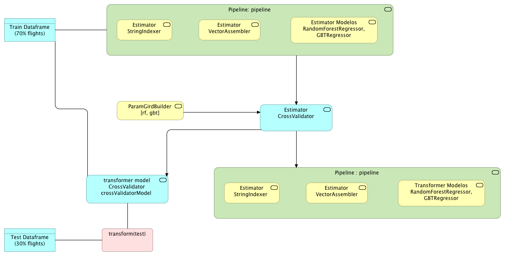
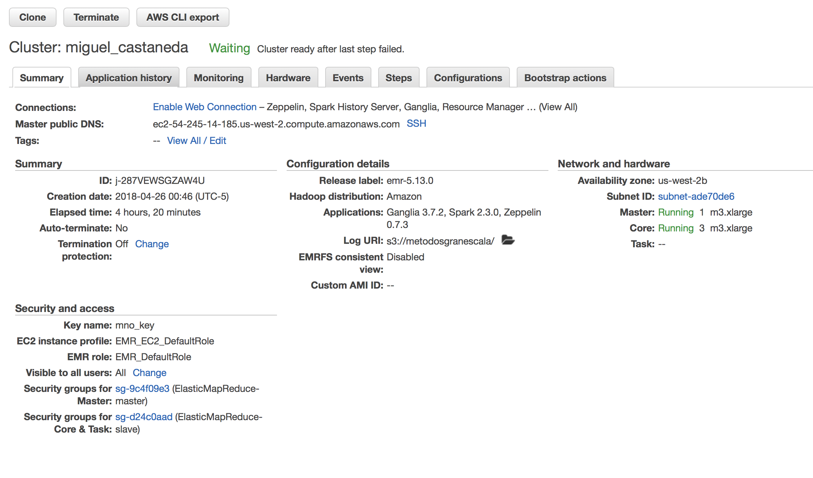
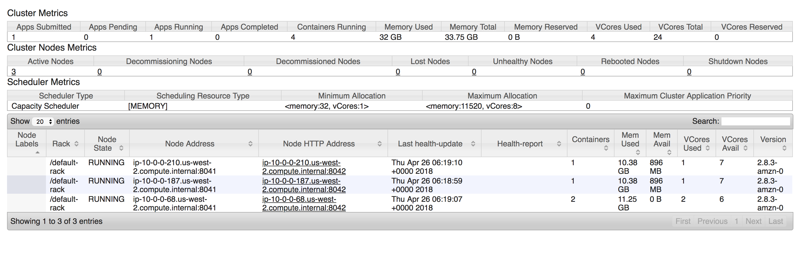
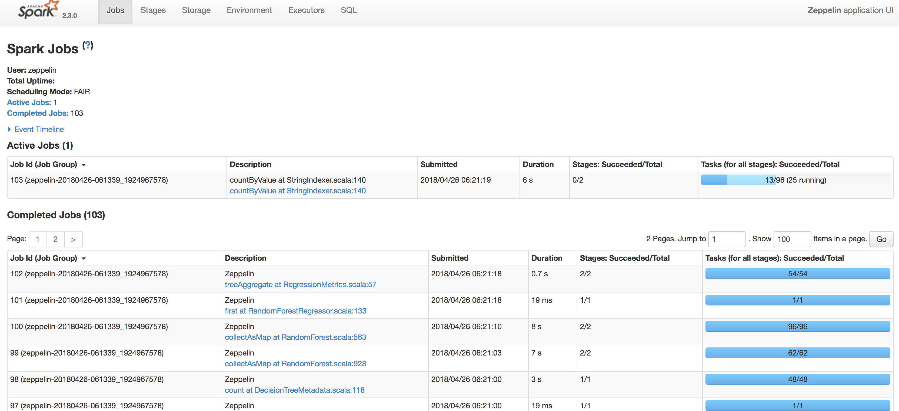
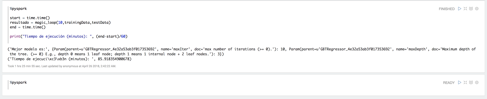

```{r setup, include=FALSE}
knitr::opts_chunk$set(echo = TRUE)
```

Con los datos que tenemos de flights queremos predecir el tiempo de retraso de salida DEPARTURE_DELAY

+ Si requieres de hacer transformaciones a los datos, feature selection y/o feature engineering tendrás que hacerlos como parte de un pipeline
+ Deberás dividir el set en entrenamiento y pruebas (70 y 30)
+ Deberás ocupar 10 como valor de k en cross validation
+ Deberás seleccionar 2 algoritmos de tu preferencia para realizar la predicción
+ Necesitas generar un gridParamMap para modificar los parámetros de los algoritmos que seleccionaste, al menos + deberás de tener 3 valores diferentes en 2 de los parámetros. Por ejemplo: si seleccionaste un random forest puedes modificar el número de árboles y el número de elementos mínimo para no seguir dividiendo (con 3 valores diferentes)
Necesitas generar un magic loop para probar probar tus dos diferentes algoritmos
+ Deberás seleccionar los mejores parámetros por algoritmo a través de un evaluador (como lo vimos en el ejemplo)
+ ¿Qué parametros resultaron mejor por algoritmo? (ver el método bestModel)
+ ¿Qué algoritmo resultó el mejor, con qué parámetros?
+ Indicar el tiempo de ejecución de la función de magic loop (ocupa python directo con la librería timeit)


### Entregables 


+ El script de pyspark (con comentarios en tu código)

En el archivo [Tarea7.py](src/Tarea7.py) se encuentra el código correspondiente a la tarea

+ El diagrama de elementos de tu código (transformadores, estimadores, data frames, pipeline, etc)

 


+ Foto del summary de tu clúster








+ Foto del step en verde de tu script

El scritp lo ejecuté usando Zepellin, anexo la imagen con la evidencia de la ejecución



+ El zeppelin (si lo hiciste en zeppelin), jupyter (si lo hiciste en jupyter)

En el archivo [Tarea7.json](src/Tarea7.json) se encuentra el código correspondiente al notebook de Zepellin

+ ¿Qué parametros resultaron mejor por algoritmo? (ver el método bestModel)

Gradient-boosted tree regression con parámetros:

* MaxIter = 10
* MaxDepth = 3

Random Forest Regressor con parámetros:

* numTrees = 10
* MaxDepth = 3


+ ¿Qué algoritmo resultó el mejor, con qué parámetros?

El mejor modelo fue Gradient-boosted tree regression con parámetros

* MaxIter = 10
* MaxDepth = 3

+ Tiempo de ejecución del magic loop (punto anterior)

El magic loop se ejecutó en 86 minutos.


