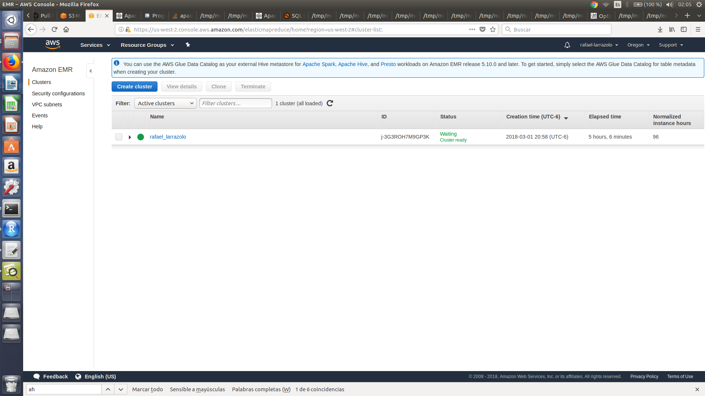
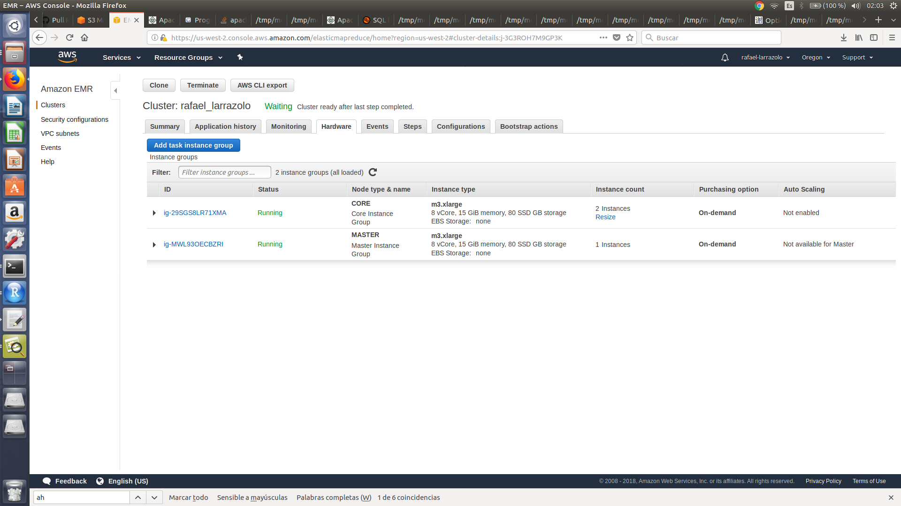
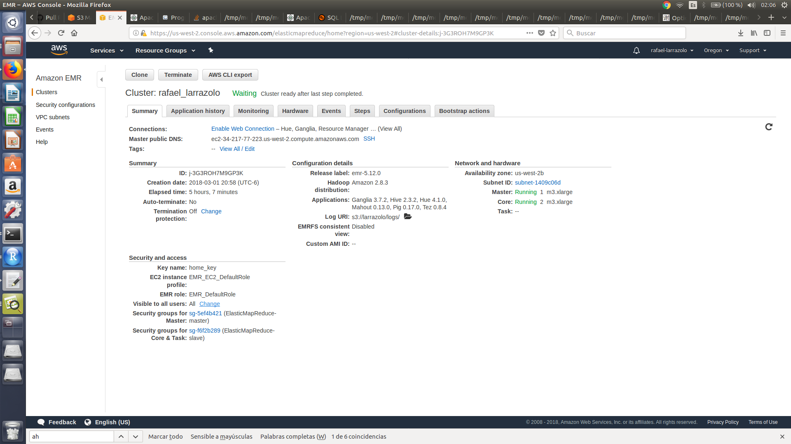

```{r setup, include=FALSE}
knitr::opts_chunk$set(echo = TRUE)
```

## Clúster AWS

Utilicé AWS para realizar la tarea; levaté un clúster usando 2 nodos *slave* y 1 *master*.

+ Cluster con mi nombre *rafael_larrazolo*:


<br>


+ Nodos *slaves* y *master*


<br>


+ Clúster listo para su uso:


<br>

## Ejercicio A - Northwind

*Modifica el ejercicio de Rank para que en lugar de obtener el id del producto con mejor rank obtengamos el nombre del producto -requieres un join- con el mejor rank*

La siguiente modificación del código visto en clase incluye un join para poder visualizar el nombre del producto con el mejor rank, incluyendo el rank asociado, id del producto y el número de órdenes; la salida está en formato CSV.

Obteniendo como resultado que el producto mejor rankeado es *Raclette Courdavaul* con *54* órdenes. 

```
--pregunta_A.pig

products = load 's3://larrazolo/data/products.csv' using PigStorage(',') as (productid:chararray, productname:chararray, supplierid:chararray, categoryid:chararray, quantityperunit:int, unitprice:float, unitsinstock:int, unitsonorder:int, reorderlevel:int, discounted:int);
order_details = load 's3://larrazolo/data/order_details.csv' using PigStorage(',') as (orderid:chararray, productid:chararray, unitprice:float, quantity:int, discount:float);
group_orders = group order_details by productid;
count_products = FOREACH group_orders GENERATE group as productid, COUNT($1) as n;
ranked = rank count_products by n DESC;
limited_rank = limit ranked 1;
join_prod = JOIN limited_rank by productid, products by productid;
salida = FOREACH join_prod generate rank_count_products as rank, $1 as productid, productname as productname, n as n_orders;
STORE salida INTO 's3://larrazolo/output/pregA' USING org.apache.pig.piggybank.storage.CSVExcelStorage(',', 'NO_MULTILINE', 'UNIX', 'WRITE_OUTPUT_HEADER');

```


<br>

```{bash}
cat PreguntaA/output_A

```

<br>

## Ejercicio B - Flights

### Pregunta 1

¿Cuántos vuelos existen en el dataset cuyo aeropuerto destino sea el *Honolulu International Airport*?

El número de vuelos donde el aeropuerto destino es *Honolulu International Airport* es :43157

```
-- pregunta1.pig

flights = LOAD 's3://larrazolo/data/flights.csv' using PigStorage(',') as (year:float, month:int, day:int, day_of_week:int, airline:chararray, flight_number:float, tail_numer:chararray, origin_airport:chararray, destination_airport:chararray, scheduled_departure:chararray, departure_time: chararray, departure_delay:int, taxi_out:int, wheels_off:chararray, scheduled_time:float, elapsed_time:float, air_time:float, distance:float, wheels_on:chararray, taxi_in:int, scheduled_arrival:chararray, arrival_time:chararray, arrival_delay:int, diverted:int, cancelled:int, cancelation_reason:chararray, air_system_delay:chararray, security_delay:chararray, airline_delay:chararray, late_aircraft_delay:chararray, weather_delay:chararray);
airports = LOAD 's3://larrazolo/data/airports.csv' using PigStorage(',') as (iata_code:chararray, airport:chararray, city:chararray, state:chararray, country:chararray, latitud:float, longitude:float);
destination = FOREACH flights generate destination_airport;
airport_code = FOREACH airports generate iata_code, airport;
group_destination = group destination by destination_airport;
count_destination = FOREACH group_destination GENERATE group as destination_airport, COUNT($1) as n;
join_airport = JOIN count_destination by destination_airport, airport_code by iata_code;
honolulu = FILTER join_airport by airport in ('Honolulu International Airport');
salida = FOREACH honolulu generate airport as airport, n as flights;
STORE salida INTO 's3://larrazolo/output/preg1' USING org.apache.pig.piggybank.storage.CSVExcelStorage(',', 'NO_MULTILINE', 'UNIX', 'WRITE_OUTPUT_HEADER');
```
<br>

```{bash}
cat PreguntaB/pregunta1/outputB1

```

<br>


### Pregunta 2

¿Cuál es el vuelo con más retraso? ¿De qué aerolínea es?

El vuelo con más retrasos fue el *1322* de American Airlines.


```
--pregunta2.pig

flights = LOAD 's3://larrazolo/data/flights.csv' using PigStorage(',') as (year:float, month:int, day:int, day_of_week:int, airline:chararray, flight_number:chararray, tail_numer:chararray, origin_airport:chararray, destination_airport:chararray, scheduled_departure:chararray, departure_time: chararray, departure_delay:int, taxi_out:int, wheels_off:chararray, scheduled_time:float, elapsed_time:float, air_time:float, distance:float, wheels_on:chararray, taxi_in:int, scheduled_arrival:chararray, arrival_time:chararray, arrival_delay:int, diverted:int, cancelled:int, cancelation_reason:chararray, air_system_delay:chararray, security_delay:chararray, airline_delay:chararray, late_aircraft_delay:chararray, weather_delay:chararray);
airlines = LOAD 's3://larrazolo/data/airlines.csv' using PigStorage(',') as (iata_code:chararray, airline:chararray);
delays_sum = FOREACH flights GENERATE airline as airline_code, flight_number, arrival_delay;
ranked = rank delays_sum by arrival_delay DESC;
limited = limit ranked 1;
join_airline = JOIN limited by airline_code, airlines by iata_code;
salida = FOREACH join_airline generate flight_number as flight, iata_code as code, airline as airline,  arrival_delay as arrival_delay;
STORE salida INTO 's3://larrazolo/output/preg2' USING org.apache.pig.piggybank.storage.CSVExcelStorage(',', 'NO_MULTILINE', 'UNIX', 'WRITE_OUTPUT_HEADER');
```
<br>

```{bash}
cat PreguntaB/pregunta2/outputB2

```

<br>


### Pregunta 3

¿Qué día es en el que más vuelos cancelados hay?

El día en que más retrasos hay es el día catalogado como *1* (domingo o lunes)

```
-- pregunta3.pig

flights = LOAD 's3://larrazolo/data/flights.csv' using PigStorage(',') as (year:float, month:int, day:int, day_of_week:int, airline:chararray, flight_number:float, tail_numer:chararray, origin_airport:chararray, destination_airport:chararray, scheduled_departure:chararray, departure_time: chararray, departure_delay:int, taxi_out:int, wheels_off:chararray, scheduled_time:float, elapsed_time:float, air_time:float, distance:float, wheels_on:chararray, taxi_in:int, scheduled_arrival:chararray, arrival_time:chararray, arrival_delay:int, diverted:int, cancelled:int, cancelation_reason:chararray, air_system_delay:chararray, security_delay:chararray, airline_delay:chararray, late_aircraft_delay:chararray, weather_delay:chararray);
flights_sum = FOREACH flights generate day_of_week, cancelled;
cancelled = FILTER flights_sum by cancelled == 1;
group_day = group cancelled by day_of_week;
count_cancelled = FOREACH group_day GENERATE group as day_of_week, COUNT($1) as total_cancel;
ranked = rank count_cancelled by total_cancel DESC;
limited = limit ranked 1;
salida = FOREACH limited generate day_of_week, total_cancel as cancelations_on_dayweek;
STORE salida INTO 's3://larrazolo/output/preg3' USING org.apache.pig.piggybank.storage.CSVExcelStorage(',', 'NO_MULTILINE', 'UNIX', 'WRITE_OUTPUT_HEADER');
```
<br>

```{bash}
cat PreguntaB/pregunta3/outputB3

```

<br>


### Pregunta 4

¿Cuáles son los aeropuertos orígen con 17 cancelaciones?

Los aeropuertos origen con 17 cancelaciones fueron: 

*Dothan Regional Airport*, *Dickinson Theodore Roosevelt Regional Airport* y *Delta County Airport*.

```
-- pregunta4.pig

flights = LOAD 's3://larrazolo/data/flights.csv' using PigStorage(',') as (year:float, month:int, day:int, day_of_week:int, airline:chararray, flight_number:float, tail_numer:chararray, origin_airport:chararray, destination_airport:chararray, scheduled_departure:chararray, departure_time: chararray, departure_delay:int, taxi_out:int, wheels_off:chararray, scheduled_time:float, elapsed_time:float, air_time:float, distance:float, wheels_on:chararray, taxi_in:int, scheduled_arrival:chararray, arrival_time:chararray, arrival_delay:int, diverted:int, cancelled:int, cancelation_reason:chararray, air_system_delay:chararray, security_delay:chararray, airline_delay:chararray, late_aircraft_delay:chararray, weather_delay:chararray);
airports = LOAD 's3://larrazolo/data/airports.csv' using PigStorage(',') as (iata_code:chararray, airport:chararray, city:chararray, state:chararray, country:chararray, latitud:float, longitude:float);
flights_sum = FOREACH flights generate origin_airport, cancelled;
airports_sum = FOREACH airports generate iata_code, airport;
cancelled = FILTER flights_sum by cancelled == 1;
group_origin = group cancelled by origin_airport;
count_cancelled = FOREACH group_origin GENERATE group as origin_airport, COUNT($1) as total_cancel;
seventeen = FILTER count_cancelled by total_cancel == 17;
join_airports = join seventeen by origin_airport, airports_sum by iata_code;
salida = FOREACH join_airports generate airport as airport, iata_code as code, total_cancel as cancelations;
STORE salida INTO 's3://larrazolo/output/preg4' USING org.apache.pig.piggybank.storage.CSVExcelStorage(',', 'NO_MULTILINE', 'UNIX', 'WRITE_OUTPUT_HEADER');
```
<br>

```{bash}
cat PreguntaB/pregunta4/outputB4

```

<br>


### Pregunta 5

¿Cuál es el aeropuerto origen con más vuelos cancelados?

El aeropuerto origen con más vuelos cancelados fue *Chicago O'Hare International Airport* con $8548$ vuelos cancelados.

```
-- pregunta5.pig

flights = LOAD 's3://larrazolo/data/flights.csv' using PigStorage(',') as (year:float, month:int, day:int, day_of_week:int, airline:chararray, flight_number:float, tail_numer:chararray, origin_airport:chararray, destination_airport:chararray, scheduled_departure:chararray, departure_time: chararray, departure_delay:int, taxi_out:int, wheels_off:chararray, scheduled_time:float, elapsed_time:float, air_time:float, distance:float, wheels_on:chararray, taxi_in:int, scheduled_arrival:chararray, arrival_time:chararray, arrival_delay:int, diverted:int, cancelled:int, cancelation_reason:chararray, air_system_delay:chararray, security_delay:chararray, airline_delay:chararray, late_aircraft_delay:chararray, weather_delay:chararray);
airports = LOAD 's3://larrazolo/data/airports.csv' using PigStorage(',') as (iata_code:chararray, airport:chararray, city:chararray, state:chararray, country:chararray, latitud:float, longitude:float);
flights_sum = FOREACH flights generate origin_airport, cancelled;
airports_sum = FOREACH airports generate iata_code, airport;
cancelled = FILTER flights_sum by cancelled == 1;
group_origin = group cancelled by origin_airport;
count_cancelled = FOREACH group_origin GENERATE group as origin_airport, COUNT($1) as total_cancel;
join_airports = join count_cancelled by origin_airport, airports_sum by iata_code;
ranked = rank join_airports by total_cancel DESC;
limited = limit ranked 1;
salida = FOREACH limited generate airport as airport, iata_code as code, total_cancel as cancelations;
STORE salida INTO 's3://larrazolo/output/preg5' USING org.apache.pig.piggybank.storage.CSVExcelStorage(',', 'NO_MULTILINE', 'UNIX', 'WRITE_OUTPUT_HEADER');
```
<br>

```{bash}
cat PreguntaB/pregunta5/outputB5

```


<br>

### Pregunta 6

¿Cuál es el vuelo (flight number) con mayor diversidad de aeropuertos destino, cuáles son estos destinos? 

El vuelo con mayor diversidad de aeropuertos destinos fue el vuelo *202* con $68$ destinos diferentes.

Aquí se muestra una parte de los aeropuertos destino, algunos no incluyen el nombre ya que su *iata_code* no tenía asignado el nombre correspondiente del aeropuerto.

```
-- pregunta6.pig

flights = LOAD 's3://larrazolo/data/flights.csv' using PigStorage(',') as (year:float, month:int, day:int, day_of_week:int, airline:chararray, flight_number:float, tail_numer:chararray, origin_airport:chararray, destination_airport:chararray, scheduled_departure:chararray, departure_time: chararray, departure_delay:int, taxi_out:int, wheels_off:chararray, scheduled_time:float, elapsed_time:float, air_time:float, distance:float, wheels_on:chararray, taxi_in:int, scheduled_arrival:chararray, arrival_time:chararray, arrival_delay:int, diverted:int, cancelled:int, cancelation_reason:chararray, air_system_delay:chararray, security_delay:chararray, airline_delay:chararray, late_aircraft_delay:chararray, weather_delay:chararray);
airports = LOAD 's3://larrazolo/data/airports.csv' using PigStorage(',') as (iata_code:chararray, airport:chararray, city:chararray, state:chararray, country:chararray, latitud:float, longitude:float);
flights_sum = FOREACH flights generate flight_number, destination_airport;
codes = FOREACH airports generate iata_code, airport;
group_flight = group flights_sum by flight_number;
uniq_airport = FOREACH group_flight {
               destiny = flights_sum.destination_airport;
               uniq_air = distinct destiny;
               generate group as flight_number, COUNT(uniq_air) as n;
};
ranked = rank uniq_airport by n DESC;
limited = limit ranked 1;
distinct_flights_dest = distinct flights_sum;
join_flights = join limited by flight_number, distinct_flights_dest by flight_number; 
join_names = join join_flights by destination_airport LEFT OUTER, codes by iata_code;
salida = FOREACH join_names generate $1 as flight_number, $2 as number_of_distinct_destinations, $4 as iata_code, $6 as destination_airport;
STORE salida INTO 's3://larrazolo/output/preg6' USING org.apache.pig.piggybank.storage.CSVExcelStorage('\t', 'NO_MULTILINE', 'UNIX', 'WRITE_OUTPUT_HEADER');
```
<br>

```{bash}
cat PreguntaB/pregunta6/outputB6

```


