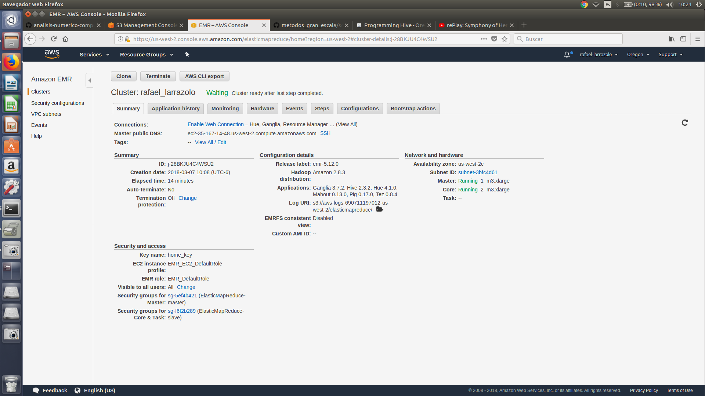
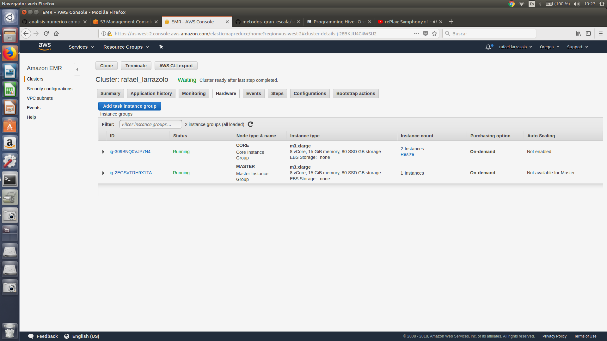

```{r setup, include=FALSE}
knitr::opts_chunk$set(echo = TRUE)
```

## Clúster AWS

Levanté un clúster usando 2 nodos *slave* y 1 *master*.

+ Cluster con mi nombre *rafael_larrazolo*:


<br>


+ Nodos *slaves* y *master*


<br>


## Ejercicio A - Northwind

### Pregunta a) 

**¿Cuántos "jefes" hay en la tabla empleados? ¿Cuáles son estos jefes: número de empleado, nombre, apellido, título, fecha de nacimiento, fecha en que iniciaron en la empresa, ciudad y país?**

Para responder a la pregunta de cuántos jefes hay en la tabla empleados, se utiliza la siguiente query donde obtenemos que se tienen *2* jefes:

```
SELECT count(DISTINCT(reportsto))
FROM employees
WHERE reportsto > 0;
```
<br>

Ahora visualizamos a dichos jefes con sus datos personales solicitados, con el siguiente query:

```
SELECT employeeid, firstname as nombre, tabla1.lastname as apellido, tabla1.title as titulo, tabla1.birthdate as f_nacimiento, tabla1.hiredate as f_inicio, tabla1.city as ciudad, tabla1.country as pais
FROM employees tabla1 JOIN
(SELECT reportsto, collect_set(lastname) as lastname, collect_set(employeeid) AS subordinados
FROM employees
WHERE reportsto > 0
GROUP BY reportsto) tabla2
ON tabla1.employeeid = tabla2.reportsto
```
<br>

Obteniendo como resultado la siguiente tabla:

```{bash}
cat Ejercicio1/IncisoA/output1a.csv

```
<br>

Otra forma de responder la pregunta era utilizando la *explode*, haciendo la siguiente consulta:

```
SELECT t.id_jefe, t.nombre, t.apellido, t.f_nacimiento, f_inicio, t.ciudad, t.pais,nombre_subordinado FROM(
SELECT employeeid as id_jefe, a.firstname as nombre, a.lastname as apellido, a.title as titulo, a.birthdate as f_nacimiento, a.hiredate as f_inicio, a.city as ciudad, a.country as pais,b.subordinados as subordinado
FROM employees a 
JOIN
(SELECT reportsto, collect_set(lastname) as lastname, collect_set(firstname) AS subordinados
FROM employees
WHERE reportsto > 0
GROUP BY reportsto) b
ON a.employeeid = b.reportsto) t
LATERAL VIEW explode(t.subordinado) vis as nombre_subordinado
```
<br>

Resultando en una tabla donde podemos observar a los subordinados de dichos jefes.

```{bash}
cat Ejercicio1/IncisoA/output1a_explode.csv
```
<br>

### Pregunta b) 

**¿Quién es el segundo "mejor" empleado que más órdenes ha generado? (nombre, apellido, título, cuándo entró a la compañía, número de órdenes generadas, número de órdenes generadas por el mejor empleado (número 1))?**

El segundo mejor empleado fue *Janet Leverling* con un total de *127* órdenes generadas. Quien le ganó como "mejor" empleado fue quien logró generar *156* órdenes.

```
SELECT a.employeeid as employee_id ,b.firstname as nombre, b.lastname as apellido, b.title as titulo, b.hiredate as f_ingreso,  a.n as num_ordenes, a.maximo_ordenes as ordenes_mejor_empleado 
FROM
(SELECT result.* FROM
(SELECT p.employeeid, lead(p.n) OVER(ORDER BY p.n) maximo_ordenes, p.n FROM
(SELECT employeeid, count(employeeid) as n
FROM orders
GROUP BY employeeid
ORDER BY n DESC) p
ORDER BY p.n DESC
LIMIT 2) result
SORT BY n LIMIT 1) a
JOIN
(SELECT employeeid,firstname, lastname, title, hiredate
FROM employees) b
ON a.employeeid = b.employeeid

```
<br>

```{bash}
cat Ejercicio1/IncisoB/output1b.csv
```
<br>

### Pregunta c) 

**¿Cuál es el delta de tiempo más grande entre una orden y otra?**

Para contestar esta pregunta fue necesario crear una tabla auxiliar *ordenes2* para poder hacer uso adecuadamente de los atributos del tipo *timestamp*.

Creación de tabla auxiliar:

```
create table orders2 as select orderid, from_utc_timestamp(date_format(orderdate,'yyyy-MM-dd HH:mm:ss.SSS'),'UTC') as order_date from orders;
```
<br>

Una vez teniendo disponible dicha tabla, se realiza la query correspondiente, la cual nos indica que existieron diversas órdenes donde la diferencia de tiempo *delta* fue de *3* días.

```
SELECT t.order_id as order_id, datediff(t.order_date, t.delta) as delta FROM 
(SELECT orderid as order_id, order_date as order_date, lag(order_date) OVER(ORDER BY orderid) as delta FROM
orders2 ) t
ORDER BY delta DESC
LIMIT 10
```
<br>

```{bash}
cat Ejercicio1/IncisoC/output1c.csv
```

## Ejercicio B - Flights

### Pregunta a)

**¿Qué aerolíneas (nombres) llegan al aeropuerto "Honolulu International Airport"?**

```
SELECT a.airline as iata_code, b.airline as airline FROM 
(SELECT DISTINCT(airline) FROM vuelos WHERE destination_airport in(
(SELECT iata_code FROM airports
WHERE airport in ("Honolulu International Airport")))) a
JOIN
airlines b ON
a.airline = b.iata_code
```
<br>

```{bash}
cat Ejercicio2/IncisoA/output2a.csv

```
<br>


### Pregunta b)

**¿En qué horario (hora del día, no importan los minutos) hay salidas del aeropuerto de San Francisco ("SFO") a "Honolulu International Airport"?**

```
SELECT DISTINCT(cast(substr(departure_time, 1, 2) as int)) as hora_dia, origin_airport, destination_airport FROM vuelos 
WHERE destination_airport in(
SELECT iata_code FROM airports
WHERE city in ("Honolulu")) 
AND origin_airport in(
SELECT iata_code FROM airports
WHERE city in ("San Francisco"))
ORDER BY hora_dia 
```
<br>

```{bash}
cat Ejercicio2/IncisoB/output2b.csv
```
<br>

### Pregunta c)

**¿Qué día de la semana y en qué aerolínea nos conviene viajar a "Honolulu International Airport" para tener el menor retraso posible?**

Para responder esta pregunta se consideró tomar el retraso promedio de cada aerolínea por día; con base a esto se eligió a la que tuviera un menor retraso obteniendo como resultado que la mejor opción es viajar por *Alaska Airlines* los días *Martes*.

```
SELECT b.airline, day_week  FROM(
SELECT t.airline as airline, 
    CASE WHEN t.day_of_week = 1 THEN "Domingo" 
    WHEN t.day_of_week = 2 THEN "Lunes" 
    WHEN t.day_of_week = 3 THEN "Martes"
    WHEN t.day_of_week = 4 THEN "Miercoles"
    WHEN t.day_of_week = 5 THEN "Jueves"
    WHEN t.day_of_week = 6 THEN "Viernes"
    ELSE "Sabado" 
    END day_week, 
    round(avg(t.departure_delay),2) as retraso_prom FROM (
SELECT day_of_week, airline, departure_delay FROM vuelos
WHERE destination_airport IN (
SELECT iata_code FROM airports
WHERE airport in ("Honolulu International Airport"))) t
GROUP BY t.airline, t.day_of_week
SORT BY retraso_prom
LIMIT 1) a
JOIN
airlines b ON
a.airline = b.iata_code
```
<br>

```{bash}
cat Ejercicio2/IncisoC/output2c.csv

```

<br>


### Pregunta d)

**¿Cuál es el aeropuerto con mayor tráfico de entrada?**

El aeropuerto más transitado de entrada, o que más es recurrido como aeropuerto destino, es *Hartsfield-Jackson Atlanta International Airport*.

```
SELECT a.destination_airport as destination_airport, b.airport as airport, trafico_entrada FROM
(SELECT destination_airport, count(destination_airport) as trafico_entrada FROM vuelos
GROUP BY destination_airport
ORDER BY trafico_entrada DESC
LIMIT 1) a
JOIN
airports b ON
a.destination_airport = b.iata_code
```
<br>

```{bash}
cat Ejercicio2/IncisoD/output2d.csv
```
<br>


### Pregunta e)

**¿Cuál es la aerolínea con mayor retraso de salida por día de la semana? **

Esta pregunta la podemos interpretar de dos maneras:

Interpretación 1: Mayor retraso en promedio para las aerolíneas en cierto día de la semana.

Para responder la pregunta bajo esta interpretación, se optá por considerar el máximo de los promedios de retraso de salida de los vuelos *departure_delay*, esto a nivel aerolínea y día. Se observó que para casi toda la semana, la aerolínea con mayor promedio de tiempo de retaso fue *Spirit Air Lines*. 

```
SELECT 
    CASE WHEN x.day_of_week = 1 THEN "Domingo" 
    WHEN x.day_of_week = 2 THEN "Lunes" 
    WHEN x.day_of_week = 3 THEN "Martes"
    WHEN x.day_of_week = 4 THEN "Miercoles"
    WHEN x.day_of_week = 5 THEN "Jueves"
    WHEN x.day_of_week = 6 THEN "Viernes"
    ELSE "Sabado" 
    END day_week,
    y.airline as airline,
    x.retraso_promedio as retraso_promedio 
FROM
    (SELECT a.airline, b.* 
    FROM(
        (SELECT airline, day_of_week, round(avg(departure_delay),2) as retraso_promedio 
        FROM vuelos
        GROUP BY airline, day_of_week)) a
    JOIN 
    (SELECT max(retraso_promedio) as retraso_promedio, day_of_week 
    FROM (
        SELECT airline, day_of_week, round(avg(departure_delay),2) as retraso_promedio 
    FROM vuelos
        GROUP BY airline, day_of_week) t
    GROUP BY day_of_week) b
    ON
    a.retraso_promedio = b.retraso_promedio) x
JOIN 
airlines y
ON
x.airline = y.iata_code
```
<br>

```{bash}
cat Ejercicio2/IncisoE/output2e.csv
```
<br>

Interpretación 2: Mayor retraso de salida histórico por día de la semana.

Para responder la pregunta bajo este enfoque, se extrae el mayor tiempo de retraso registado para cada día de la semana. Se obtuvo que *American Airlines* posee los mayores tiempos de retraso para todos los días de la semana.

```
SELECT b.airline as airline ,
CASE WHEN x.day_of_week = 1 THEN "Domingo" 
    WHEN x.day_of_week = 2 THEN "Lunes" 
    WHEN x.day_of_week = 3 THEN "Martes"
    WHEN x.day_of_week = 4 THEN "Miercoles"
    WHEN x.day_of_week = 5 THEN "Jueves"
    WHEN x.day_of_week = 6 THEN "Viernes"
    ELSE "Sabado" 
    END day_week, 
x.maximo_dia as maximo_retraso_dia
FROM (
SELECT b.airline ,a.day_of_week, a.maximo_dia FROM
(SELECT day_of_week, max(departure_delay) as maximo_dia
FROM vuelos a
GROUP BY day_of_week) a
JOIN
vuelos b 
ON
a.day_of_week = b.day_of_week AND a.maximo_dia = b.departure_delay) x
JOIN
airlines b 
ON
x.airline = b.iata_code
```
<br>

```{bash}
cat Ejercicio2/IncisoE/output2e_b.csv
```
<br>

### Pregunta f)

**¿Cuál es la tercer aerolínea con menor retraso de salida los lunes (day of week = 2)?**

La aerolínea que registro el tercer menor promedio de tiempo de retraso para los días lunes fue *US Airways*.

```
SELECT x.ranking as ranking, y.airline as airline, x.retraso_promedio as retraso_promedio FROM (
SELECT a.* FROM (
SELECT row_number() OVER (ORDER BY t.retraso_promedio) as ranking, t.airline, t.retraso_promedio FROM (
SELECT airline, round(avg(departure_delay),2) as retraso_promedio 
FROM vuelos
WHERE day_of_week = 2
GROUP BY airline
ORDER BY retraso_promedio ASC) t ) a
WHERE a.ranking = 3 ) x
JOIN
airlines y
ON
x.airline = y.iata_code
```
<br>

```{bash}
cat Ejercicio2/IncisoF/output2f.csv
```
<br>

### Pregunta g)

**¿Cuál es el aeropuerto origen que llega a la mayor cantidad de aeropuertos destino diferentes?**

El aeropuerto que llega a más aeropuertos distintos es *Hartsfield-Jackson Atlanta International Airport*.

```
SELECT b.airport as aeropuerto, a.distinct_destination as n_aeropuertos_destino FROM (
SELECT origin_airport, count(DISTINCT(destination_airport)) as distinct_destination FROM vuelos
GROUP BY origin_airport
ORDER BY distinct_destination DESC
LIMIT 1) a
JOIN
airports b
ON
a.origin_airport = b.iata_code

```
<br>

```{bash}
cat Ejercicio2/IncisoG/output2g.csv
```
<br>


