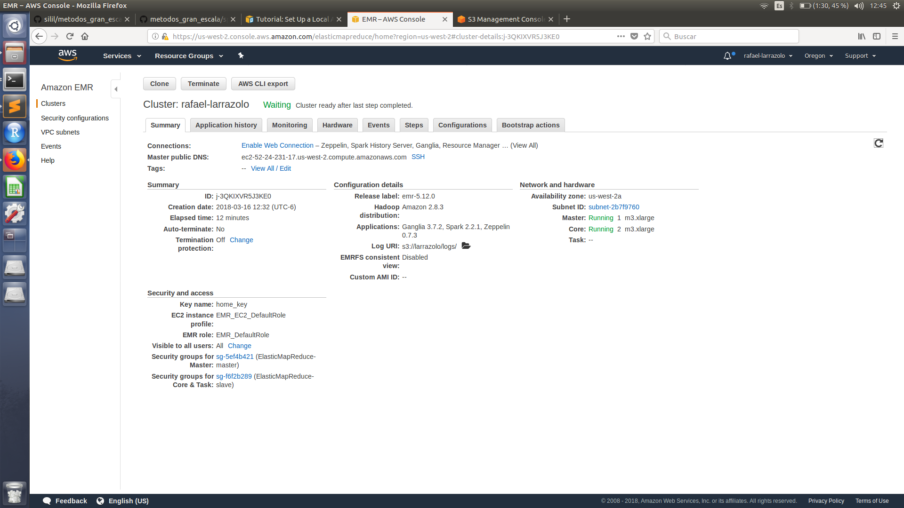

```{r setup, include=FALSE}
knitr::opts_chunk$set(echo = TRUE)
```

## Clúster AWS

Levanté un clúster usando 2 nodos *slave* y 1 *master* para realizar mi tarea de *Spark*

+ Cluster con mi nombre *rafael_larrazolo*:


<br>


+ Nodos *slaves* y *master*


<br>


Posteriormente, para hacer las consultadas ocupé *Zeppelin*.


<br>

## Ejercicio 1 - Northwind

### Pregunta a) 

**¿Cuántos "jefes" hay en la tabla empleados? ¿Cuáles son estos jefes: número de empleado, nombre, apellido, título, fecha de nacimiento, fecha en que iniciaron en la empresa, ciudad y país?**

Se encontró que hay dos "jefes" en la tabla empleados.

```
%pyspark

jefes = employees\
    .select("reportsto")\
    .distinct().\
    filter(employees.reportsto > 0)

jefesid = jefes\
    .select("reportsto")\
    .rdd.flatMap(lambda x: x)\
    .collect()
    
p1a = employees[employees.employeeid.isin(jefesid)]\
    .select("employeeid","firstname", "lastname", "title", "birthdate", "hiredate", "city", "country" )
    
p1a.show()
```
<br>


<br>

### Pregunta b) 

**¿Quién es el segundo "mejor" empleado que más órdenes ha generado? (nombre, apellido, título, cuándo entró a la compañía, número de órdenes generadas, número de órdenes generadas por el mejor empleado (número 1))?**

El segudo mejor empleado fue **Janet Leverling** con 127 órdenes; el mejor empleado generó 156 órdenes.

```
%pyspark
# ¿Quién es el segundo "mejor" empleado que más órdenes ha generado? (nombre, apellido, título, cuándo entró a la compañía, número de órdenes generadas, número de órdenes generadas por el mejor empleado (número 1)) 

from pyspark.sql.functions import lag, col, lead
from pyspark.sql.window import Window


p1b =orders\
    .groupBy("employeeid")\
    .count()\
    .orderBy("count", ascending=True)

w = Window()\
    .partitionBy()\
    .orderBy(col("count"))

p1b = p1b\
    .select("*", lead("count")\
    .over(w)\
    .alias("orders_from_best"))\
    .na.drop()\
    .orderBy("count", ascending=False)\
    .limit(1)

p1b = p1b\
    .join(employees, ["employeeid"])\
    .select("employeeid","firstname", "lastname", "title", "hiredate", "count", "orders_from_best")

p1b.write.csv('s3a://larrazolo/output/tarea6/p1b.csv')

p1b.show()

```
<br>

<br>


### Pregunta c) 

**¿Cuál es el delta de tiempo más grande entre una orden y otra?**

Se encontró que el delta (diferencia) de tiempo entre una orden y otra fue de 3.

```
%pyspark
# ¿Cuál es el delta de tiempo más grande entre una orden y otra?

from pyspark.sql.functions import lag, col, lead
from pyspark.sql.window import Window
from pyspark.sql.functions import datediff, to_date, lit

p1c = orders\
    .orderBy("orderid", ascending=True)
    
w = Window()\
    .partitionBy().\
    orderBy(col("orderid"))
    
p1c = p1c\
    .select("orderid", "orderdate", lag("orderdate" )\
        .over(w)\
        .alias("previous_order"))


p1c = p1c.withColumn("delta", 
              datediff(to_date("orderdate", "yyyy/MM/dd"),
                       to_date("previous_order","yyyy/MM/dd"))).orderBy("delta", ascending = False).select("orderid", "delta").limit(5)
                       

p1c.write.csv('s3a://larrazolo/output/tarea6/p1c.csv')

p1c.show()

```
<br>


<br>

## Ejercicio 2 - Flights

### Pregunta a)

**¿Qué aerolíneas (nombres) llegan al aeropuerto "Honolulu International Airport"?**

Las aerolíneas que llegan a **Honolulu International Airport** son:

*Virgin America*, *US Airways*, *Alaska Airlines*, *Hawaiian Airlines*, *Delta Air Lines*, *American Airlines*, *United Air Lines*.

```
%pyspark
#¿Qué aerolíneas (nombres) llegan al aeropuerto "Honolulu International Airport"?


honolulu = airports\
            .filter(airports["Airport"] == "Honolulu International Airport")\
            .select("iata_code", "airport")

p2a = flights\
        .join(honolulu, flights.DESTINATION_AIRPORT == honolulu.iata_code)\
        .select("airline", "airport")\
        .distinct()

p2a = p2a\
        .join(airlines, p2a.airline == airlines.IATA_CODE)\
        .select(airlines.AIRLINE)
        
p2a.write.csv('s3a://larrazolo/output/tarea6/p2a.csv')

p2a.show()
```
<br>


<br>


### Pregunta b)

**¿En qué horario (hora del día, no importan los minutos) hay salidas del aeropuerto de San Francisco ("SFO") a "Honolulu International Airport"?**

LLegan a todas horas a excepción de las *2* y *3* horas.

(Nota: el output de este query no se ve completo en la imagen).

```
%pyspark
# ¿En qué horario (hora del día, no importan los minutos) hay salidas del aeropuerto de San Francisco ("SFO") a "Honolulu International Airport"

from pyspark.sql.functions import *

p2b = flights[(flights.ORIGIN_AIRPORT.isin(['SFO'])) & (flights.DESTINATION_AIRPORT.isin(['HNL']))]\
    .select("ORIGIN_AIRPORT", "DESTINATION_AIRPORT", "DEPARTURE_TIME")\
    .withColumn('Hour', when(flights.DEPARTURE_TIME > 1000, floor((flights.DEPARTURE_TIME)/100))\
        .otherwise(when(flights.DEPARTURE_TIME > 100, floor((flights.DEPARTURE_TIME)/100))\
        .otherwise(0)))\
    .select("Hour")\
    .distinct()\
    .orderBy("Hour", ascending=True)
    
p2b.write.csv('s3a://larrazolo/output/tarea6/p2b.csv')

p2b.show()

```
<br>


<br>


### Pregunta c)

**¿Qué día de la semana y en qué aerolínea nos conviene viajar a "Honolulu International Airport" para tener el menor retraso posible?**

Para responder esta pregunta se consideró tomar el retraso promedio de arribo de cada aerolínea por día; con base a esto se eligió a la que tuviera un menor retraso obteniendo como resultado que la mejor opción es viajar por *Virgin America* los días *Domingo*.


```
%pyspark

#¿Qué día de la semana y en qué aerolínea nos conviene viajar a "Honolulu International Airport" para tener el menor retraso posible? 

import pyspark.sql.functions as func

honolulu = airports.filter(airports["Airport"] == "Honolulu International Airport").selectExpr("IATA_CODE as iata_code", "AIRPORT as airport_name")

p2c = flights\
    .select("day_of_week", "airline", "destination_airport", "arrival_delay")\
    .join(honolulu, flights.DESTINATION_AIRPORT == honolulu.iata_code)\
    .groupBy("day_of_week", "airline").avg("arrival_delay")\
    .orderBy("avg(arrival_delay)")\
        .join(airlines, flights.AIRLINE == airlines.IATA_CODE)\
    .select("day_of_week", airlines.AIRLINE, "avg(arrival_delay)")\
    .limit(1)
    
p2c.write.csv('s3a://larrazolo/output/tarea6/p2c.csv')

p2c.show()
```
<br>


<br>


### Pregunta d)

**¿Cuál es el aeropuerto con mayor tráfico de entrada?**

El aeropuerto más transitado de entrada, o que más es recurrido como aeropuerto destino, es *Hartsfield-Jackson Atlanta International Airport*.


```
%pyspark

#¿Cuál es el aeropuerto con mayor tráfico de entrada?

p2d = flights\
    .select("destination_airport")\
    .groupBy("destination_airport")\
    .count()\
    .orderBy("count", ascending = False)\
    .limit(1).\
    join(airports, flights.DESTINATION_AIRPORT == airports.IATA_CODE)\
    .select("DESTINATION_AIRPORT","AIRPORT", "count")

p2d.write.csv('s3a://larrazolo/output/tarea6/p2d.csv')

p2d.show()

```
<br>


<br>


### Pregunta e)

**¿Cuál es la aerolínea con mayor retraso de salida por día de la semana? **

Interpretación 1: Mayor retraso en promedio para las aerolíneas en cierto día de la semana.

Para responder esta pregunta se consideró el retraso de salida promedio por cada aerolínea en cada día, es decir, se optó por considerar el máximo de los promedios de retraso de salida de los vuelos *departure_delay*, esto a nivel aerolínea y día. 

Se observó que para casi toda la semana, la aerolínea con mayor promedio de tiempo de retaso fue *Spirit Air Lines*. 


```
%pyspark
from pyspark.sql.window import Window

#¿Cuál es la aerolínea con mayor retraso de salida por día de la semana?


w = Window\
    .partitionBy("day_of_week")\
    .orderBy(desc("avg(departure_delay)"))

p2e = flights\
    .select("day_of_week", "airline" ,"departure_delay")\
    .groupBy("day_of_week", "airline")\
    .avg("departure_delay")\
    .withColumn("rank", rank().over(w))\
    .filter(col("rank") == 1)\
    .join(airlines, flights\
        .AIRLINE == airlines\
        .IATA_CODE)\
    .select("day_of_week", airlines.AIRLINE)\
    .orderBy("day_of_week")
    
p2e.write.csv('s3a://larrazolo/output/tarea6/p2e.csv')
    
p2e.show()
```
<br>


<br>

### Pregunta f)

**¿Cuál es la tercer aerolínea con menor retraso de salida los lunes (day of week = 2)?**

La aerolínea que registro el tercer menor promedio de tiempo de retraso para los días lunes fue *US Airways*.

```
%pyspark
from pyspark.sql.window import Window

# ¿Cuál es la tercer aerolínea con menor retraso de salida los lunes (day of week = 2)?

w = Window.orderBy("avg(departure_delay)")
 
 
p2f = flights\
    .select( "day_of_week" , "airline", "departure_delay")\
    .filter(col("day_of_week") == 2)\
    .groupBy("airline")\
    .avg("departure_delay")\
    .orderBy("avg(departure_delay)", ascending = True)\
    .withColumn("rank", rank().over(w))\
    .filter(col("rank")==3)\
    .join(airlines, flights.AIRLINE == airlines.IATA_CODE)\
    .select("rank","IATA_CODE", airlines.AIRLINE)
    
p2f.write.csv('s3a://larrazolo/output/tarea6/p2f.csv')
    
p2f.show()
```
<br>


<br>


### Pregunta g)

**¿Cuál es el aeropuerto origen que llega a la mayor cantidad de aeropuertos destino diferentes?**

El aeropuerto que llega a más aeropuertos distintos es *Hartsfield-Jackson Atlanta International Airport*.

```
%pyspark

#¿Cuál es el aeropuerto origen que llega a la mayor cantidad de aeropuertos destino diferentes?


p2g = flights\
    .select("origin_airport", "destination_airport")\
    .distinct()\
    .groupBy("origin_airport")\
    .count()\
    .orderBy("count", ascending = False)\
    .limit(1)\
    .join(airports, flights.ORIGIN_AIRPORT == airports.IATA_CODE)\
    .select("origin_airport", "AIRPORT", "count")
    
p2g.write.csv('s3a://larrazolo/output/tarea6/p2g.csv')
    
p2g.show()
```
<br>


<br>
