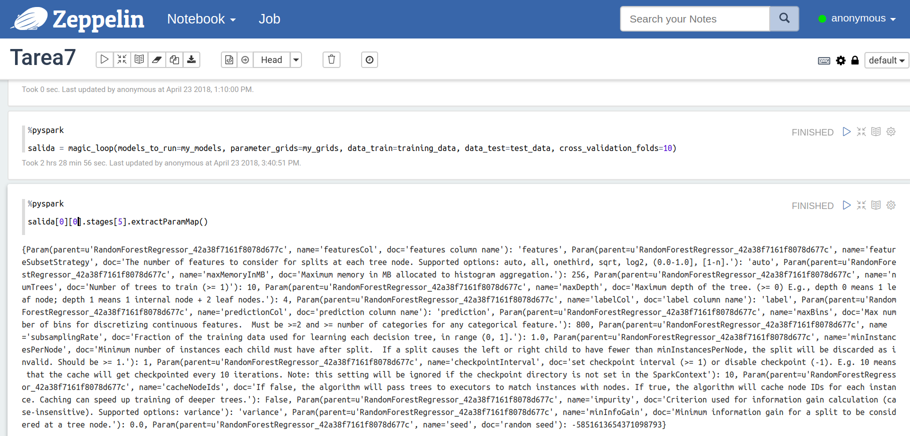

```{r setup, include=FALSE}
knitr::opts_chunk$set(echo = TRUE)
```

## Clúster AWS

Levanté un clúster usando 2 nodos *slave* y 1 *master* para realizar mi tarea.

+ Cluster con mi nombre *rafael_larrazolo*:


<br>


+ Nodos *slaves* y *master*


<br>


Posteriormente, para hacer las consultas y modelos ocupé *Zeppelin*.


<br>

## Database Flights

Utilizando la base de datos `flights`, se elaboró un código en *spark* con el fin de obtener un modelo de Machine Learning capaz de pronosticar o estimar el tiempo de salida de los aviones.

La tabla en cuestión tiene un tamaño de 5.8 millones de vuelos aproximadamente.

```{bash}
wc -l flights.csv
```

En primera instancia se eliminaron las variables que indicaban el tipo de retraso que sufrió el avión; de igual modo se eliminaron registros que tuvieran *NA*.

En este ejercicio se separaron los datos en dos conjuntos, un conjunto de entrenamiento y otro de prueba los cuales son el 70% y el 30% de los datos originales respectivamente. Una vez teniendo los dos tipos de conjuntos se crearon `StringIndexer` para trabajar con las variables categóricas (nombre de la aerolínea, código del avión, aeropuerto de origen, aeropuerto destino) y se utilizón un `VectorAssembler` para llevar a cabo los modelos a probar. Estas instancias forman parte del pipeline necesario para ajustar los modelos que serán del tipo aprendizaje supervisado (específicamente de regresión).

Se propusieron dos modelos: el primero fue un *Decision Tree* donde se propuso probar con los parámetros que determinan la profundidad del árbol (*maxDepth* = 2, 5, 10) y el número mínimo de elementos en cada nodo del árbol (*minInstancesPerNode* = 100, 500, 1000); el segundo modelo fue extender la idea anterior pero a un *Random Forest* el cual también es probado con distinto número de profundidad en sus árboles (*maxDepth* = 2, 3, 4) y el número de árboles que tendrá el bosque (*numTrees* = 10, 12, 15).

Se generó una función *MagicLoop* en la cual se crean los pipelines necesarios que contienen las modificaciones a los datos y ajuste a los modelos, evaluan los modelos propuestos y nos quedamos con la mejor versión de cada propuesta (el mejor *Decision Tree* y el mejor *Random Forest*). En el ajuste de los modelos, se hace uso de validación cruzada (k = 10) para evaluar a los modelos propuestos en el *grid* de parámetros para después con el *RegressionEvaluator* y los datos de prueba, obtener el error de cada modelo y así determinar el mejor de todos.


## Mejores Modelos

A partir del MagicLoop se obtuvo el mejor conjunto de parámetros para cada tipo de modelo, los cuales se presentan a continuación.
El MagicLoop tardó en ejecutar alrededor de **2 horas y 30 minutos** (no usé la librería `timeit` sino que directamente con el tiempo de ejecución indicado en Zeppelin; también lo corrí en un Jupyter Notebook usando un contendor de docker con sparky tardó alrededor de 5 horas).


### Decision Tree

Los parámetros del mejor *Decision Tree* obtenidos a partir del MagicLoop son:

+ *maxDepth* = 10

+ *minInstancesPerNode* = 100


### Random Forest

Los parámetros del mejor *Random Forest* obtenidos a partir del MagicLoop son:

+ *maxDepth* = 4

+ *numTrees* = 10



### BEST MODEL

Para elegir el mejor modelo se determinó por calcular el *Root Mean Squared Error (RMSE)* de los modelos de regresión y elegir aquel que tuviera el menor error. El MagicLoop ajustaba los modelos considerando las combinaciones de parámetros en los 'grid' y, para cada tipo de modelo, eligió el mejor de éstos, esto es, eligió el mejor *Decision Tree* y el mejor *Random Forest* de acuerdo a la métrica propuesta. Finalmente, de estos dos finalistas se elige el que tenga menor *RMSE* de entre ellos. 

El modelo seleccionado como el mejor fue *Decision Tree* con *maxDepth* = 10 y  *minInstancesPerNode* = 100. 


## Diagrama


