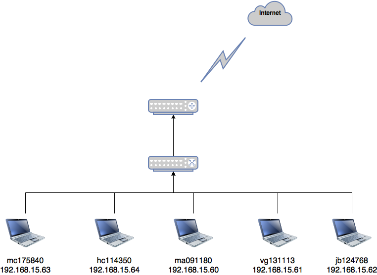
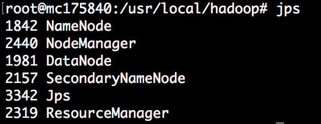
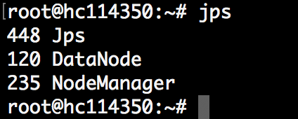
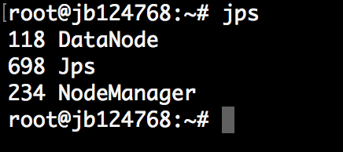
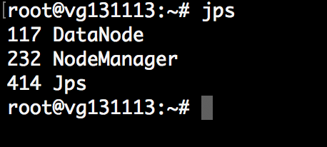
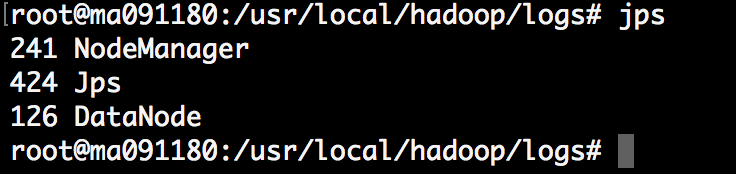
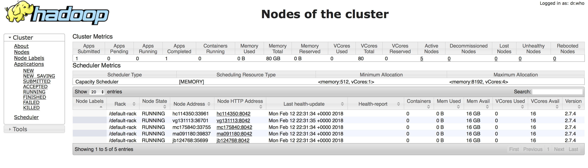

```{r setup, include=FALSE}
knitr::opts_chunk$set(echo = TRUE)
```

# Tarea 3

**Parte 1:** 

En tu carpeta `alumnos/` crea una carpeta `tarea_3/parte_1` **¡en minúsculas!** 

+ Hacer una clúster de Hadoop **multi nodo** con los miembros de tu equipo 
+ Tendrás que utilizar una imágen de Docker construida por ustedes que tenga Ubuntu 16.4, Hadoop 2.7.4, python 3.5.2
    + el `etc/hosts/` debe ser el mismo en todos los nodos
    + en tu docker pon el network mode como `host` y no como `bridge`
+ Cada *host* del equipo será nombrado con la inicial de tu nombre y apellido seguido de un guión bajo y la matrícula correspondiente. Por ejemplo: mi hostname sería `lm_54903`

¿Qué se entrega? 

+ Subir tu dockerfile $\rightarrow$ se requiere que ustedes creen su propia imágen...
+ En un Rmd poner la imagen que obtengan de `jps` una vez que todos los miembros del equipo se han podido conectar al clúster de hadoop
+ En el mismo Rmd poner la imagen de `localhost:8088` seleccionando la opción Nodes

¿Qué se califica? 

+ Se entrega el dockerfile: 2
+ Se entrega el RMD y html: 1
+ Se entregan las imágenes solicitadas: 2

Total: 5


El cluster consiste de 5 nodos conectados mediante un switch 



**Dockerfile**

+ Subir tu dockerfile $\rightarrow$ se requiere que ustedes creen su propia imágen...

Se incluye el  [Dockerfile](dockerfile/Dockerfile) usado para generar los nodos 

Para construir la imagen se ejecutó:

```
docker build -t hadoop . 
```

Para crear los nodos se ejecutó:
```
docker run -d --net=host --name mc175840 -h mc175840 -e "MASTER_IP=192.168.15.63" -e "MASTER_HOST=mc175840" hadoop
docker run -d --net=host --name hc114350 -h hc114350 -e "MASTER_IP=192.168.15.63" -e "MASTER_HOST=mc175840" hadoop
docker run -d --net=host --name ma091180 -h ma091180 -e "MASTER_IP=192.168.15.63" -e "MASTER_HOST=mc175840" hadoop
docker run -d --net=host --name vg131113 -h vg131113 -e "MASTER_IP=192.168.15.63" -e "MASTER_HOST=mc175840" hadoop
docker run -d --net=host --name jb124768 -h jb124768 -e "MASTER_IP=192.168.15.63" -e "MASTER_HOST=mc175840" hadoop
```

+ En un Rmd poner la imagen que obtengan de `jps` una vez que todos los miembros del equipo se han podido conectar al clúster de hadoop















+ En el mismo Rmd poner la imagen de `http:192.168.15.63:8088` seleccionando la opción Nodes




