```{r setup, include=FALSE}
knitr::opts_chunk$set(echo = TRUE)
```

# Tarea 3

**Parte 2:**

Los siguientes ejercicios son utilizando su cluster multinodo creado con su imagen de docker: 

En tu carpeta `alumnos/` crea la carpeta `tarea_3/parte_2` **¡en minúsculas!**

+ Ejercicio 1: Utilizando los datos de [ecobici_2010_2017](https://www.dropbox.com/sh/u0g3g378xfdyxot/AACN77EAFN1rjNkPemkX-PWZa?dl=0) y MapReduce averigua ¿Cuántos registros hay por cicloestación? 
+ Ejercicio 2: Con los datos de [vuelos retrasados en USA](https://www.dropbox.com/sh/rdd78b7nofjb5vy/AAAwUm97baTusv5l8QY2ZAi2a?dl=0) hacer un join del lado del *mapper* con flights, airports y airlines. Primero intenta una sola llave o flights o airports
+ Ejercicio 3: Con los datos de [vuelos retrasados en USA](https://www.dropbox.com/sh/rdd78b7nofjb5vy/AAAwUm97baTusv5l8QY2ZAi2a?dl=0) hacer un join del lado del *reducer* con flights, airports y airlines. Primero intenta una sola llave o flights o airports


### Ejericio 1
El   [`mapper.py`](ejercicio1/mapper.py)  ,  [`reducer.py`](ejercicio1/reducer.py)   y  [`output.txt`](ejercicio1/output.txt) del conteo del \# de registros por cicloestación
  
Se ejecutó el job con:

```{}
./bin/hadoop jar /usr/local/hadoop/share/hadoop/tools/lib/hadoop-streaming-2.7.4.jar \
-input /tarea3/ciclo_est_retiro_num_prueba.txt \
-output /tarea3/output \
-file /usr/local/hadoop/datos/mapper.py \
-mapper mapper.py \
-file /usr/local/hadoop/datos/reducer.py \
-reducer reducer.py
```
  
  
+ Imágen del jps del clúster
    
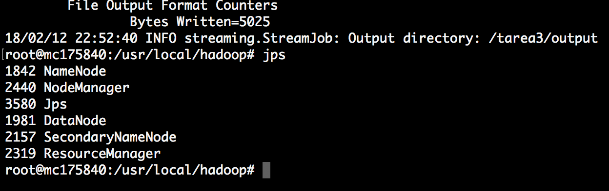
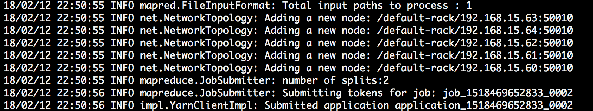
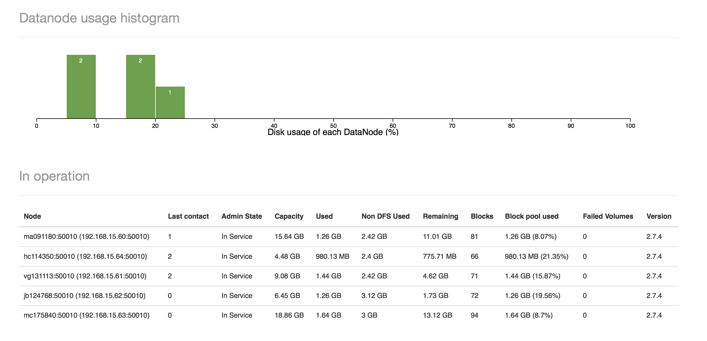
    
+ Imágen de `localhost:8088` seleccionando la opción Nodes
    

    
+ Imágen de `localhost:8088` seleccionando la opción FINISHED para ver que los jobs corrieron existosamente
    
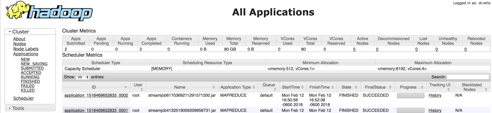
    
+ Imágen de output.txt 
    
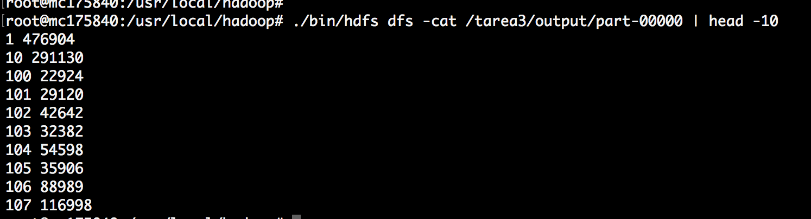
   
   
   
### Ejercicio 2 (Reducer-Side Join)
De acuerdo con [stackoverflow](https://stackoverflow.com/questions/32346198/join-three-files-in-single-mapreduce-program?rq=1) se requieren dos mapreduce jobs para hacer un join de tres tablas. De esta manera incluimos el mapper y el reducer del primer y el segundo job.

El   [`mapper.py`](ejercicio2/join_mapper.py)  ,  [`reducer.py`](ejercicio2/join_reducer.py)   y  [`output.txt`](ejercicio2/output.txt) del join del lado del *mapper* 
  
Hacemos el join lo hacemos en dos pasos, primero ejecutamos:

```{}
./bin/hadoop jar /usr/local/hadoop/share/hadoop/tools/lib/hadoop-streaming-2.7.4.jar \
-input /tarea3/flights.csv \
-input /tarea3/airports.csv \
-output /tarea3/output_join \
-file /usr/local/hadoop/datos/join_mapper.py \
-mapper join_mapper.py \
-file /usr/local/hadoop/datos/join_reducer.py \
-reducer join_reducer.py

```
  
+ Imágen del jps del clúster
    
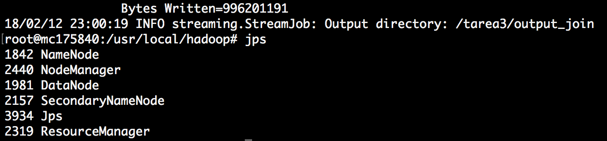
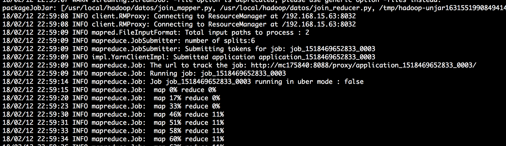
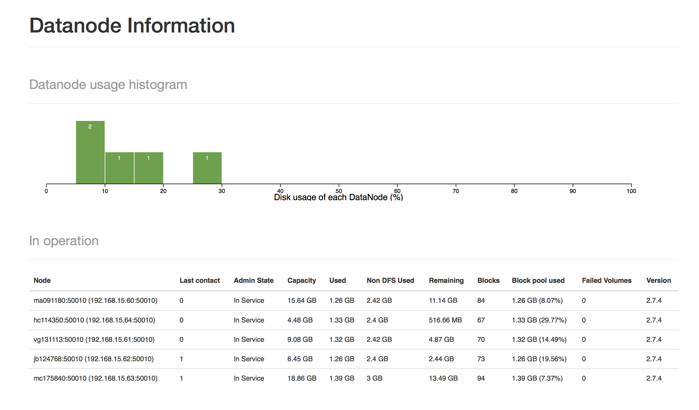
    
+ Imágen de `localhost:8088` seleccionando la opción Nodes
    
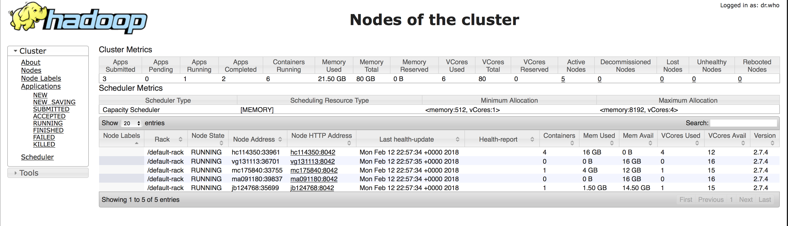
    
+ Imágen de `localhost:8088` seleccionando la opción FINISHED para ver que los jobs corrieron existosamente
    
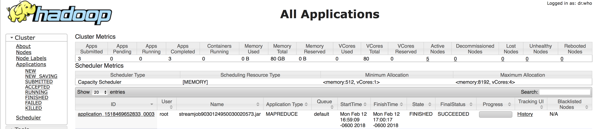
    
+ Imágen de output.txt 
    
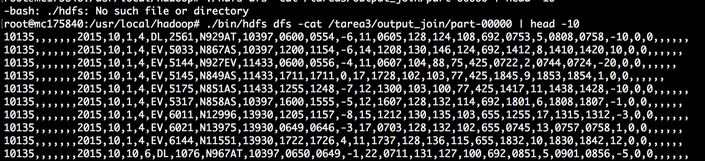
      
      

El   [`mapper.py`](ejercicio2/join_mapper_1.py)  ,  [`reducer.py`](ejercicio2/join_reducer_1.py)   y  [`output.txt`](ejercicio2/output2.txt) del join del lado del *mapper* 

La salida del primer join la usamos como entrada del segundo join ejecutando:

```{}
./bin/hadoop jar /usr/local/hadoop/share/hadoop/tools/lib/hadoop-streaming-2.7.4.jar \
-input /tarea3/output_join/part-00000 \
-input /tarea3/airlines.csv \
-output /tarea3/output_join_reducer \
-file /usr/local/hadoop/datos/join_mapper_1.py \
-mapper join_mapper_1.py \
-file /usr/local/hadoop/datos/join_reducer_1.py \
-reducer join_reducer_1.py
```

+ Imágen del jps del clúster
    
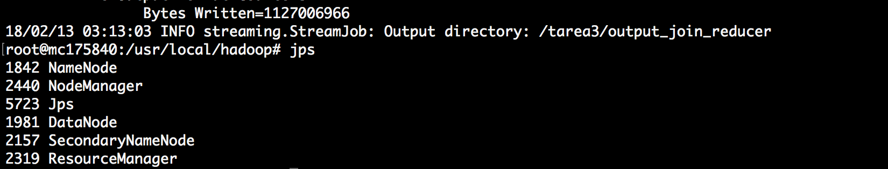
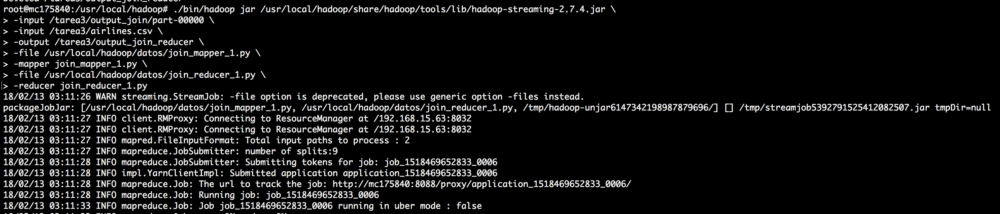
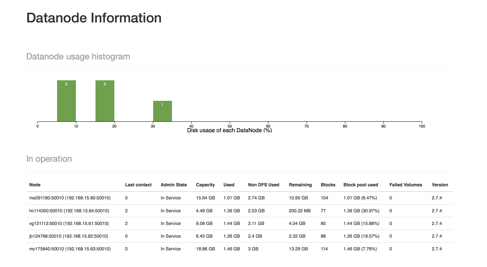
    
+ Imágen de `localhost:8088` seleccionando la opción Nodes
    
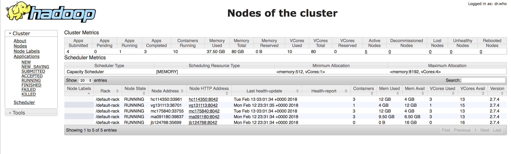
    
+ Imágen de `localhost:8088` seleccionando la opción FINISHED para ver que los jobs corrieron existosamente
    
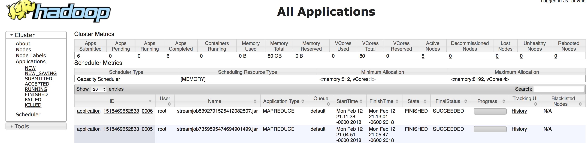
    
+ Imágen de output.txt (renglones 100,000 a 100,010) 
    
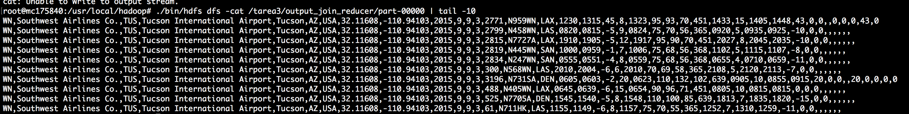


### Ejercicio 3 (Mapper-Side Join)

En este [blog](https://acadgild.com/blog/map-side-joins-in-hive/) encontramos que el mapper-side join requiere que se cargue a memoria la 'tabla chica' y el join lo realiza cada mapper. En este caso el reducer no hace nada. 

En este caso solo juntamos dos tablas: flights y airports

El   [`mapper.py`](ejercicio3/join_mapper_0.py)  ,  [`reducer.py`](ejercicio3/join_reducer_0.py)   y  [`output.txt`](ejercicio3/output.txt) del join del lado del *reducer* 

Ejecutamos:

```{}
./bin/hadoop jar /usr/local/hadoop/share/hadoop/tools/lib/hadoop-streaming-2.7.4.jar \
-input /tarea3/flights.csv \
-input /tarea3/airports.csv \
-output /tarea3/output_join_mapper \
-file /usr/local/hadoop/datos/join_mapper_0.py \
-mapper join_mapper_0.py \
-file /usr/local/hadoop/datos/join_reducer_0.py \
-reducer join_reducer_0.py
```
    
+ Imágen del jps del clúster
    
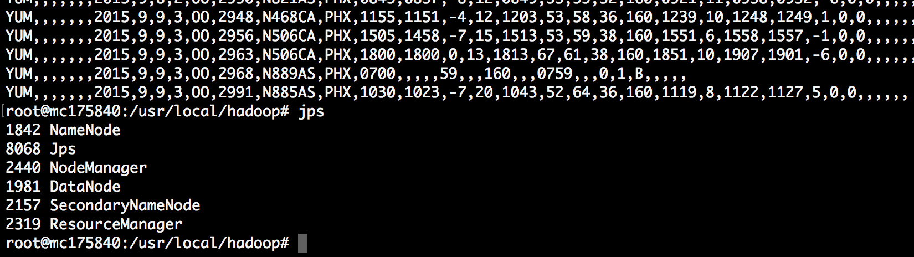
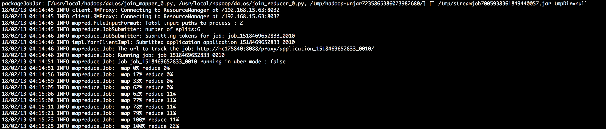
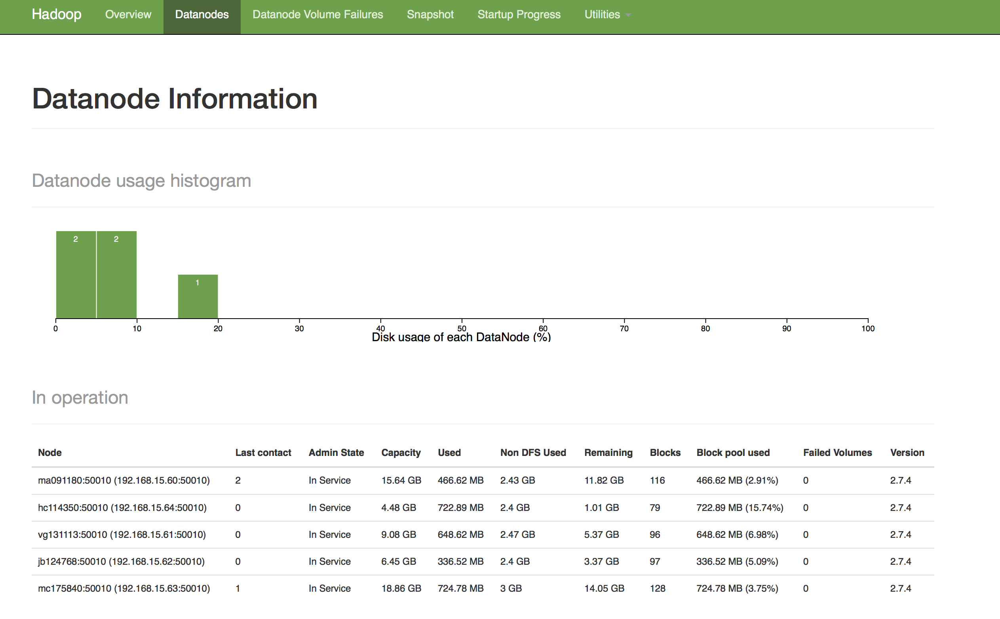
    
+ Imágen de `localhost:8088` seleccionando la opción Nodes
    
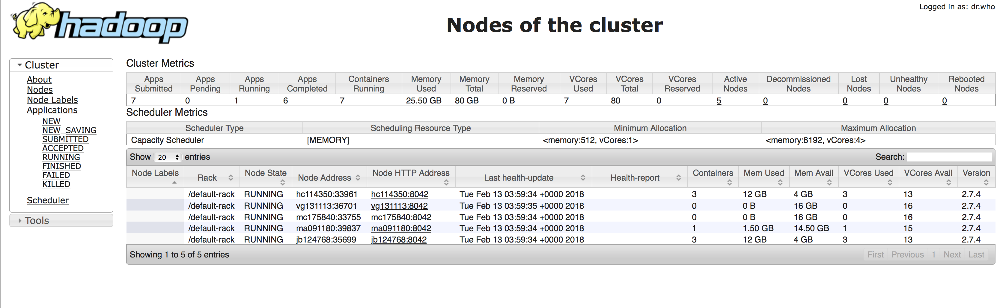
    
+ Imágen de `localhost:8088` seleccionando la opción FINISHED para ver que los jobs corrieron existosamente
    
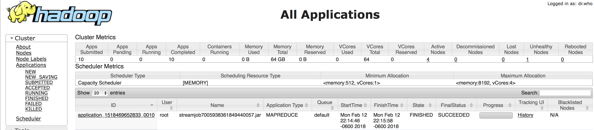
    
+ Imágen de output.txt 
    
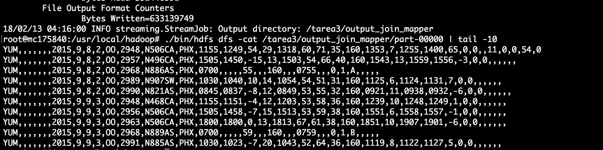

Se incluye el [Dockerfile](../parte_1/dockerfile/Dockerfile) usado para generar los nodos 
    
    

+ El rmd y html con el reporte que contiene el código del `mapper.py`, `reducer.py`, **head** del `output.txt` y las imágenes solicitadas de cada ejercicio

+ El dockerfile de su imágen

