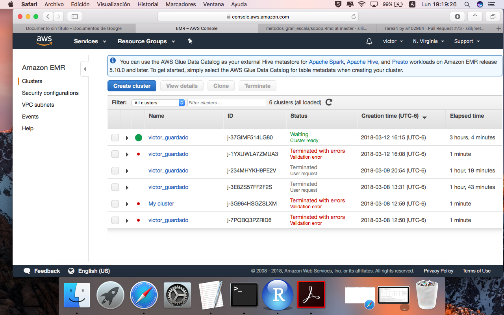
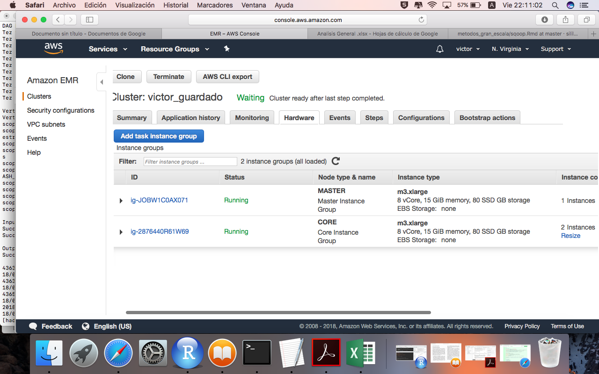
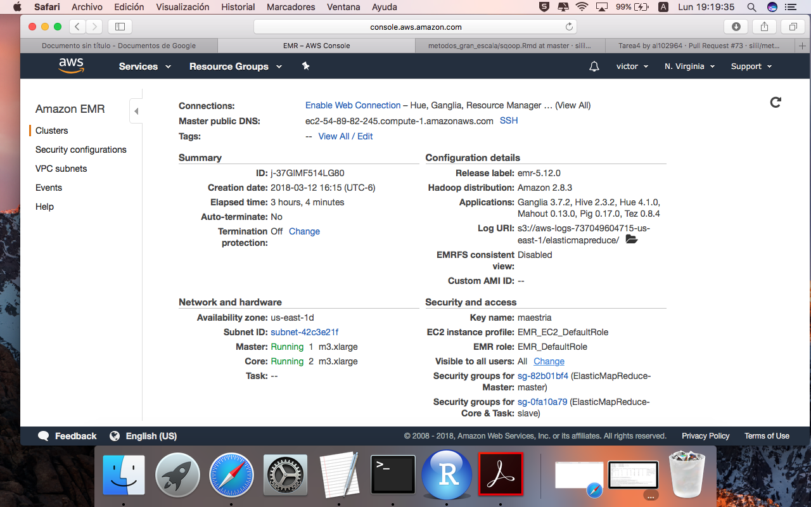

```{r setup, include=FALSE}
knitr::opts_chunk$set(echo = TRUE)
```


##Foto del CLuster en AWS



##Foto de los 2 nodos de slave y 1 master



##Foto de los detalles de los nodos



### Estructura de los archivos en S3

Para realizar la tarea 4 creé el bucket: **bucketmaestriavmg**, donde cargué los datos dentro de una carpeta llamda: **data**. Posteriormente creé dentro del mismo bucket las carpetas: **ejericioA** y **ejercicio_b**. En dichas carpetas se encuentran las salidas de cada una de sus respectivas preguntas. 


##Ejercicio A

**Modifica el ejercicio de Rank para que en lugar de obtener el id del producto con mejor rank obtengamos el nombre del producto con el mejor rank.**

```{r eval=FALSE}
## Creación de datasets 

orders = load 's3://bucketmaestriavmg/data/order_details.csv' using PigStorage(',') as (orderid:chararray,productid:chararray,unitprice:float,quantity:int,discount:float);
divs = load 's3://bucketmaestriavmg/data/products.csv' using PigStorage(',') as (productid:chararray, productname:chararray, supplierid:chararray, categoryid:chararray, quantityperunit:int, unitprice:float, unitsinstock:int, unitsonorder:int, reorderlevel:int, discounted:int);

##Operaciones

ordenes_agrupadas = group orders by productid;
contar_productos = FOREACH ordenes_agrupadas GENERATE group as productid,COUNT($1) as n;
join_ordenes_agrupadas = JOIN contar_productos by productid, divs by productid;
ranking = rank output by n DESC;
limite_ranking = limit ranking 1;
salida_A = FOREACH join_ordenes_agrupadas GENERATE $0,$3,n;


##Almacenaje de salida en S3

store salida_A into 's3://bucketmaestriavmg/data/ejercicioA/salida/’ using PigStorage(‘,’);
```


```{r eval=FALSE}

Resultado: 1,59,Raclette Courdavault,54
```


## Ejercicio B 

###Pregunta 1

**¿Cuántos vuelos existen en el dataset cuyo aeropuerto destino sea el "Honolulu International Airport"?**

```{r eval=FALSE}
## Creación de datasets 

aeropuertos = load 's3://bucketmaestriavmg/data/airports.csv' using PigStorage(',') as (iata_code:chararray,airport:chararray,city:chararray,state:chararray,country:chararray,latitude:float,longitude:float); 
vuelos = load 's3://bucketmaestriavmg/data/flights.csv' using PigStorage(',') as (year:int, month:int, day:int,day_of_week:int,airline:chararray,flight_number:int,tail_number:chararray,origin_airport:chararray,destination_airport:chararray,scheduled_departure:int,departure_time:int,departure_delay:int, taxi_out:int,wheels_off:int,scheduled_time:int,elapsed_time:int,air_time:int,distance:int,wheels_on:int,taxi_in:int,scheduled_arrival:int, arrival_time:int,arrival_delay:int,diverted:int,cancelled:int,cancellation_reason:chararray,air_system_delay:chararray,security_delay:chararray,airline_delay:chararray,late_aircraft_delay:chararray,weather_delay:chararray);
aerolineas = load 's3://bucketmaestriavmg/data/airlines.csv' using PigStorage(',') as (iata_code:chararray,airline:chararray);

##Operaciones

aeropuerto_honolulu = filter aeropuertos by airport in ('Honolulu International Airport');
honolulu_formato = FOREACH aeropuerto_honolulu generate iata_code, airport;
vuelos_honolulu = JOIN vuelos BY destination_airport, honolulu_formato BY iata_code;
vuelos_honolulu_group = GROUP vuelos_honolulu ALL;
salida_1 = FOREACH vuelos_honolulu_group GENERATE COUNT(vuelos_honolulu);

##Almacenaje de salida en S3

store salida_1 into 's3://bucketmaestriavmg/tarea_4/ejercicio_b/output_1' using PigStorage(',', '-schema');
```

```{r eval=FALSE}

Resultado: 43157
```


###Pregunta 2

**Cuál es el vuelo con más retraso? ¿De qué aerolínea es?**

```{r eval=FALSE}
##Operaciones

demora_vuelos = ORDER vuelos BY arrival_delay DESC;
summary_vuelos = FOREACH demora_vuelos GENERATE airline as codigo_aerolinea, numero_vuelo, demora;
summary_vuelos_top = limit summary_vuelos 1;
salida_2 = JOIN summary_vuelos_top by codigo_aerolinea, aerolineas by iata_code;

##Almacenaje de salida en S3

store salida_2 into 's3://bucketmaestriavmg/tarea_4/ejercicio_b/output_2/' using PigStorage(',', '-schema');
```

```{r eval=FALSE}

Resultado: AA,1322,1971,AA,American Airlines Inc.
```


###Pregunta 3

**¿Qué día es en el que más vuelos cancelados hay?**

```{r eval = FALSE}
##Operaciones

cancelados = filter vuelos by cancelled == 1;
reduccion_cancelados = FOREACH cancelados GENERATE day_of_week, cancelled;
dia_agrupados = GROUP reduccion_cancelados by day_of_week;
contador_dia = FOREACH dia_agrupados GENERATE group as day_of_week as dia, COUNT($1) as n;
salida_3 = rank contador_dia by n DESC;

##Almacenaje de salida en S3

store salida_3 into 's3://bucketmaestriavmg/tarea_4/ejercicio_b/output_3/' using PigStorage(',', '-schema');
```

```{r eval = FALSE}

Resultado: 1,1,21073
```


###Pregunta 4

**¿Cuáles son los aeropuertos orígen con 17 cancelaciones?**

```{r eval = FALSE}
##Operaciones

origen_vuelos_cancelados = FOREACH cancelados GENERATE origin_airport, cancelled;
origen_vuelos_cancelados_agrupados = GROUP origen_vuelos_cancelados by origin_airport;
suma_origen_vuelos_cancelados = FOREACH origen_vuelos_cancelados_agrupados GENERATE group as origin_airport, COUNT($1) as n;
vuelos_cancelados_top = filter suma_origen_vuelos_cancelados by n == 17;
join_vuelos_cancelados_top = JOIN vuelos_cancelados_top by origin_airport, aeropuertos by iata_code;
salida_4 = FOREACH join_vuelos_cancelados_top GENERATE iata_code, airport, n;

##Almacenaje de salida en S3

store salida_4 into 's3://bucketmaestriavmg/tarea_4/ejercicio_b/output_4/' using PigStorage(',', '-schema');
```

```{r eval = FALSE}

Resultado: 
            DHN,Dothan Regional Airport,17
            DIK,Dickinson Theodore Roosevelt Regional Airport,17
            ESC,Delta County Airport,17
```


###Pregunta 5

**¿Cuál es el aeropuerto origen con más vuelos cancelados?**

```{r eval = FALSE}
##Operaciones

join_aeropuertos_cancelados = JOIN suma_origen_vuelos_cancelados by origin_airport, airports by iata_code;
top_aeropuertos_cancelados = ORDER join_aeropuertos_cancelados by n DESC;
salida_5 = limit top_aeropuertos_cancelados 1;

##Almacenaje de salida en S3

store salida_5 into 's3://bucketmaestriavmg/tarea_4/ejercicio_b/output_5/' using PigStorage(',', '-schema');
```

```{r eval = FALSE}

Resultado:  ORD,8548,ORD,Chicago OHare International Airport,Chicago,IL,USA,41.9796,-87.90446
```


###Pregunta 6

**¿Cuál es el vuelo (flight number) con mayor diversidad de aeropuertos destino, cuáles son estos destinos? (ocupar bag te ayudará en esta pregunta)**

```{r eval = FALSE}
##Operaciones

destino_vuelos = FOREACH vuelos GENERATE flight_number, destination_airport;
destino_vuelos_distintos = distinct destino_vuelos;
info_aeropuertos = FOREACH aeropuertos GENERATE iata_code, airport;
vuelos_agrupados = GROUP destino_vuelos by flight_number;
aeropuertos_unicos = FOREACH vuelos_agrupados {dst = destino_vuelos.destination_airport; aeropuertos_unicos = distinct dst; GENERATE group as flight_number, COUNT(aeropuertos_unicos) as n;}; 
mayores_destinos = ORDER aeropuertos_unicos by n DESC;
mayor_destino = limit mayores_destinos 1;
mayores_destinos_iata = JOIN mayor_destino by flight_number, destino_vuelos_distintos by flight_number; 
mayores_destinos_completo = JOIN mayores_destinos_iata by $3, aeropuertos by iata_code;
salida_6 = FOREACH mayores_destinos_completo GENERATE $0 as flightnumber,$1 as flights_quantity,$3 as iata_code, $5 as airline; 

##Almacenaje de salida en S3

store salida_6 into 's3://bucketmaestriavmg/tarea_4/ejercicio_b/output_6/' using PigStorage(',', '-schema');
```

```{r eval=FALSE}

Resultado: 202,68,ATL,Hartsfield-Jackson Atlanta International Airport
```


