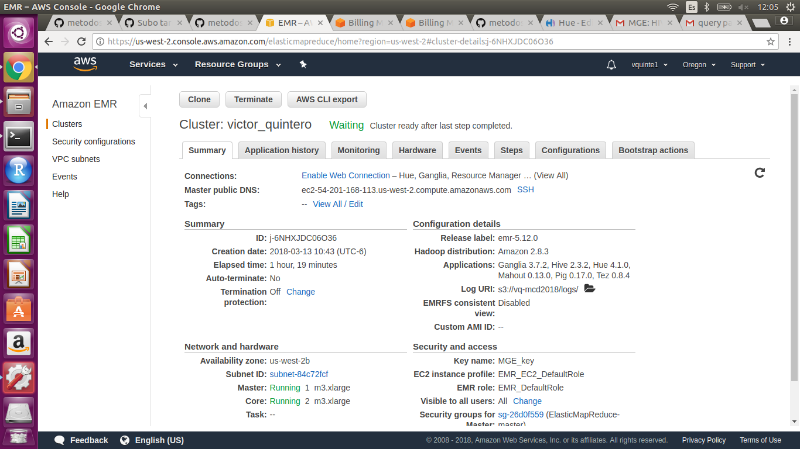
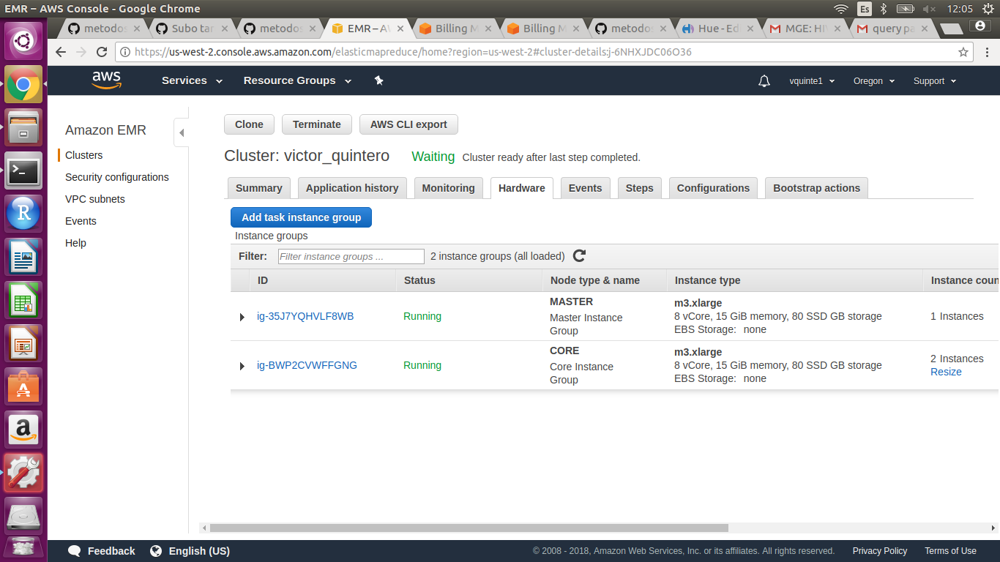

Para esta tarea se utilizó AWS con la interfaz de Hue, de acuerdo a lo recomendado, poniendole al cluster mi nombre.



<br>


<br>

Ejercicio 1. Con la base de datos de northwind que se encuentran en el dropbox:

a. ¿Cuántos "jefes" hay en la tabla empleados? 

*Hay dos jefes en la tabla empleados*

Query:
```{r, eval=FALSE}
SELECT count(DISTINCT(reportsto))
from employees
WHERE reportsto > 0;
```

¿Cuáles son estos jefes: número de empleado, nombre, apellido, título, fecha de nacimiento, fecha en que iniciaron en la empresa, ciudad y país? (atributo reportsto, ocupa explode en tu respuesta)

*num_empleado,	nombre,	apellido,	titulo,	fecha_nacimiento,	fecha_ingreso,	ciudad,	pais*

*2	Andrew,	Fuller,	Vice President Sales,	1952-02-19,	1992-08-14,	Tacoma,	USA*

*5	Steven,	Buchanan,	Sales Manager,	1955-03-04,	1993-10-17,	London,	UK*

Query:
```{r, eval=FALSE}
CREATE temporary table reporters as
SELECT reportsto, COLLECT_SET(lastname) as apellidos
from employees
WHERE reportsto > 0
GROUP BY reportsto; 

CREATE temporary table jointable as
SELECT employees.employeeid as num_empleado, 
        employees.firstname as nombre, 
        employees.lastname as apellido,  
        employees.title as titulo, 
        employees.birthdate as fecha_nacimiento, 
        employees.hiredate as fecha_ingreso, 
        employees.city as ciudad, 
        employees.country as pais,
	reporters.apellidos as subordinado
from employees
JOIN  reporters ON employees.employeeid = reporters.reportsto;

SELECT num_empleado,nombre,apellido,titulo,fecha_nacimiento,fecha_ingreso,ciudad,pais FROM jointable
LATERAL VIEW explode(subordinado) subview as sub;

```

b. ¿Quién es el segundo "mejor" empleado que más órdenes ha generado? (nombre, apellido, título, cuándo entró a la compañía, número de órdenes generadas, número de órdenes generadas por el mejor empleado (número 1))

*EL segundo mejor empleado es Janet Leverling con 127 órdenes generadas, que es Sales Representative, entró el primero de abril de 1992. El mejor empleado generó 156 órdenes.*

Query:
```{r, eval=FALSE}
CREATE temporary table numordenes as
SELECT employeeid, count(employeeid) as n
FROM orders
GROUP BY employeeid
ORDER BY n DESC
LIMIT 2;

CREATE temporary table toporders as
SELECT numordenes.employeeid, lead(numordenes.n) OVER(ORDER BY numordenes.n) as ordenes_primero, numordenes.n 
FROM numordenes
ORDER BY numordenes.n ASC
LIMIT 1;

SELECT employees.firstname as nombre,
        employees.lastname as apellido, 
        employees.title as titulo,
        employees.hiredate as fecha_ingreso,
        toporders.n as num_ordenes,
        toporders.ordenes_primero as num_ordenes_mejor_empleado
from toporders
JOIN employees ON toporders.employeeid = employees.employeeid;
```

Output:
nombre	apellido	titulo	fecha_ingreso	num_ordenes	num_ordenes_mejor_empleado
Janet	Leverling	Sales Representative	1992-04-01	127	156


c. ¿Cuál es el delta de tiempo más grande entre una orden y otra?

*El delta máximo es 3*

Query:
```{r, eval=FALSE}
CREATE temporary table orders_fecha as 
SELECT orderid, from_utc_timestamp(date_format(orderdate,'yyyy-MM-dd HH:mm:ss.SSS'),'UTC') as order_date, lag(from_utc_timestamp(date_format(orderdate,'yyyy-MM-dd HH:mm:ss.SSS'),'UTC')) OVER (partition by NULL) as order_date2 
from orders
ORDER BY order_date asc;

SELECT max(datediff(order_date, order_date2)) as delta 
FROM orders_fecha;
```


Ejercicio 2. Con los archivos de vuelos, aeropuertos y aerolíneas que están en el dropbox

a. ¿Qué aerolíneas (nombres) llegan al aeropuerto "Honolulu International Airport"?

*AS	Alaska Airlines Inc.*
*US	US Airways Inc.*
*AA	American Airlines Inc.*
*DL	Delta Air Lines Inc.*
*HA	Hawaiian Airlines Inc.*
*UA	United Air Lines Inc.*
*VX	Virgin America*

Query:
```{r,eval= FALSE}
SELECT DISTINCT airlines.iata_code as codigo_iata, airlines.airline as aerolinea
FROM flights
JOIN airlines ON flights.airline = airlines.iata_code
JOIN airports ON flights.destination_airport = airports.iata_code
WHERE airports.airport in ("Honolulu International Airport");
```

b. ¿En qué horario (hora del día, no importan los minutos) hay salidas del aeropuerto de San Francisco ("SFO") a "Honolulu International Airport"?

*Los horarios (hora del día) donde hay salidas del aeropuerto de San Francisco ("SFO") a "Honolulu International Airport":*

*1, 6, 7, 8, 9, 10, 11, 12, 13, 14, 15, 16, 17, 18, 19, 20, 21, 22, 23*

Query:
```{r, eval=FALSE}
SELECT DISTINCT CASE
    WHEN LENGTH(cast(flights.departure_time as string)) = "3" then cast(substr(flights.departure_time, 1, 1) as int) 
    WHEN LENGTH(cast(flights.departure_time as string)) = "4" then cast(substr(flights.departure_time, 1, 2) as int)
    ELSE 0
    END as horario
FROM flights
WHERE destination_airport in(SELECT iata_code FROM airports WHERE airport in ("Honolulu International Airport")) 
AND origin_airport in("SFO")
AND flights.departure_time IS NOT NULL
ORDER BY horario ASC;
```


c. ¿Qué día de la semana y en qué aerolínea nos conviene viajar a "Honolulu International Airport" para tener el menor retraso posible? 

*El mejor día para tener el menor retraso promedio de salida posible es el 1 (domingo) en la aerolinea Virgin America.*

*Nota: Se consideró como retraso únicamente valores positivos de la variable departure_delay, de acuerdo a lo comentado en slack.*

Query:
```{r,eval=FALSE}
create temporary table Honolulu as
SELECT day_of_week, airline, departure_delay
FROM flights
WHERE destination_airport IN (SELECT iata_code FROM airports WHERE airport in ("Honolulu International Airport"))
AND departure_delay > 0
AND flights.departure_delay IS NOT NULL;

SELECT honolulu.day_of_week as dia_semana, airlines.airline as aerolinea, round(avg(honolulu.departure_delay),2) as avg_delay
FROM honolulu
JOIN airlines ON honolulu.airline = airlines.iata_code
GROUP BY airlines.airline, honolulu.day_of_week
ORDER BY avg_delay ASC
LIMIT 1;
```

d. ¿Cuál es el aeropuerto con mayor tráfico de entrada?

*El aeropuerto con mayor tráfico de entrada es Hartsfield-Jackson Atlanta International Airport*

Query:
```{r, eval=FALSE}
SELECT airports.airport as aeropuerto, count(flights.destination_airport) as num_entradas
FROM flights
JOIN airports ON flights.destination_airport = airports.iata_code
GROUP BY flights.destination_airport, airports.airport
ORDER BY num_entradas DESC 
LIMIT 1;
```


e. ¿Cuál es la aerolínea con mayor retraso de salida por día de la semana?


*dia_semana,	aerolinea,	mayor_retraso*

*1,	Frontier Airlines Inc.,	50.22*

*2,	Frontier Airlines Inc.,	47.32*

*3,	Frontier Airlines Inc.,	43.85*

*4,	Atlantic Southeast Airlines,	41.68*

*5,	Frontier Airlines Inc.,	41.88*

*6,	Frontier Airlines Inc.,	44.57*

*7,	Frontier Airlines Inc.,	44.16*


*Vemos que la aerolínea que en promedio tiene más retrasos por día es Frontier Airlines*

*Nota: Se consideró como retraso únicamente valores positivos de la variable departure_delay, de acuerdo a lo comentado en slack.*

Query:
```{r, eval=FALSE}
CREATE temporary table retrasos as
SELECT day_of_week, airline, departure_delay 
FROM flights
WHERE departure_delay > 0
AND flights.departure_delay IS NOT NULL;

CREATE temporary table retrasosgroup as
SELECT retrasos.day_of_week as dia_semana, airlines.airline as aerolinea, round(avg(retrasos.departure_delay),2) as avg_delay
FROM retrasos
JOIN airlines ON retrasos.airline = airlines.iata_code
GROUP BY airlines.airline, retrasos.day_of_week
ORDER BY avg_delay ASC;

CREATE temporary table retrasomax as
SELECT dia_semana, aerolinea, max(avg_delay) as max_delay
FROM retrasosgroup
group by dia_semana, aerolinea;

CREATE temporary table maxdia as
SELECT dia_semana, MAX(max_delay) as max_retraso
FROM retrasomax
GROUP BY dia_semana;

SELECT maxdia.dia_semana as dia_semana, retrasomax.aerolinea as aerolinea, maxdia.max_retraso as mayor_retraso
FROM maxdia
JOIN retrasomax ON  maxdia.max_retraso = retrasomax.max_delay
ORDER BY dia_semana asc;
```

f. ¿Cuál es la tercer aerolínea con menor retraso de salida los lunes (day of week = 2)?

*La tercer aerolínea con menor retraso en promedio de salida los lunes es Southwest Airlines Co.*

*Nota: Se consideró como retraso únicamente valores positivos de la variable departure_delay, de acuerdo a lo comentado en slack.*

Query:
```{r, eval=FALSE}
CREATE temporary table retrasos as
SELECT airlines.airline as aerolinea, round(avg(flights.departure_delay),2) as avg_delay
FROM flights
JOIN airlines ON flights.airline = airlines.iata_code
WHERE departure_delay > 0
AND day_of_week = 2
AND flights.departure_delay IS NOT NULL
GROUP BY airlines.airline
ORDER BY avg_delay ASC;

CREATE temporary table retrasosranking as
SELECT row_number() OVER (ORDER BY retrasos.avg_delay) as ranking, aerolinea, avg_delay 
FROM retrasos;

SELECT * FROM retrasosranking
WHERE ranking = 3;
```


g. ¿Cuál es el aeropuerto origen que llega a la mayor cantidad de aeropuertos destino diferentes?

*El aeropuerto origen que llega a más aeropuertos destino diferentes es Hartsfield-Jackson Atlanta International Airport, con 169*

Query:
```{r, eval=FALSE}
CREATE temporary table destinos as
SELECT origin_airport, count(DISTINCT(destination_airport)) as n_destinos 
FROM flights
GROUP BY origin_airport
ORDER BY n_destinos DESC
LIMIT 1;

SELECT airports.airport as aeropuerto, destinos.n_destinos as destinos_diferentes
FROM destinos
JOIN airports ON destinos.origin_airport = airports.iata_code;
```


