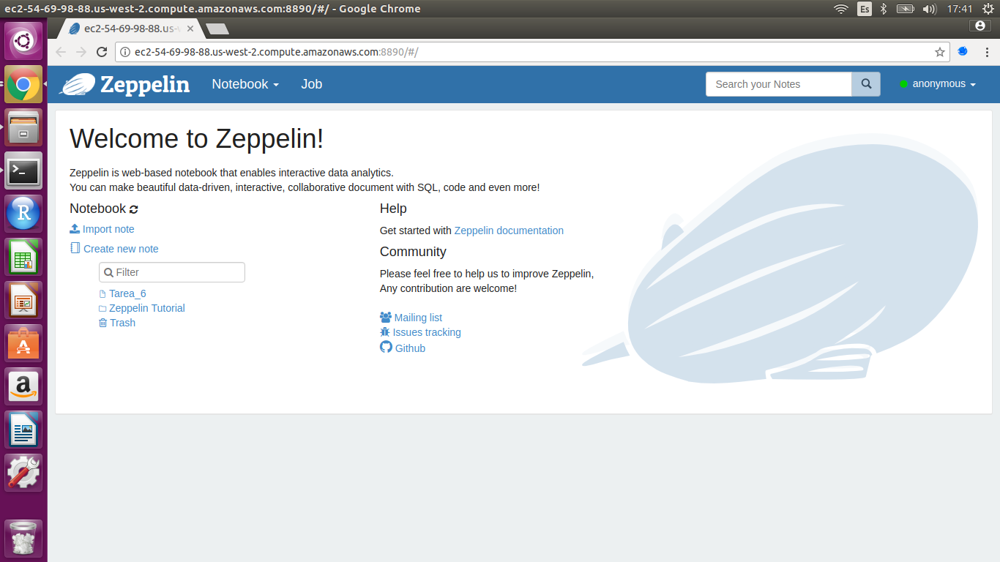

Para esta tarea se utilizó AWS con la interfaz de Zeppelin, de acuerdo a lo recomendado, poniendole al cluster mi nombre.


<br>


<br>


<br>

Ejercicio 1. Con la base de datos de northwind que se encuentran en el dropbox:

a. ¿Cuántos "jefes" hay en la tabla empleados? 

*Hay dos jefes en la tabla empleados*

Query:
```{r, eval=FALSE}
%pyspark
num_jefes = employees.select("reportsto").distinct().filter(employees.reportsto > 0)
num_jefes.count()
```

¿Cuáles son estos jefes: número de empleado, nombre, apellido, título, fecha de nacimiento, fecha en que iniciaron en la empresa, ciudad y país? (atributo reportsto, ocupa explode en tu respuesta)

+----------+---------+--------+--------------------+-------------------+-------------------+------+-------+------------+
|employeeid|firstname|lastname|               title|          birthdate|           hiredate|  city|country|subordinados|
+----------+---------+--------+--------------------+-------------------+-------------------+------+-------+------------+
|         2|   Andrew|  Fuller|Vice President, S...|1952-02-19 00:00:00|1992-08-14 00:00:00|Tacoma|    USA|       Janet|
|         2|   Andrew|  Fuller|Vice President, S...|1952-02-19 00:00:00|1992-08-14 00:00:00|Tacoma|    USA|       Laura|
|         2|   Andrew|  Fuller|Vice President, S...|1952-02-19 00:00:00|1992-08-14 00:00:00|Tacoma|    USA|       Nancy|
|         2|   Andrew|  Fuller|Vice President, S...|1952-02-19 00:00:00|1992-08-14 00:00:00|Tacoma|    USA|    Margaret|
|         2|   Andrew|  Fuller|Vice President, S...|1952-02-19 00:00:00|1992-08-14 00:00:00|Tacoma|    USA|      Steven|
|         5|   Steven|Buchanan|       Sales Manager|1955-03-04 00:00:00|1993-10-17 00:00:00|London|     UK|      Robert|
|         5|   Steven|Buchanan|       Sales Manager|1955-03-04 00:00:00|1993-10-17 00:00:00|London|     UK|        Anne|
|         5|   Steven|Buchanan|       Sales Manager|1955-03-04 00:00:00|1993-10-17 00:00:00|London|     UK|     Michael|
+----------+---------+--------+--------------------+-------------------+-------------------+------+-------+------------+

Query:
```{r, eval=FALSE}
%pyspark

#Ahora vemos cuales son esos jefes y ponemos los datos solicitados usando la función explode:

jefes = employees.groupby(col("reportsto").alias("id_jefe")).agg(collect_set("firstname").alias("subordinados")).filter(employees.reportsto > 0).orderBy("reportsto")
    
jefes = jefes.join(employees, employees.employeeid == jefes.id_jefe) \
    .select( "employeeid", 
        "firstname", 
        "lastname", 
        "title", 
        "birthdate", 
        "hiredate", 
        "city", 
        "country",
        explode("subordinados").alias("subordinados"))
          

jefes.coalesce(1).write.csv("s3a://vq-mcd2018/tarea_6/outputs/ej1a.csv", header = True)       
jefes.show()
```

b. ¿Quién es el segundo "mejor" empleado que más órdenes ha generado? (nombre, apellido, título, cuándo entró a la compañía, número de órdenes generadas, número de órdenes generadas por el mejor empleado (número 1))

*EL segundo mejor empleado es Janet Leverling con 127 órdenes generadas, que es Sales Representative, entró el primero de abril de 1992. El mejor empleado generó 156 órdenes.*

Query:
```{r, eval=FALSE}
%pyspark

num_ordenes = orders.groupBy("employeeid").count().orderBy("count", ascending=False)

segundo = num_ordenes.select("*", lead("count").over(Window.orderBy("count")).alias("ordenes_primero")) \
    .orderBy("count", ascending=False).limit(2) \
    .orderBy("count", ascending=True).limit(1) \
    .join(employees, "employeeid") \
    .select("employeeid", 
            "firstname", 
            "lastname", 
            "title",            
            "hiredate", 
            "count",
            "ordenes_primero")
            
segundo.coalesce(1).write.csv("s3a://vq-mcd2018/tarea_6/outputs/ej1b.csv", header = True)   

segundo.show()
```

Output:

+----------+---------+---------+--------------------+-------------------+-----+---------------+
|employeeid|firstname| lastname|               title|           hiredate|count|ordenes_primero|
+----------+---------+---------+--------------------+-------------------+-----+---------------+
|         3|    Janet|Leverling|Sales Representative|1992-04-01 00:00:00|  127|            156|
+----------+---------+---------+--------------------+-------------------+-----+---------------+


c. ¿Cuál es el delta de tiempo más grande entre una orden y otra?

*El delta máximo es 3*

Query:
```{r, eval=FALSE}
%pyspark

delta = orders.select("*", lag("orderdate").over(Window.orderBy("orderdate")).alias("prev_orderdate")) \
    .withColumn("delta", datediff("orderdate", "prev_orderdate")) \
    .orderBy("delta", ascending=False).select("delta") \
    .limit(1)

delta.coalesce(1).write.csv("s3a://vq-mcd2018/tarea_6/outputs/ej1c.csv", header = True)  

delta.show()
```


Ejercicio 2. Con los archivos de vuelos, aeropuertos y aerolíneas que están en el dropbox

a. ¿Qué aerolíneas (nombres) llegan al aeropuerto "Honolulu International Airport"?

+------------+--------------------+
|iata_airline|             AIRLINE|
+------------+--------------------+
|          AS|Alaska Airlines Inc.|
|          DL|Delta Air Lines Inc.|
|          VX|      Virgin America|
|          US|     US Airways Inc.|
|          HA|Hawaiian Airlines...|
|          AA|American Airlines...|
|          UA|United Air Lines ...|
+------------+--------------------+

Query:
```{r,eval= FALSE}
%pyspark
Honolulu = flights.select(col("airline").alias("iata_airline"),"destination_airport").join(airlines, airlines["iata_code"] == col("iata_airline")) \
    .join(airports, flights["destination_airport"] == airports["iata_code"]) \
    .filter(col("AIRPORT") == "Honolulu International Airport").select("iata_airline","AIRLINE").distinct()

Honolulu.coalesce(1).write.csv("s3a://vq-mcd2018/tarea_6/outputs/ej2a.csv", header = True) 

Honolulu.show()
```

b. ¿En qué horario (hora del día, no importan los minutos) hay salidas del aeropuerto de San Francisco ("SFO") a "Honolulu International Airport"?

*Los horarios (hora del día) donde hay salidas del aeropuerto de San Francisco ("SFO") a "Honolulu International Airport":*

*6, 7, 8, 9, 10, 11, 12, 13, 14, 15, 16, 17, 18, 19 *

Query:
```{r, eval=FALSE}
%pyspark

codigo_iata = airports.select("iata_code").filter(col("AIRPORT")=="Honolulu International Airport").first()[0]

Horas = flights.filter((col("destination_airport") == codigo_iata) & (col("origin_airport") == "SFO") & (col("SCHEDULED_DEPARTURE").isNotNull())) \
    .withColumn("Hora", when(flights["SCHEDULED_DEPARTURE"] > 100, floor((flights["SCHEDULED_DEPARTURE"])/100)).otherwise(0))\
    .select("Hora") \
    .distinct() \
    .orderBy("Hora")

Horas.coalesce(1).write.csv("s3a://vq-mcd2018/tarea_6/outputs/ej2b.csv", header = True) 
Horas.show()
```


c. ¿Qué día de la semana y en qué aerolínea nos conviene viajar a "Honolulu International Airport" para tener el menor retraso posible? 

*El mejor día para tener el menor retraso promedio de salida posible es el 1 (domingo) en la aerolinea Virgin America.*

*Nota: Se consideró como retraso únicamente valores positivos de la variable departure_delay, de acuerdo a lo comentado en slack.*

Query:
```{r,eval=FALSE}
%pyspark

codigo_iata = airports.select("iata_code").filter(col("AIRPORT")=="Honolulu International Airport").first()[0]

dia_semana = flights.filter((col("destination_airport") == codigo_iata) & (col("departure_delay") > 0) & (col("departure_delay").isNotNull())) \
    .select("day_of_week", col("airline").alias("iata_airline"), "departure_delay") \
    .groupBy("day_of_week", "iata_airline").avg("departure_delay") \
    .orderBy("avg(departure_delay)", ascending= True).limit(1) \
    .join(airlines, airlines["iata_code"] == col("iata_airline")) \
    .select("day_of_week","iata_airline","airline", col("avg(departure_delay)").alias("retraso_promedio"))
    
dia_semana.coalesce(1).write.csv("s3a://vq-mcd2018/tarea_6/outputs/ej2c.csv", header = True) 
dia_semana.show() 
```

d. ¿Cuál es el aeropuerto con mayor tráfico de entrada?

*El aeropuerto con mayor tráfico de entrada es Hartsfield-Jackson Atlanta International Airport*

Query:
```{r, eval=FALSE}
%pyspark

mas_entradas = flights.select("destination_airport").groupBy("destination_airport").count() \
    .join(airports, flights["destination_airport"] == airports["iata_code"]) \
    .orderBy("count", ascending=False).select("destination_airport","AIRPORT",col("count").alias("entradas")).limit(1)
    

mas_entradas.coalesce(1).write.csv("s3a://vq-mcd2018/tarea_6/outputs/ej2d.csv", header = True)

mas_entradas.show()
```


e. ¿Cuál es la aerolínea con mayor retraso de salida por día de la semana?


+-----------+--------------------+-----------+
|day_of_week|             airline|max_retraso|
+-----------+--------------------+-----------+
|          1|Frontier Airlines...|      50.22|
|          2|Frontier Airlines...|      47.32|
|          3|Frontier Airlines...|      43.85|
|          4|Atlantic Southeas...|      41.68|
|          5|Frontier Airlines...|      41.88|
|          6|Frontier Airlines...|      44.57|
|          7|Frontier Airlines...|      44.16|
+-----------+--------------------+-----------+


*Vemos que la aerolínea que en promedio tiene más retrasos por día es Frontier Airlines*

*Nota: Se consideró como retraso únicamente valores positivos de la variable departure_delay, de acuerdo a lo comentado en slack.*

Query:
```{r, eval=FALSE}
%pyspark

retraso_aerolineas = flights.filter((col("departure_delay") > 0) & (col("departure_delay").isNotNull())) \
    .select(col("airline").alias("iata_airline"),"departure_delay", "day_of_week") \
    .groupBy("day_of_week", "iata_airline").agg(round(avg("departure_delay"),2).alias("retraso_prom")) \
    .join(airlines, airlines["iata_code"] == col("iata_airline")).select("day_of_week","iata_airline","retraso_prom", "airline")
    
    
retraso_dia = retraso_aerolineas.select(col("day_of_week").alias("dia_semana"),"iata_airline","retraso_prom", "airline").groupBy("dia_semana").agg(max("retraso_prom").alias("max_retraso")) \
    .join(retraso_aerolineas, col("retraso_prom")==col("max_retraso")) \
    .select("day_of_week","airline", "max_retraso") \
    .orderBy("day_of_week", ascending=True)

retraso_dia.coalesce(1).write.csv("s3a://vq-mcd2018/tarea_6/outputs/ej2e.csv", header = True)

retraso_dia.show()
```

f. ¿Cuál es la tercer aerolínea con menor retraso de salida los lunes (day of week = 2)?

*La tercer aerolínea con menor retraso en promedio de salida los lunes es Southwest Airlines Co.*

*Nota: Se consideró como retraso únicamente valores positivos de la variable departure_delay, de acuerdo a lo comentado en slack.*

Query:
```{r, eval=FALSE}
%pyspark

retraso_aerolineas = flights.filter( (col("day_of_week") == 2) & (col("departure_delay") > 0) & (col("departure_delay").isNotNull())) \
    .select(col("airline").alias("iata_airline"),"departure_delay") \
    .groupBy("iata_airline").agg(round(avg("departure_delay"),2).alias("retraso_prom")) \
    .join(airlines, airlines["iata_code"] == col("iata_airline")).select("iata_airline","retraso_prom", "airline") \
    .orderBy("retraso_prom", ascending=True) \
    .withColumn("rank", rank().over(Window.orderBy("retraso_prom"))) \
    .filter(col("rank") == 3)

retraso_aerolineas.coalesce(1).write.csv("s3a://vq-mcd2018/tarea_6/outputs/ej2f.csv", header = True)
  
retraso_aerolineas.show()
```


g. ¿Cuál es el aeropuerto origen que llega a la mayor cantidad de aeropuertos destino diferentes?

*El aeropuerto origen que llega a más aeropuertos destino diferentes es Hartsfield-Jackson Atlanta International Airport, con 169*

Query:
```{r, eval=FALSE}
%pyspark

mas_destinos = flights.select("origin_airport", "destination_airport").distinct().groupBy("origin_airport").count().orderBy("count", ascending=False) \
    .join(airports, flights["origin_airport"] == airports["iata_code"]) \
    .select("origin_airport", "AIRPORT", col("count").alias("num_destinos")).limit(1)
    
mas_destinos.coalesce(1).write.csv("s3a://vq-mcd2018/tarea_6/outputs/ej2g.csv", header = True)
  
mas_destinos.show()
```


