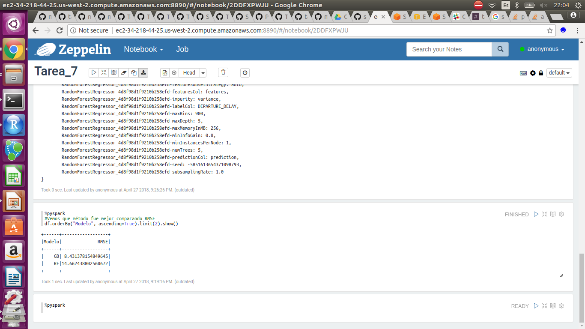

Se crea cluster

 

 

Se muestra diagrama de elementos del código, donde se representa con verde DataFrames, con azul transformers, gris estimadores y blanco diccionarios para el grid search:

 

 

El script a correr se puede ver en el archivo *script.py*. Además se agrega el archivo *Tarea_7.json* que es el zeppelin que se ocupó.

Se pone evidencia de que el script se ejecutó correctamente:

 

 

Los algoritmos que se ocuparon fueron Random Forest y Gradient Boosting.

##Preguntas:

### ¿Qué parámetros resultaron mejor por algoritmo? 

Los mejores parámetros para Gradient Boosting fueron:

{
	GBTRegressor_44f5a2b1652e23f52302-cacheNodeIds: false,
	GBTRegressor_44f5a2b1652e23f52302-checkpointInterval: 10,
	GBTRegressor_44f5a2b1652e23f52302-featuresCol: features,
	GBTRegressor_44f5a2b1652e23f52302-impurity: variance,
	GBTRegressor_44f5a2b1652e23f52302-labelCol: DEPARTURE_DELAY,
	GBTRegressor_44f5a2b1652e23f52302-lossType: squared,
	GBTRegressor_44f5a2b1652e23f52302-maxBins: 800,
	GBTRegressor_44f5a2b1652e23f52302-maxDepth: 5,
	GBTRegressor_44f5a2b1652e23f52302-maxIter: 5,
	GBTRegressor_44f5a2b1652e23f52302-maxMemoryInMB: 256,
	GBTRegressor_44f5a2b1652e23f52302-minInfoGain: 0.0,
	GBTRegressor_44f5a2b1652e23f52302-minInstancesPerNode: 1,
	GBTRegressor_44f5a2b1652e23f52302-predictionCol: prediction,
	GBTRegressor_44f5a2b1652e23f52302-seed: -6363326153609583521,
	GBTRegressor_44f5a2b1652e23f52302-stepSize: 0.1,
	GBTRegressor_44f5a2b1652e23f52302-subsamplingRate: 1.0
}

Evidencia en cluster:

 

 

Los mejores parámetros para Random Forest fueron:

{
	RandomForestRegressor_4d8f98d1f9210b258efd-cacheNodeIds: false,
	RandomForestRegressor_4d8f98d1f9210b258efd-checkpointInterval: 10,
	RandomForestRegressor_4d8f98d1f9210b258efd-featureSubsetStrategy: auto,
	RandomForestRegressor_4d8f98d1f9210b258efd-featuresCol: features,
	RandomForestRegressor_4d8f98d1f9210b258efd-impurity: variance,
	RandomForestRegressor_4d8f98d1f9210b258efd-labelCol: DEPARTURE_DELAY,
	RandomForestRegressor_4d8f98d1f9210b258efd-maxBins: 900,
	RandomForestRegressor_4d8f98d1f9210b258efd-maxDepth: 5,
	RandomForestRegressor_4d8f98d1f9210b258efd-maxMemoryInMB: 256,
	RandomForestRegressor_4d8f98d1f9210b258efd-minInfoGain: 0.0,
	RandomForestRegressor_4d8f98d1f9210b258efd-minInstancesPerNode: 1,
	RandomForestRegressor_4d8f98d1f9210b258efd-numTrees: 5,
	RandomForestRegressor_4d8f98d1f9210b258efd-predictionCol: prediction,
	RandomForestRegressor_4d8f98d1f9210b258efd-seed: -5851613654371098793,
	RandomForestRegressor_4d8f98d1f9210b258efd-subsamplingRate: 1.0
}

 

 

### ¿Qué algoritmo resultó el mejor, con qué parámetros?

Para elegir el mejor modelo se usó la metrica de error cuadrático medio (RMSE), dando los siguientes resultados

|Modelo|              RMSE|
|------|------------------|
|    GB| 8.431378154849645|
|    RF|14.662438802560672|

Evidencia en cluster:

 

 

Por lo que el mejor modelo fue Gradient Boosting con los parámetros descritos anteriormente:

maxBins: 800
maxDepth: 5
maxIter: 5

{
	GBTRegressor_44f5a2b1652e23f52302-cacheNodeIds: false,
	GBTRegressor_44f5a2b1652e23f52302-checkpointInterval: 10,
	GBTRegressor_44f5a2b1652e23f52302-featuresCol: features,
	GBTRegressor_44f5a2b1652e23f52302-impurity: variance,
	GBTRegressor_44f5a2b1652e23f52302-labelCol: DEPARTURE_DELAY,
	GBTRegressor_44f5a2b1652e23f52302-lossType: squared,
	GBTRegressor_44f5a2b1652e23f52302-maxBins: 800,
	GBTRegressor_44f5a2b1652e23f52302-maxDepth: 5,
	GBTRegressor_44f5a2b1652e23f52302-maxIter: 5,
	GBTRegressor_44f5a2b1652e23f52302-maxMemoryInMB: 256,
	GBTRegressor_44f5a2b1652e23f52302-minInfoGain: 0.0,
	GBTRegressor_44f5a2b1652e23f52302-minInstancesPerNode: 1,
	GBTRegressor_44f5a2b1652e23f52302-predictionCol: prediction,
	GBTRegressor_44f5a2b1652e23f52302-seed: -6363326153609583521,
	GBTRegressor_44f5a2b1652e23f52302-stepSize: 0.1,
	GBTRegressor_44f5a2b1652e23f52302-subsamplingRate: 1.0
}

El tiempo de ejecución del magic_loop fue de 2 hrs 20 min 27 sec de acuerdo a zeppelin, no se uso la función timeit por problemas de java en el cluster.

