# Configuración inicial

## Inicialización del cluster AWS

Se montó un cluster en AWS que contuviera Hive y HUE para poder ejecutar los queries.

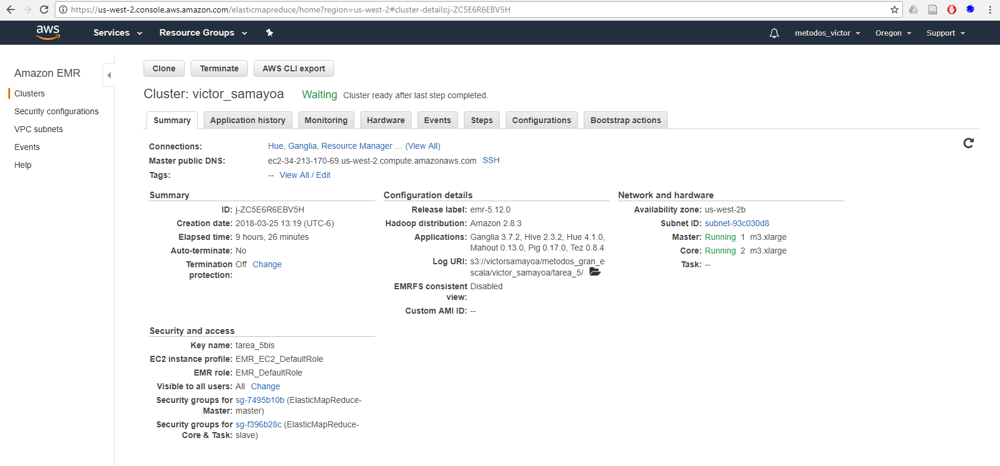

Una vez creado el cluster, se procedió a conectarse al HUE 

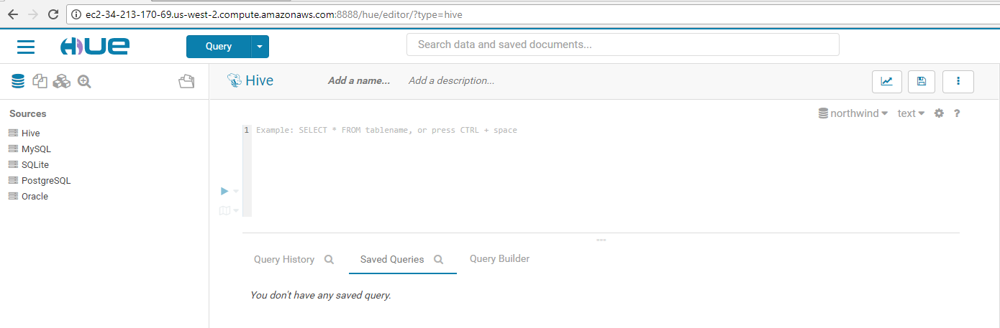

A partir de este momento, todos los comandos se ejecutarán desdel el HUE.

# Ejercicio 1

Creamos la base de datos que contendrá las tablas de **northwind**

~~~sql
drop database if exists northwind cascade;

create database if not exists northwind
location 's3://victorsamayoa/metodos_gran_escala/victor_samayoa/tarea_5/hive/northwind/';
~~~

Y una vez creada la base de datos, se comienzan a crear las tablas y a cargarlas con la información de los archivos.

Se crea la tabla **products**:

~~~sql
create external table if not exists northwind.products (
productid smallint,
productname string,
supplierid smallint,
categoryid smallint,
quantityperunit string,
unitprice float,
unitsinstock smallint,
unitsonorder smallint,
reorderlevel smallint,
discontinued int
)
ROW FORMAT DELIMITED FIELDS TERMINATED BY ','
LOCATION 's3://victorsamayoa/metodos_gran_escala/victor_samayoa/tarea_5/hive/northwind/products'
TBLPROPERTIES ("skip.header.line.count" = "1");

LOAD DATA INPATH 's3://victorsamayoa/metodos_gran_escala/victor_samayoa/tarea_5/datos/northwind/products.csv'
INTO table northwind.products;
~~~

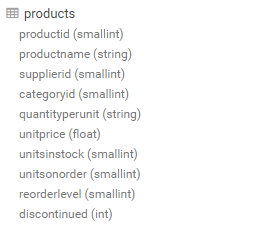

Se crea la tabla **orders**

~~~sql
create external table if not exists northwind.orders (
orderid smallint,
customerid string,
employeeid smallint,
orderdate date,
requireddate date,
shippeddate date,
shipvia smallint,
freight	float,
shipname string,
shipaddress string,
shipcity string,
shipregion	string,
shippostalcode string,
shipcountry string
)
ROW FORMAT DELIMITED FIELDS TERMINATED BY ','
LOCATION 's3://victorsamayoa/metodos_gran_escala/victor_samayoa/tarea_5/hive/northwind/orders'
TBLPROPERTIES ("skip.header.line.count" = "1");

LOAD DATA INPATH 's3://victorsamayoa/metodos_gran_escala/victor_samayoa/tarea_5/datos/northwind/orders.csv'
INTO table northwind.orders;
~~~

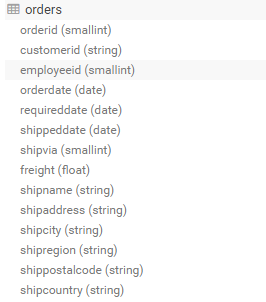

Se crea la tabla **order_details**

~~~sql
create external table if not exists northwind.order_details (
orderid smallint,
productid smallint,
unitprice float,
quantity smallint,
discount float
)
ROW FORMAT DELIMITED FIELDS TERMINATED BY ','
LOCATION 's3://victorsamayoa/metodos_gran_escala/victor_samayoa/tarea_5/hive/northwind/order_details'
TBLPROPERTIES ("skip.header.line.count" = "1");

LOAD DATA INPATH 's3://victorsamayoa/metodos_gran_escala/victor_samayoa/tarea_5/datos/northwind/order_details.csv'
INTO table northwind.order_details;
~~~

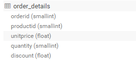

Se crea la tabla **employees**

~~~sql
create external table if not exists northwind.employees (
employeeid smallint,
lastname string,
firstname string,
title string,
titleofcourtesy string,
birthdate date,
hiredate date,
address string,
city string,
region string,
postalcode string,
country string,
homephone string,
extension string,
photo string,
notes string,
reportsto smallint,
photopath string
)
ROW FORMAT DELIMITED FIELDS TERMINATED BY ','
LOCATION 's3://victorsamayoa/metodos_gran_escala/victor_samayoa/tarea_5/hive/northwind/employees'
TBLPROPERTIES ("skip.header.line.count" = "1");

LOAD DATA INPATH 's3://victorsamayoa/metodos_gran_escala/victor_samayoa/tarea_5/datos/northwind/employees.csv'
INTO table northwind.employees;
~~~

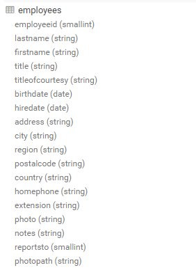

Se crea la tabla **customers**

~~~sql
create external table if not exists northwind.customers (
customerid string,
companyname string,
contactname string,
contacttitle string,
address	string, 
city string,
region string,
postalcode string,
country string,
phone string,
fax string
)
ROW FORMAT DELIMITED FIELDS TERMINATED BY ','
LOCATION 's3://victorsamayoa/metodos_gran_escala/victor_samayoa/tarea_5/hive/northwind/customers'
TBLPROPERTIES ("skip.header.line.count" = "1");

LOAD DATA INPATH 's3://victorsamayoa/metodos_gran_escala/victor_samayoa/tarea_5/datos/northwind/customers.csv'
INTO table northwind.customers;
~~~

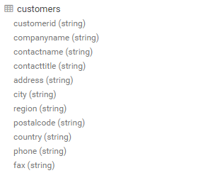

Una vez creada la base de datos northwind con uss tablas respectivas, se le indica al HUE que todos los queries se ejecutaran desde la base de datos northwind

~~~sql
USE northwind;
~~~

Y se comienzan e a ejecutar los queries para responder las preguntas de los ejercicios

## Pregunta 1.a
¿Cuántos "jefes" hay en la tabla empleados?

~~~sql
SELECT count(J.jefes) as num_jefes 
FROM (
SELECT reportsto as jefes 
FROM employees 
WHERE reportsto IS NOT NULL
GROUP BY reportsto) J;
~~~

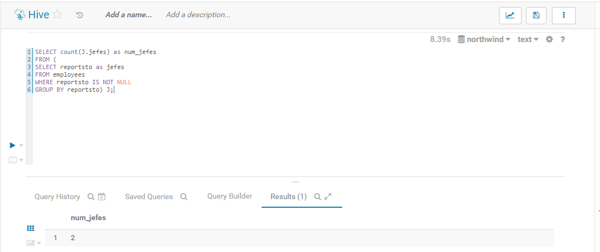

¿Cuáles son estos jefes: número de empleado, nombre, apellido, título, fecha de nacimiento, fecha en que iniciaron en la empresa, ciudad y país?

~~~sql
SELECT employeeid
      ,firstname
      ,lastname
      ,title
      ,birthdate
      ,hiredate
      ,city
      ,country
      ,reportsto
FROM employees
WHERE employeeid IN (SELECT reportsto
                     FROM employees
                     WHERE reportsto IS NOT NULL
                     GROUP BY reportsto);
~~~

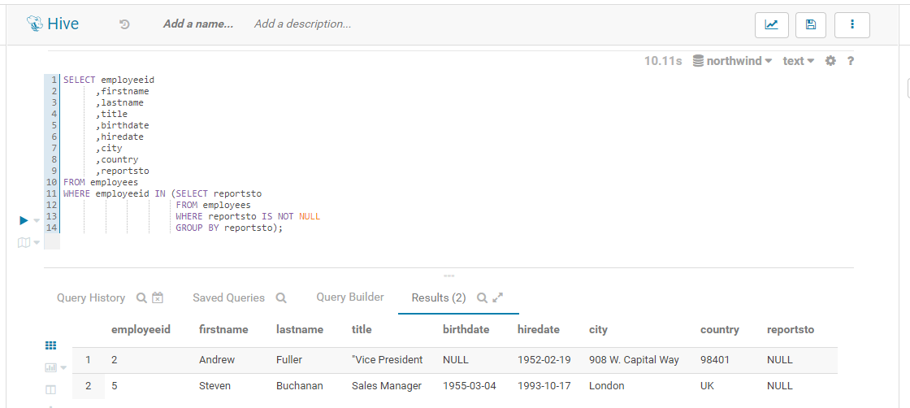

## Pregunta 1.b
¿Quién es el segundo "mejor" empleado que más órdenes ha generado? (nombre, apellido, título, cuándo entró a la compañía, número de órdenes generadas, número de órdenes generadas por el mejor empleado (número 1))

~~~sql
SELECT E.firstname 
      ,E.lastname 
      ,E.title 
      ,E.hiredate 
      ,T.orders 
      ,T.bestOrders 
FROM employees E 
INNER JOIN ( 
SELECT employeeid 
      ,COUNT(*) as orders 
      ,LEAD(COUNT(*)) OVER(ORDER BY COUNT(*) ASC) as bestOrders 
      ,ROW_NUMBER() OVER(ORDER BY COUNT(*) DESC) as position 
FROM orders 
GROUP BY employeeid) T 
ON (E.employeeid = T.employeeid) 
WHERE position = 2;
~~~

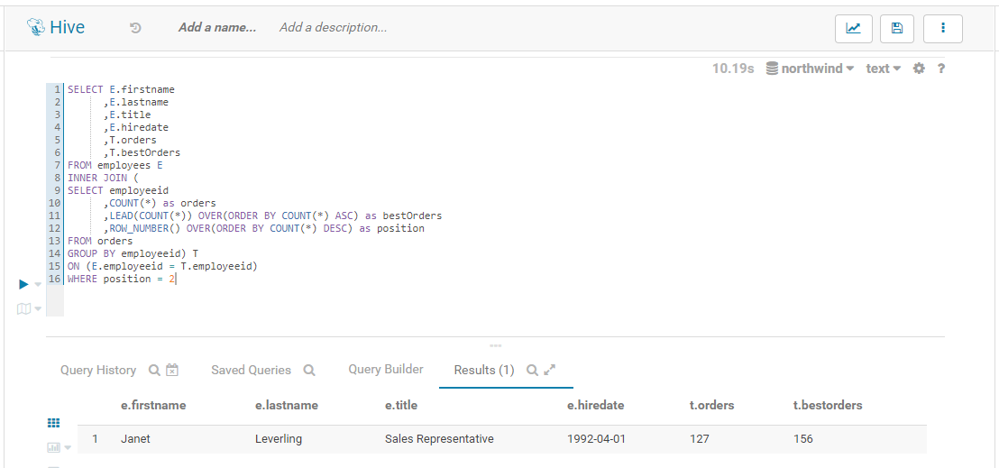

## Pregunta 1.c
¿Cuál es el delta de tiempo más grande entre una orden y otra?

~~~sql
SELECT max(D.daydiff) as daydiff 
FROM ( 
SELECT DATEDIFF(TIMESTAMP(orderdate) 
      ,TIMESTAMP(LAG(orderdate) OVER(ORDER BY orderdate ASC))) as daydiff 
FROM orders) D;
~~~

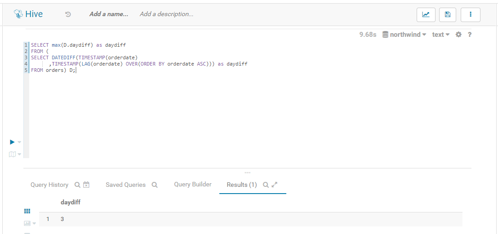

# Ejercicio 2

Creamos la base de datos que contendrá las tablas de **flights**

~~~sql
drop database if exists flights cascade;

create database if not exists northwind
location 's3://victorsamayoa/metodos_gran_escala/victor_samayoa/tarea_5/hive/flights/';
~~~

Se crea la tabla **airlines**

~~~sql
create external table if not exists flights.airlines (
iata_code string,
airline string
)
ROW FORMAT DELIMITED FIELDS TERMINATED BY ','
LOCATION 's3://victorsamayoa/metodos_gran_escala/victor_samayoa/tarea_5/hive/flights/airlines'
TBLPROPERTIES ("skip.header.line.count" = "1");

LOAD DATA INPATH 's3://victorsamayoa/metodos_gran_escala/victor_samayoa/tarea_5/datos/flights/airlines.csv'
INTO table flights.airlines;
~~~

Se crea la tabla **airports**

~~~sql
create external table if not exists flights.airports (
iata_code string,
airport string,
city string,
state string,
country string,
latitude float,
longitude float
)
ROW FORMAT DELIMITED FIELDS TERMINATED BY ','
LOCATION 's3://victorsamayoa/metodos_gran_escala/victor_samayoa/tarea_5/hive/flights/airports'
TBLPROPERTIES ("skip.header.line.count" = "1");

LOAD DATA INPATH 's3://victorsamayoa/metodos_gran_escala/victor_samayoa/tarea_5/datos/flights/airports.csv'
INTO table flights.airports;
~~~

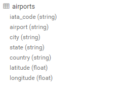

Se crea la tabla **flights**

~~~sql
create external table if not exists flights.flights (
year smallint,
month smallint,
day smallint,
day_of_week smallint,
airline string,
flight_number string,
tail_number string,
origin_airport string,
destination_airport string,
scheduled_departure string,
departure_time string,
departure_delay smallint,
taxi_out smallint,
wheels_off smallint,
scheduled_time smallint,
elapsed_time smallint,
air_time smallint,
distance smallint,
wheels_on smallint,
taxi_in smallint,
scheduled_arrival string,
arrival_time string,
arrival_delay smallint,
diverted smallint,
cancelled smallint,
cancellation_reason string,
air_system_delay smallint,
security_delay smallint,
airline_delay smallint,
late_aircraft_delay smallint,
weather_delay smallint
)
ROW FORMAT DELIMITED FIELDS TERMINATED BY ','
LOCATION 's3://victorsamayoa/metodos_gran_escala/victor_samayoa/tarea_5/hive/flights/flights'
TBLPROPERTIES ("skip.header.line.count" = "1");

LOAD DATA INPATH 's3://victorsamayoa/metodos_gran_escala/victor_samayoa/tarea_5/datos/flights/flights.csv'
INTO table flights.flights;
~~~

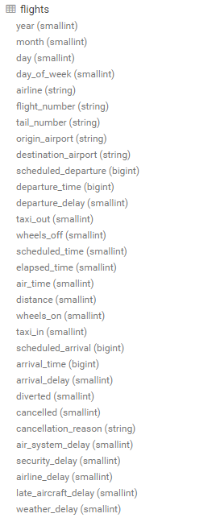

Una vez creada la base de datos flights con uss tablas respectivas, se le indica al HUE que todos los queries se ejecutaran desde la base de datos flights

~~~sql
USE flights;
~~~

Y se comienzan e a ejecutar los queries para responder las preguntas de los ejercicios

## Ejercicio 2.a
¿Qué aerolíneas (nombres) llegan al aeropuerto "Honolulu International Airport"? 

~~~sql
SELECT A.airline 
FROM airlines A 
INNER JOIN (
SELECT airline 
FROM flights 
WHERE destination_airport = (SELECT iata_code 
                             FROM airports 
                             WHERE airport == 'Honolulu International Airport') 
GROUP BY airline) F 
ON (A.IATA_CODE = F.airline);
~~~

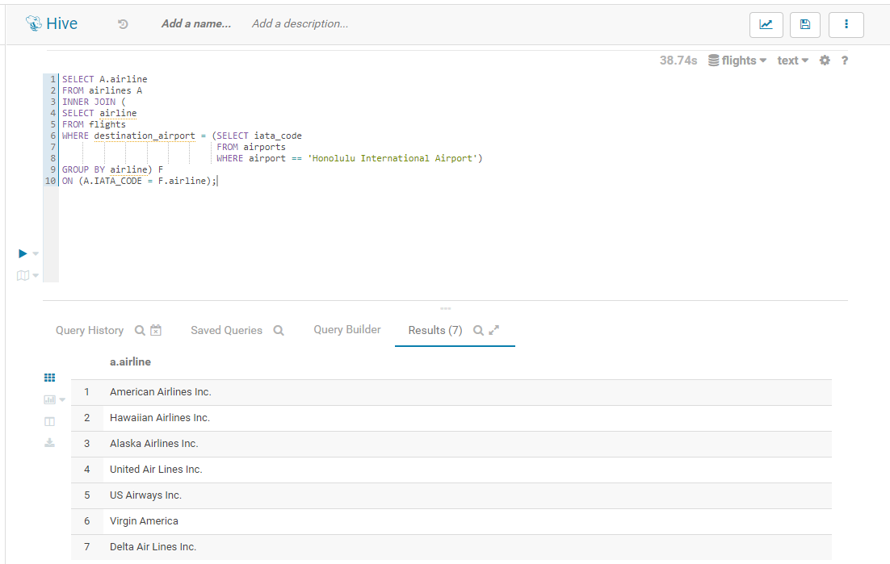

## Ejercicio 2.b
¿En qué horario (hora del día, no importan los minutos) hay salidas del aeropuerto de San Francisco ("SFO") a "Honolulu International Airport"?

~~~sql
SELECT SUBSTR(scheduled_departure, 1, 2) as scheduled 
FROM flights 
WHERE destination_airport = (SELECT iata_code 
                             FROM airports 
                             WHERE airport == 'Honolulu International Airport') 
AND origin_airport = (SELECT iata_code 
                      FROM airports 
                      WHERE airport == 'San Francisco International Airport') 
GROUP BY SUBSTR(scheduled_departure, 1, 2);
~~~

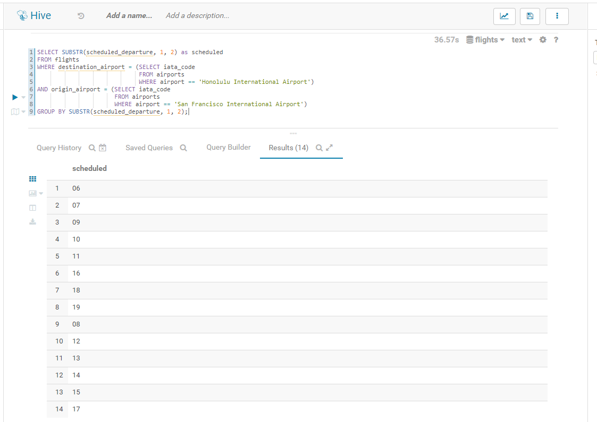

## Ejercicio 2.c
¿Qué día de la semana y en qué aerolínea nos conviene viajar a "Honolulu International Airport" para tener el menor retraso posible?

Debido a que lo importante es tener el menor retraso posible al aterrizar (No importa que el vuelo salga con 15 minutos antes si va a llegar 30 minutos tarde.) El Query se enfocará unicamente en el retraso de la llegadá

~~~sql
SELECT TBL.day_of_week 
      ,TBL.airline 
      ,TBL.avg_delay 
FROM ( 
SELECT F.day_of_week 
      ,A.airline 
      ,AVG(F.arrival_delay) as avg_delay 
      ,ROW_NUMBER() OVER(ORDER BY AVG(F.arrival_delay) ASC) as position 
FROM flights F 
INNER JOIN airlines A 
ON (F.airline = A.iata_code) 
WHERE F.destination_airport = (SELECT iata_code 
                               FROM airports 
                               WHERE airport == 'Honolulu International Airport') 
GROUP BY F.day_of_week, A.airline) TBL 
WHERE position = 1;
~~~

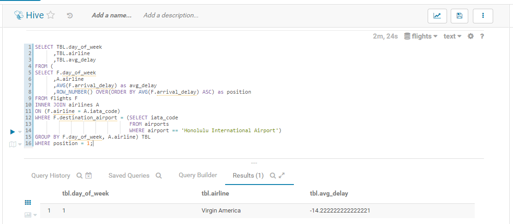

## Ejecicio 2.d
¿Cuál es el aeropuerto con mayor tráfico de entrada?

~~~sql
SELECT A.airport 
FROM airports A 
INNER JOIN ( 
SELECT destination_airport 
      ,COUNT(*) as count 
      ,ROW_NUMBER() OVER(ORDER BY COUNT(*) DESC) as position 
FROM flights 
GROUP BY destination_airport) F
ON (A.iata_code = F.destination_airport) 
WHERE position = 1;
~~~

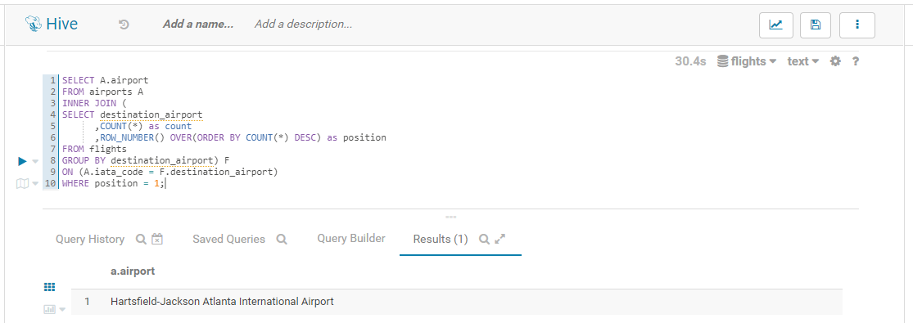

## Ejercicio 2.e
¿Cuál es la aerolínea con mayor retraso de salida por día de la semana?

~~~sql
SELECT TBL.day_of_week 
      ,TBL.airline 
      ,TBL.max_delayed_departure 
FROM ( 
SELECT F.day_of_week 
      ,A.airline 
      ,MAX(CAST(F.departure_delay as float)) as max_delayed_departure 
      ,ROW_NUMBER() OVER(PARTITION BY F.day_of_week ORDER BY MAX(F.departure_delay) DESC) as position 
FROM flights F 
INNER JOIN airlines A 
ON(F.airline = A.iata_code) 
GROUP BY F.day_of_week, A.airline) TBL
WHERE position = 1 
ORDER BY day_of_week ASC;
~~~

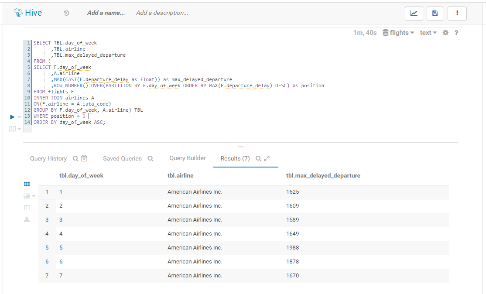

## Ejercicio 2.f
¿Cuál es la tercer aerolínea con menor retraso de salida los lunes (day of week = 2)?
 
~~~sql
SELECT TBL.day_of_week 
      ,TBL.airline 
      ,TBL.max_delayed_departure 
FROM ( 
SELECT F.day_of_week 
      ,A.airline 
      ,MIN(CAST(F.departure_delay as float)) as max_delayed_departure
      ,ROW_NUMBER() OVER(PARTITION BY F.day_of_week ORDER BY MIN(F.departure_delay) ASC) as position 
FROM flights F 
INNER JOIN airlines A 
ON(F.airline = A.iata_code) 
GROUP BY F.day_of_week, A.airline) TBL
WHERE position = 3 
AND day_of_week = 2;
~~~
 
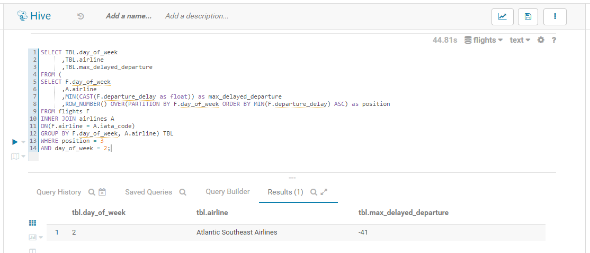
 
## Ejercicio 2.g
¿Cuál es el aeropuerto origen que llega a la mayor cantidad de aeropuertos destino diferentes?
 
~~~sql
SELECT A.airport 
      ,D.destinations 
FROM ( 
SELECT D.origin_airport 
      ,destinations 
      ,ROW_NUMBER() OVER(ORDER BY destinations DESC) as position 
FROM ( 
SELECT DISTINCT 
       D. origin_airport 
      ,COUNT(destination_airport) OVER(PARTITION BY origin_airport) as destinations 
FROM ( 
SELECT origin_airport 
      ,destination_airport 
FROM flights 
GROUP BY origin_airport, destination_airport) D ) D ) D 
INNER JOIN airports A 
ON (D.origin_airport = A.iata_code) 
WHERE position = 1;
~~~

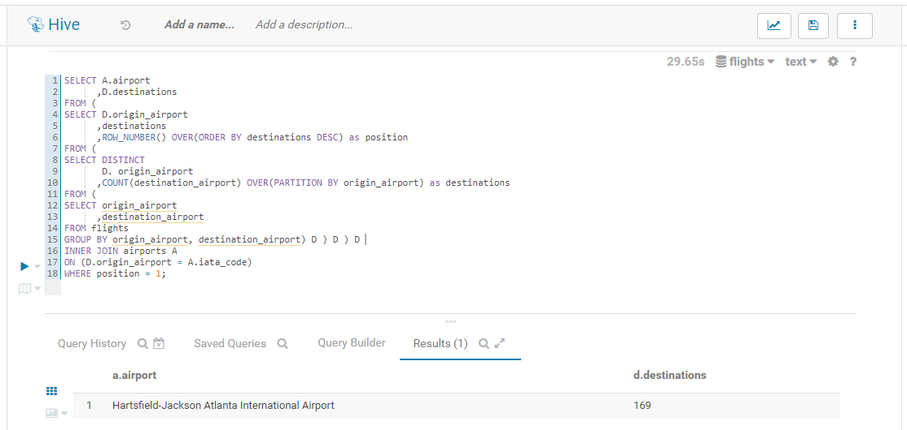