# Configuración inicial

## Inicialización de docker

El primer paso fue descargar e inicializar el contenedor con spark para realizar la tarea. Para esto, se ejecutar los siguientes comandos en shell.

```{bash, eval = FALSE}
sudo docker pull jupyter/all-spark-notebook

sudo docker run --name victor_samayoa -p 8888:8888 -v /home/victor/Documents/ITAM/metodos_gran_escala/Tarea_6:/Tarea_6 jupyter/all-spark-notebook
```

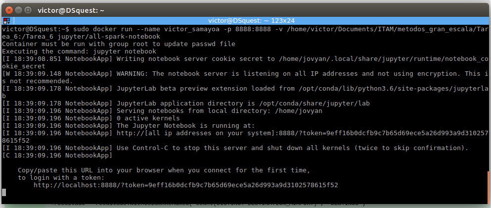

El siguiente paso es descargar los datos del dropbox y colocarlos dentro de la carpeta "Tarea_6" para tener acceso a ellos desde el contenedor

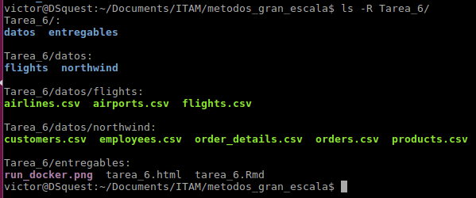

## Configuración pyspark

Con el token obtenido al ejecutar el contenedor del paso anterior, se procede a conectarse al jupyter notebook mediante la dirección https://localhost:8888 y ahí se ejecutan los siguientes comandos en python para usar pyspark.

```{python3, eval = FALSE}
from pyspark.sql import SparkSession

spark = SparkSession \
        .builder \
        .master("local") \
        .appName("Python Spark SQL") \
        .config("spark.some.config.option", "some-value") \
        .getOrCreate()
```

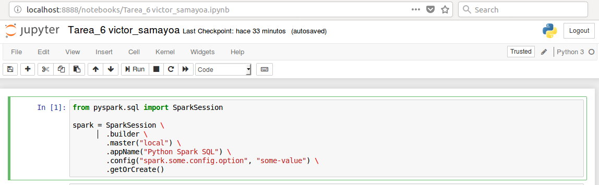
Una vez se cuenta con pyspark configurado se puede comenzar a trabajar en las preguntas

# Ejercicio 1

El primer paso es cargar los datos de **northwind** en spark. Para esto, se procede con el siguiente código:

```{python3, eval = FALSE}
customers = spark.read.csv("/Tarea_6/datos/northwind/customers.csv", header = "true")
employees = spark.read.csv("/Tarea_6/datos/northwind/employees.csv", header = "true")
order_details = spark.read.csv("/Tarea_6/datos/northwind/order_details.csv", header = "true")
orders = spark.read.csv("/Tarea_6/datos/northwind/orders.csv", header = "true")
products = spark.read.csv("/Tarea_6/datos/northwind/products.csv", header = "true")
```


Y se procede a revisar la estructura de los datos cargados.

```{python3, eval = FALSE}
customers.printSchema()
```

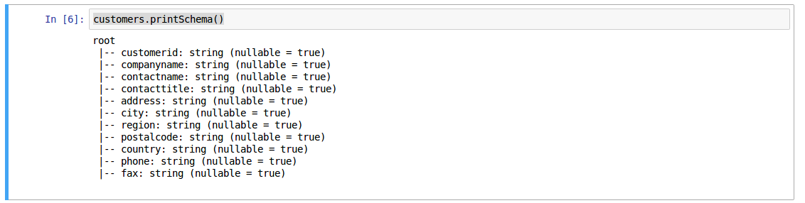

```{python3, eval = FALSE}
employees.printSchema()
```

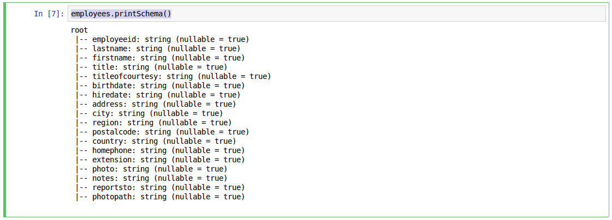

```{python3, eval = FALSE}
order_details.printSchema()
```

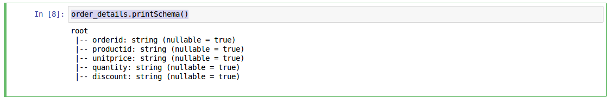

```{python3, eval = FALSE}
orders.printSchema()
```

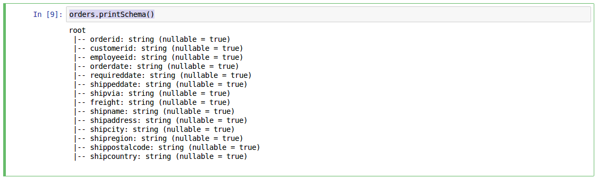

```{python3, eval = FALSE}
products.printSchema()
```

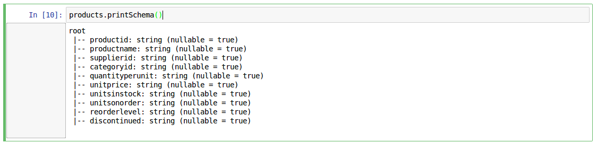

## Pregunta 1.a
¿Cuántos "jefes" hay en la tabla empleados?

```{python3, eval = FALSE}
employees.select("reportsto").distinct().na.drop().count()
```
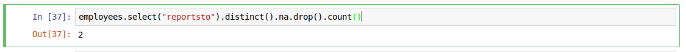

¿Cuáles son estos jefes: número de empleado, nombre, apellido, título, fecha de nacimiento, fecha en que iniciaron en la empresa, ciudad y país?


```{python3, eval = FALSE}
ejercicio_1a = employees.select("employeeid", "firstname", "lastname", "title", "birthdate", "hiredate", "city", \
                                "country", "reportsto") \
                        .where(employees.employeeid.isin(employees.select("reportsto").distinct().na.drop() \
                                                         .rdd.flatMap(lambda x:x).collect())) \

ejercicio_1a.write.csv("/Tarea_6/entregables/salidas/ejercicio_1a", header = "true")
ejercicio_1a.show()
```

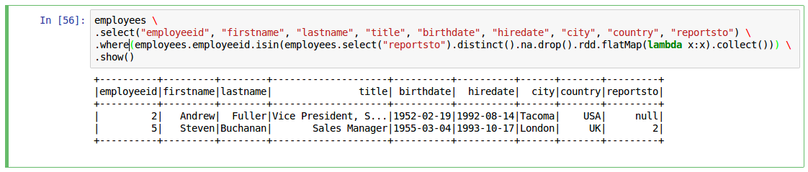

## Pregunta 1.b
¿Quién es el segundo "mejor" empleado que más órdenes ha generado? (nombre, apellido, título, cuándo entró a la compañía, número de órdenes generadas, número de órdenes generadas por el mejor empleado (número 1))

```{python3, eval = FALSE}
from pyspark.sql.functions import lag, col, lead, expr, lit
from pyspark.sql.window import Window
from pyspark.sql.functions import row_number

top_employees = orders.groupBy("employeeid") \
                .count().orderBy("count", ascending = False) \
                .select("employeeid", \
                        col("count").alias("orders"), \
                        row_number().over(Window.partitionBy().orderBy(col("count").desc())).alias("Position")) \
                .where(col("Position").isin(1, 2))
        
ejercicio_1b = top_employees.join(employees, top_employees.employeeid == employees.employeeid, "left_outer") \
                            .select("firstname", "lastname","title", "hiredate", "orders", \
                                    lead("orders").over(Window.partitionBy().orderBy("orders")).alias("bestOrders")) \
                            .na.drop()
        
ejercicio_1b.write.csv("/Tarea_6/entregables/salidas/ejercicio_1b", header = "true")
ejercicio_1b.show()
```

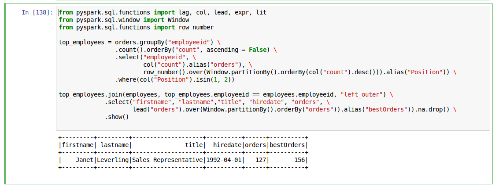

## Pregunta 1.c
¿Cuál es el delta de tiempo más grande entre una orden y otra?

```{python3, eval = FALSE}
from pyspark.sql.functions import datediff

ejercicio_1c = orders.select(datediff("orderdate", \
                                       lag("orderdate").over(Window().partitionBy().orderBy("orderdate"))) \
                                       .alias("daydiff")) \
                     .orderBy("daydiff", ascending = False) \
                     .na.drop() \
                     .distinct() \
                     .limit(1)

ejercicio_1c.write.csv("/Tarea_6/entregables/salidas/ejercicio_1c", header = "true")
ejercicio_1c.show()    
```

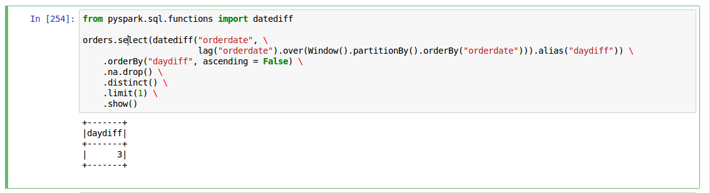

# Ejercicio 2

Se proceden a cargar los datos de flights

```{python3, eval = FALSE}
airlines = spark.read.csv("/Tarea_6/datos/flights/airlines.csv", header = "true")
airports = spark.read.csv("/Tarea_6/datos/flights/airports.csv", header = "true")
flights = spark.read.csv("/Tarea_6/datos/flights/flights.csv", header = "true")
```


Y se procede a revisar los esquemas de las tablas

```{python3, eval = FALSE}
airlines.printSchema()
```


```{python3, eval = FALSE}
airports.printSchema()
```

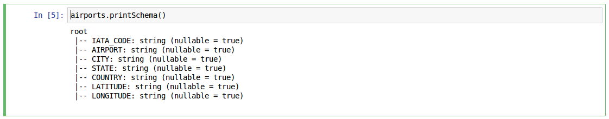

```{python3, eval = FALSE}
flights.printSchema()
```

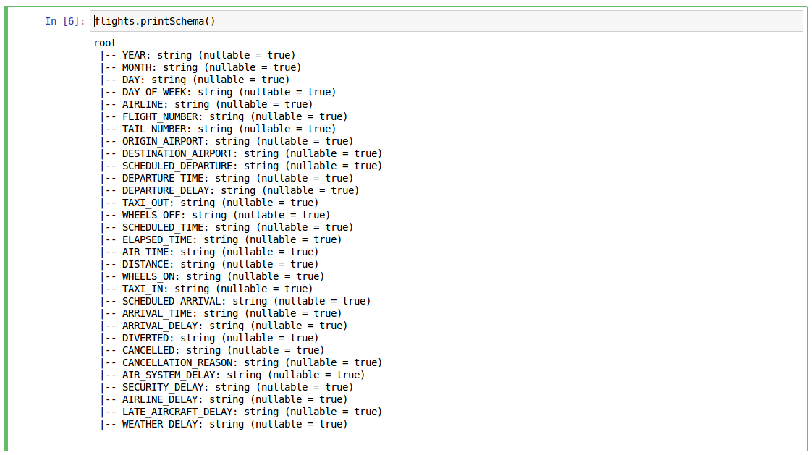

## Ejercicio 2.a
¿Qué aerolíneas (nombres) llegan al aeropuerto "Honolulu International Airport"? 

```{python3, eval = FALSE}
from pyspark.sql.functions import col

ejercicio_2a = flights.join(airlines, flights.AIRLINE == airlines.IATA_CODE, 'left_outer') \
                      .where(flights.DESTINATION_AIRPORT.isin(airports.select("IATA_CODE") \
                                                                      .where(col("AIRPORT") == "Honolulu International Airport") \
                                                                      .rdd.flatMap(lambda x: x).collect())) \
                      .select(airlines.AIRLINE) \
                      .distinct()
        
ejercicio_2a.write.csv("/Tarea_6/entregables/salidas/ejercicio_2a", header = "true")
ejercicio_2a.show()
```

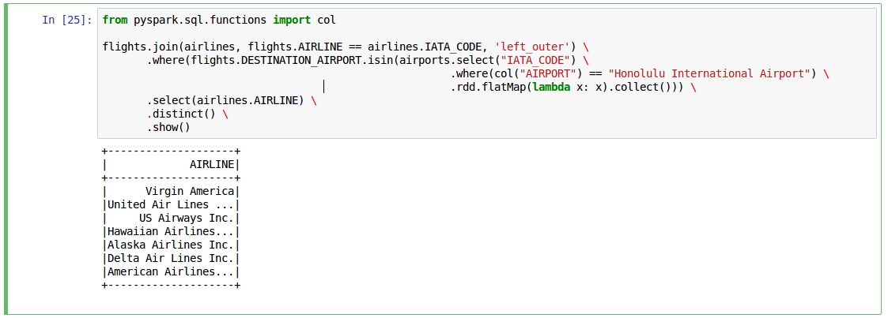

## Ejercicio 2.b
¿En qué horario (hora del día, no importan los minutos) hay salidas del aeropuerto de San Francisco ("SFO") a "Honolulu International Airport"?

```{python3, eval = FALSE}
ejercicio_2b = flights.join(airlines, flights.AIRLINE == airlines.IATA_CODE, 'left_outer') \
                      .where((flights.DESTINATION_AIRPORT.isin(airports.select("IATA_CODE") \
                                                                       .where(col("AIRPORT") == "Honolulu International Airport") \
                                                                       .rdd.flatMap(lambda x: x).collect())) &
                             (flights.ORIGIN_AIRPORT.isin(airports.select("IATA_CODE") \
                                                                  .where(col("AIRPORT") == "San Francisco International Airport") \
                                                                  .rdd.flatMap(lambda x: x).collect()))) \
                      .select(flights.SCHEDULED_DEPARTURE.substr(1, 2).alias("SCHEDULED")) \
                      .distinct()
        
ejercicio_2b.write.csv("/Tarea_6/entregables/salidas/ejercicio_2b", header = "true")
ejercicio_2b.show()
```

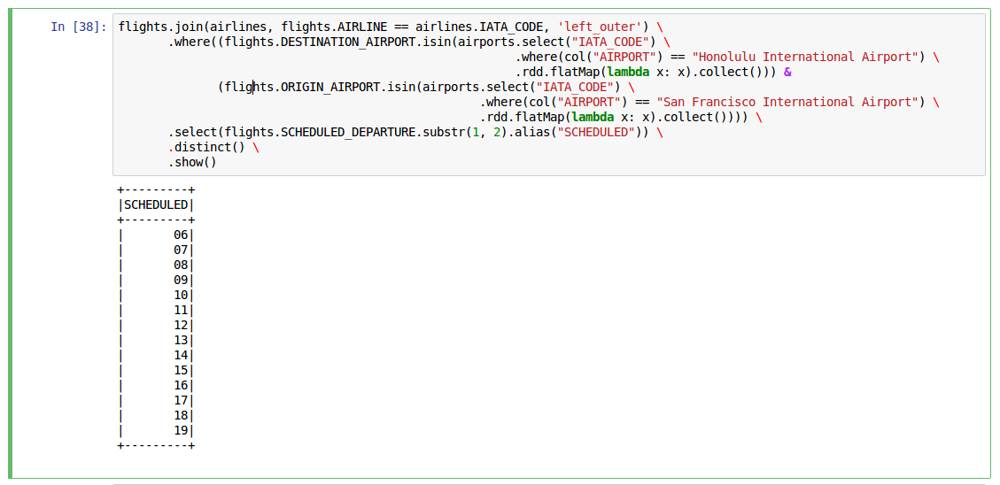

## Ejercicio 2.c
¿Qué día de la semana y en qué aerolínea nos conviene viajar a "Honolulu International Airport" para tener el menor retraso posible?

Debido a que lo importante es tener el menor retraso posible al aterrizar (No importa que el vuelo salga con 15 minutos antes si va a llegar 30 minutos tarde.) El Query se enfocará unicamente en el retraso de la llegadá
```{python3, eval = FALSE}
from pyspark.sql.functions import avg
from pyspark.sql.window import Window
from pyspark.sql.functions import row_number

ejercicio_2c = flights.alias("f").select("DAY_OF_WEEK", "AIRLINE", "DESTINATION_AIRPORT", "ARRIVAL_DELAY") \
                      .join(airlines.alias("a"), flights.AIRLINE == airlines.IATA_CODE, "inner") \
                      .select("DAY_OF_WEEK", "a.AIRLINE", "DESTINATION_AIRPORT", "ARRIVAL_DELAY") \
                      .where(flights.DESTINATION_AIRPORT.isin(airports.select("IATA_CODE") \
                                                              .where(col("AIRPORT") == "Honolulu International Airport")
                                                              .rdd.flatMap(lambda x: x).collect())) \
                      .select("DAY_OF_WEEK", "AIRLINE", \
                              avg("ARRIVAL_DELAY").over(Window.partitionBy("DAY_OF_WEEK", "AIRLINE").orderBy("DAY_OF_WEEK")) \
                                                  .alias("AVG_DELAY")) \
                      .distinct() \
                      .select("DAY_OF_WEEK", "AIRLINE", "AVG_DELAY", \
                              row_number().over(Window.partitionBy().orderBy("AVG_DELAY")).alias("POSITION")) \
                      .where(col("POSITION") == 1)
    
ejercicio_2c.write.csv("/Tarea_6/entregables/salidas/ejercicio_2c", header = "true")
ejercicio_2c.show()
```

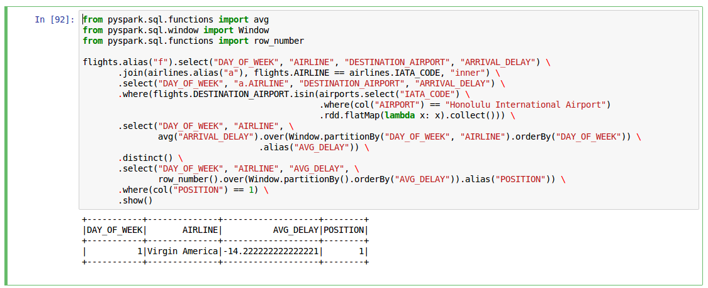

## Ejecicio 2.d
¿Cuál es el aeropuerto con mayor tráfico de entrada?

```{python3, eval = FALSE}
from pyspark.sql.window import Window
from pyspark.sql.window import Window
from pyspark.sql.functions import row_number

ejercicio_2d = flights.select("DESTINATION_AIRPORT") \
                      .join(airports, flights.DESTINATION_AIRPORT == airports.IATA_CODE, "inner") \
                      .groupBy("AIRPORT").count() \
                      .select("AIRPORT", \
                              row_number().over(Window.partitionBy().orderBy(col("count").desc())).alias("POSITION")) \
                      .where(col("POSITION") == 1) \
                      .select("AIRPORT")

ejercicio_2d.write.csv("/Tarea_6/entregables/salidas/ejercicio_2d", header = "true")
ejercicio_2d.show()
```

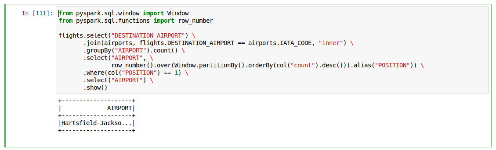

## Ejercicio 2.e
¿Cuál es la aerolínea con mayor retraso de salida por día de la semana?

```{python3, eval = FALSE}
from pyspark.sql.types import DoubleType
from pyspark.sql.functions import col, row_number
from pyspark.sql.window import Window

ejercicio_2e = flights.join(airlines.alias("a"), flights.AIRLINE == airlines.IATA_CODE) \
                      .select("DAY_OF_WEEK", col("DEPARTURE_DELAY").cast(DoubleType()), "a.AIRLINE") \
                      .groupBy("DAY_OF_WEEK", "AIRLINE").max("DEPARTURE_DELAY") \
                      .select("DAY_OF_WEEK", "AIRLINE", col("max(DEPARTURE_DELAY)").alias("MAX_DELAYED_DEPARTURE"), \
                              row_number().over(Window.partitionBy("DAY_OF_WEEK").orderBy(col("max(DEPARTURE_DELAY)").desc())) \
                              .alias("POSITION")) \
                      .where(col("POSITION") == 1) \
                      .select("DAY_OF_WEEK", "AIRLINE", "MAX_DELAYED_DEPARTURE") \
                      .orderBy("DAY_OF_WEEK")

ejercicio_2e.write.csv("/Tarea_6/entregables/salidas/ejercicio_2e", header = "true")
ejercicio_2e.show()
```

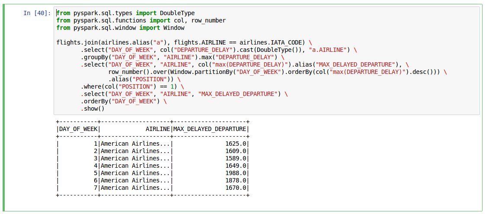

## Ejercicio 2.f
¿Cuál es la tercer aerolínea con menor retraso de salida los lunes (day of week = 2)?
 
```{python3, eval = FALSE}
from pyspark.sql.types import DoubleType
from pyspark.sql.functions import col, row_number
from pyspark.sql.window import Window

ejercicio_2f = flights.join(airlines.alias("a"), flights.AIRLINE == airlines.IATA_CODE) \
                      .select("DAY_OF_WEEK", col("DEPARTURE_DELAY").cast(DoubleType()), "a.AIRLINE") \
                      .groupBy("DAY_OF_WEEK", "AIRLINE").min("DEPARTURE_DELAY") \
                      .select("DAY_OF_WEEK", "AIRLINE", col("min(DEPARTURE_DELAY)").alias("MIN_DELAYED_DEPARTURE"), \
                              row_number().over(Window.partitionBy("DAY_OF_WEEK").orderBy(col("min(DEPARTURE_DELAY)").asc())) \
                              .alias("POSITION")) \
                      .where((col("DAY_OF_WEEK") == 2) & (col("POSITION") == 1)) \
                      .select("DAY_OF_WEEK", "AIRLINE", "MIN_DELAYED_DEPARTURE") \
                      .orderBy("DAY_OF_WEEK")

ejercicio_2f.write.csv("/Tarea_6/entregables/salidas/ejercicio_2f", header = "true")
ejercicio_2f.show()
```
 
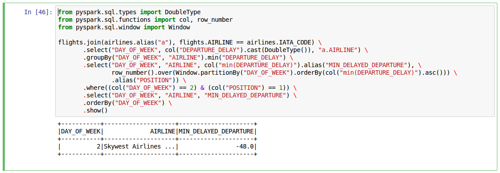
 
## Ejercicio 2.g
¿Cuál es el aeropuerto origen que llega a la mayor cantidad de aeropuertos destino diferentes?
 
```{python3, eval = FALSE}
from pyspark.sql.functions import countDistinct

ejercicio_2g = flights.join(airports.alias("a"), flights.ORIGIN_AIRPORT == airports.IATA_CODE) \
                      .select(col("a.AIRPORT").alias("ORIGIN_AIRPORT"), "DESTINATION_AIRPORT") \
                      .groupBy("ORIGIN_AIRPORT") \
                      .agg(countDistinct("DESTINATION_AIRPORT").alias("NUMBER_DESTINATION_AIRPORT")) \
                      .select("ORIGIN_AIRPORT", "NUMBER_DESTINATION_AIRPORT", \
                              row_number().over(Window.partitionBy().orderBy(col("NUMBER_DESTINATION_AIRPORT").desc())) \
                              .alias("POSITION")) \
                      .where(col("POSITION") == 1)

ejercicio_2g.write.csv("/Tarea_6/entregables/salidas/ejercicio_2g", header = "true")
ejercicio_2g.show()
```

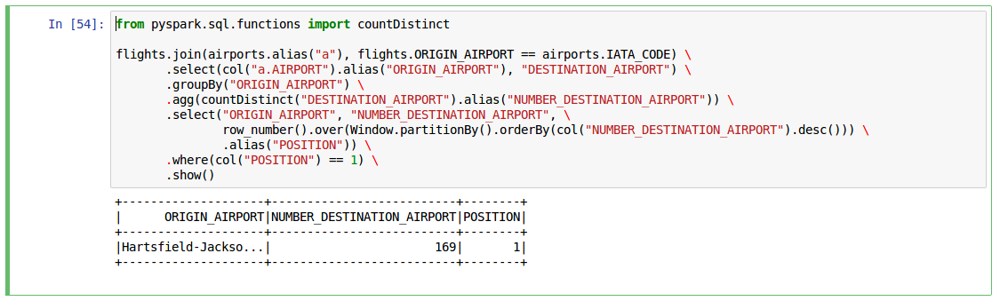