# Inicialización del cluster AWS

Se montó un cluster en AWS que contuviera Spark y Zeppelin para poder realizar la tarea.

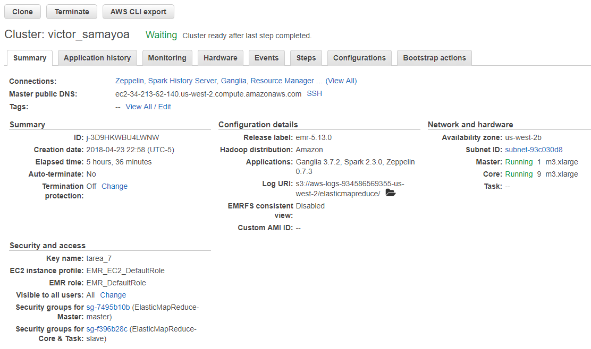

A partir de este momento, todos los comandos se ejecutarán desde Zepelin

# Tarea 7

## Carga de los datos

Se proceden a cargar los datos de flights

```{python3, eval = FALSE}
%pyspark

# Se cargan los datos de flights a spark
flights = spark.read.csv("s3://victorsamayoa/metodos_gran_escala/victor_samayoa/tarea_7/datos/flights.csv", \
                         header = "true", inferSchema = "true")
```

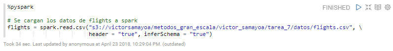

Y se procede a revisar los esquemas de las tablas

```{python3, eval = FALSE}
%pyspark

# Se imprime el esquema del data frame flights para confirmar la carga
flights.printSchema()
```

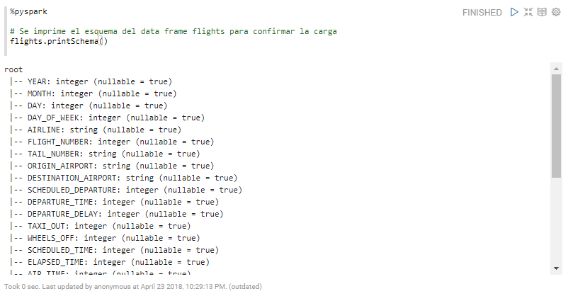

## Ejercicio
Con los datos que tenemos de flights queremos predecir el tiempo de retraso de salida DEPARTURE_DELAY

```{python3, eval = FALSE}
%pyspark

# Se importan las funciones a utilizar en el ejercicio
from pyspark.ml.regression import RandomForestRegressor, GeneralizedLinearRegression
from pyspark.ml.tuning import CrossValidator, ParamGridBuilder
from pyspark.ml.evaluation import RegressionEvaluator 
from pyspark.ml.feature import OneHotEncoder, StringIndexer, VectorAssembler
from pyspark.ml import Pipeline
import time

# Se definen variables numéricas que vamos a pasar a categóricas, para meterlas dentro de un Pipe
variables = ["AIRLINE", "ORIGIN_AIRPORT", "DESTINATION_AIRPORT", "DAY_OF_WEEK"]
variables_string_encoded = ["AIRLINE_string_encoded","ORIGIN_AIRPORT_string_encoded","DESTINATION_AIRPORT_string_encoded", \
                            "DAY_OF_WEEK_string_encoded"]

# Se define el String Indexer y el One Hot encoding y se mete dentro de un PIPE
stage_string = [StringIndexer(inputCol = c, outputCol = c + "_string_encoded") for c in variables]
stage_one_hot = [OneHotEncoder(inputCol= c + "_string_encoded", outputCol = c + "_one_hot") for c in variables]
ppl = Pipeline(stages = stage_string + stage_one_hot)
flights = ppl.fit(flights).transform(flights)

# Para poder meter las variables dentro de un solo vector usamos VectorAssembler, para poder usar esta función
# debemos de encargarnos de los variables faltantes. En este caso los vamos a dropear.
flights1 = flights.dropna(how = "any", thresh = None, \
                          subset=["YEAR", "MONTH", "DAY", "FLIGHT_NUMBER", "SCHEDULED_DEPARTURE", \
                                  "DEPARTURE_TIME", "TAXI_OUT", "WHEELS_OFF", "SCHEDULED_TIME", "ELAPSED_TIME", \
                                  "AIR_TIME", "DISTANCE", "WHEELS_OFF", "SCHEDULED_TIME", "ARRIVAL_TIME", \
                                  "ARRIVAL_DELAY"])


# Seleccionamos que variables se van a usar y meter en el VectorAssembler (quitamos aquellas que consideramos)
# que dan información adicional, las que describen las razones de retraso o cancelación
variables_int = ["YEAR","MONTH", "DAY", "FLIGHT_NUMBER", "SCHEDULED_DEPARTURE", "DEPARTURE_TIME", "TAXI_OUT", \
                 "WHEELS_OFF", "SCHEDULED_TIME", "ELAPSED_TIME", "AIR_TIME", "DISTANCE", "WHEELS_OFF", \
                 "SCHEDULED_TIME", "ARRIVAL_TIME", "ARRIVAL_DELAY"]
variables_trans = ["AIRLINE_one_hot", "ORIGIN_AIRPORT_one_hot", "DESTINATION_AIRPORT_one_hot", \
                   "DAY_OF_WEEK_one_hot"]
features = variables_int + variables_trans
vector_assembler = VectorAssembler(inputCols = features, outputCol = "features")
data_training_and_test1 = vector_assembler.transform(flights1)

# Una vez con los datos listos definimos los dos modelos que vamos a utilizar
classifiers = {"RF": RandomForestRegressor(labelCol = "DEPARTURE_DELAY", featuresCol = "features"), \
               "GLR": GeneralizedLinearRegression(labelCol = "DEPARTURE_DELAY", featuresCol = "features")}

grid = {"RF":ParamGridBuilder() \
      .addGrid(RandomForestRegressor.maxDepth, [ 5,15,20]) \
      .addGrid(RandomForestRegressor.numTrees,[100,1000,10000]) \
      .build(), \
      "GLR":ParamGridBuilder() \
      .addGrid(GeneralizedLinearRegression.regParam, [.05, .1,.15]) \
      .addGrid(GeneralizedLinearRegression.maxIter,[10,20,50]) \
      .build()}
  
# Separamos los datos en entrenamiento y prueba
(training_data, test_data) = data_training_and_test1.randomSplit([0.7, 0.3])
lista = ["RF","GLR"]
classifiers[lista[0]]

# Separamos los datos de entrenamiento a su vez en entrenamiento y preuba para hacer el magic loop
(training_data1, test_data1) = training_data.randomSplit([0.7, 0.3])
```

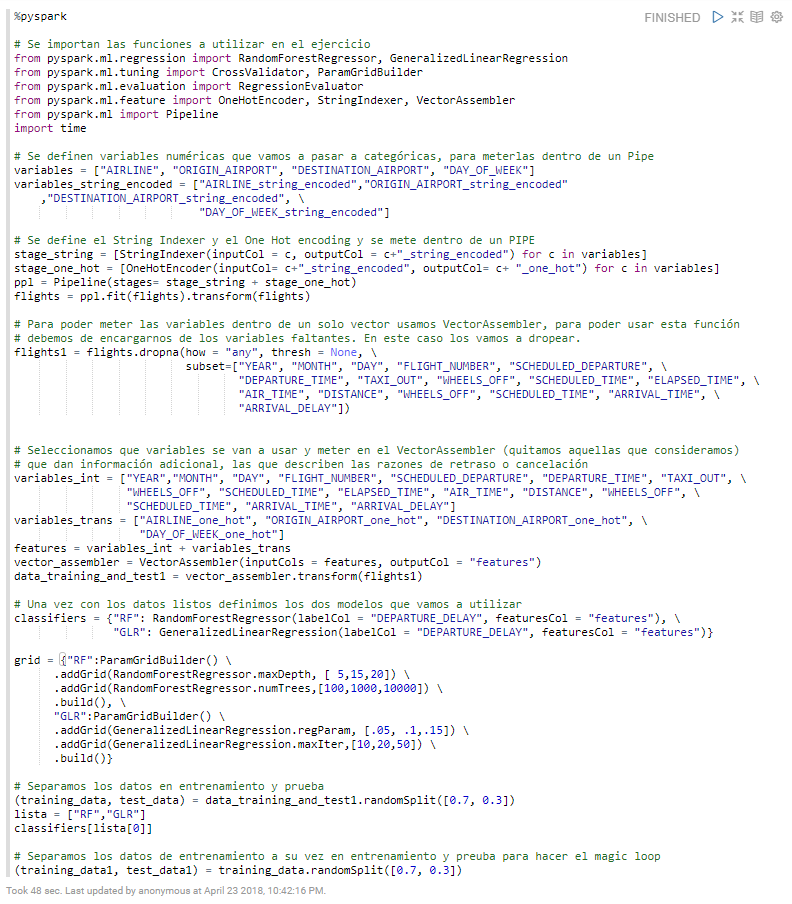

```{python3, eval = FALSE}
%pyspark

##Inicializamos el tiempo
start = time.time()

# Se genera el magic loop
for i in range(1,3):
    modelo = classifiers[lista[i-1]]
    modelo_cv = modelo
    paramGrid = grid[lista[i-1]]
    
    crossval = CrossValidator(estimator = modelo_cv, \
                              estimatorParamMaps=paramGrid, \
                              evaluator = RegressionEvaluator(labelCol = "DEPARTURE_DELAY", \
                                                              predictionCol = "prediction", \
                                                              metricName="rmse"), \
                              numFolds= 10)
    cv_model = crossval.fit(training_data1)
    predictions = cv_model.transform(test_data1)
    evaluator= RegressionEvaluator(labelCol = "DEPARTURE_DELAY", predictionCol="prediction", metricName= "rmse")
    rmse = evaluator.evaluate(predictions)
    print("Revisando el modelo:")
    print(lista[i-1])
    print("El modelo predice")
    print(predictions.select("DEPARTURE_DELAY","prediction").show(5))
    print("La raíz del error cuarático medio del modelo es:")
    print(rmse)
    print("Los hiperparámetros del modelo son:")
    print(cv_model.bestModel.extractParamMap())
    i=i+1

# Finalizamos el tiempo    
end = time.time()
```

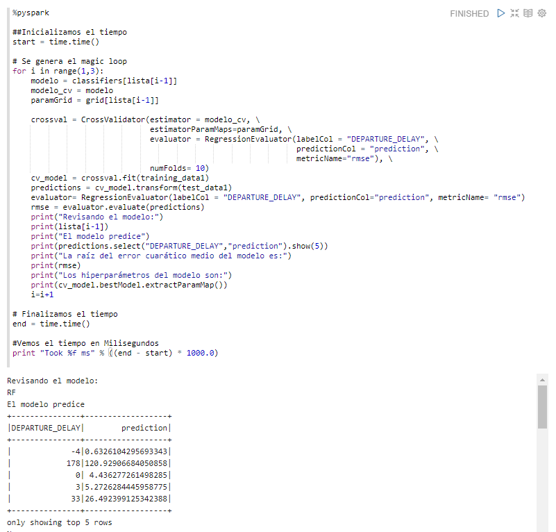


## Diagramas de elementos del código

El primer pipelane que se aplicó fue para transofrmar todo el data frame, se usaró un pipeline que contenia los estimadores **String Index()** y **One Hot Encoder()**, por lo que este pipline es un estimador y se aplicó primero un **fit()** al data frame para obtener el pipeline transofrmador para luego aplicar un **transform()** al data frame y obtener un nuevo data frame transformado.

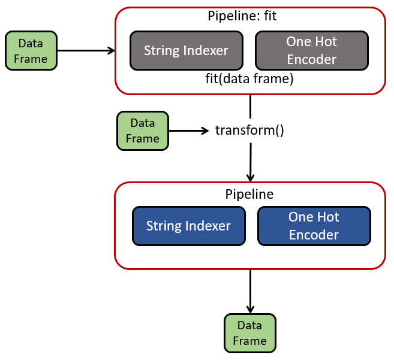

Despues de que se separaron los datos de entrenamiento y prueba, se aplicó un segundo pipeline que contenia los estimadores **RandomForestRegressor()** y **GeneralizedLinearRegression()**, este pipeline es un estimador y se aplicó primero un **fit()** al data frame de entrenamiento para obtener un transformador para luego aplicar un **transform()** al data frame de entrenamiento dentro del magic loop y con esto evaluar diversos modelos. Una vez seleccionado el modelo a usar, se aplicó **transform()** al data frame de prueba para evaluar el mejor modelo encontrado en el magic loop.

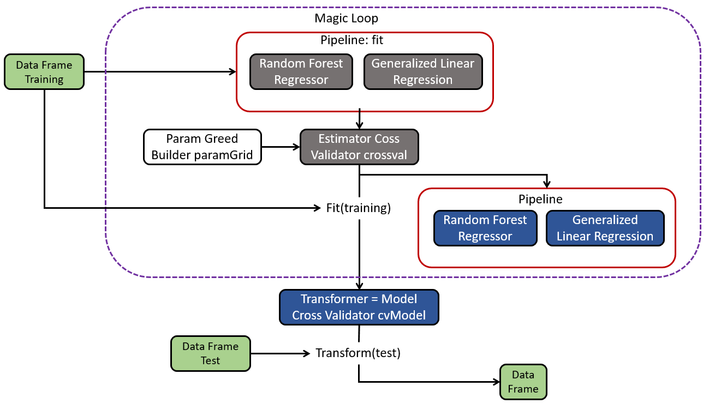

## Resultados

**¿Qué parametros resultaron mejor por algoritmo?**

Los resultados para el Random Forest con los mejors parámetros se muestran en la imagen siguiente

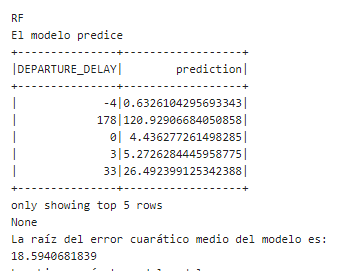

Los parámetros de este Random Forest son

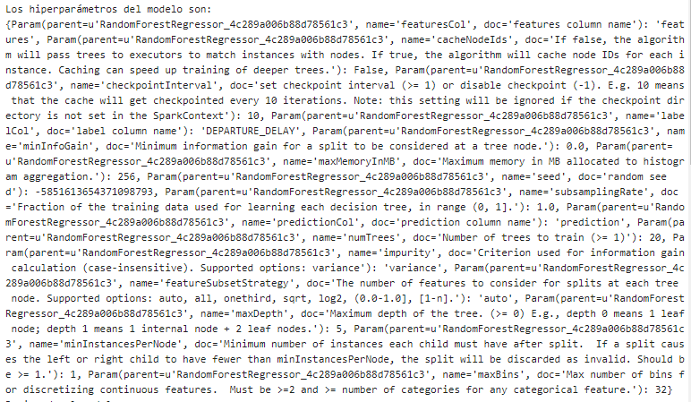

Los resultados para el Generalized Linear Regression con los mejors parámetros se muestran en la imagen siguiente

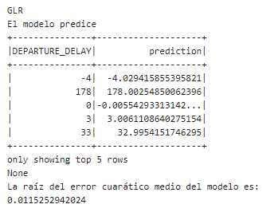

Los parámetros de este Generalized Linear Regression son

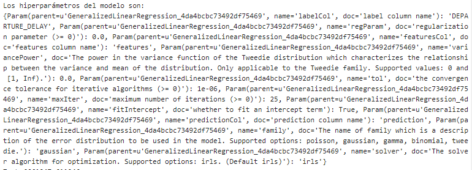

**¿Qué algoritmo resultó el mejor, con qué parámetros?**

Como se puede observar, el Generalized Linear Regression fue el que mejor desempeño obtuvo. Los paramétros de este modelos son

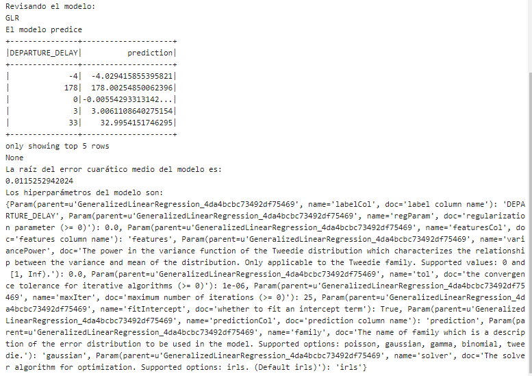

## Tiempo de ejecución

**ndicar el tiempo de ejecución de la función de magic loop**

El tiempo de ejecución fue

```{python3, eval = FALSE}
%pyspark

#Vemos el tiempo en Milisegundos
print "Took %f ms" % ((end - start) * 1000.0)
```

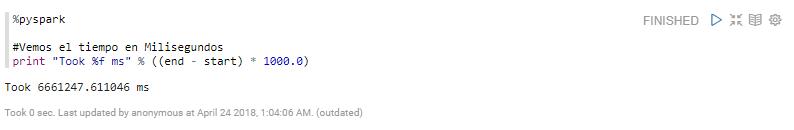
